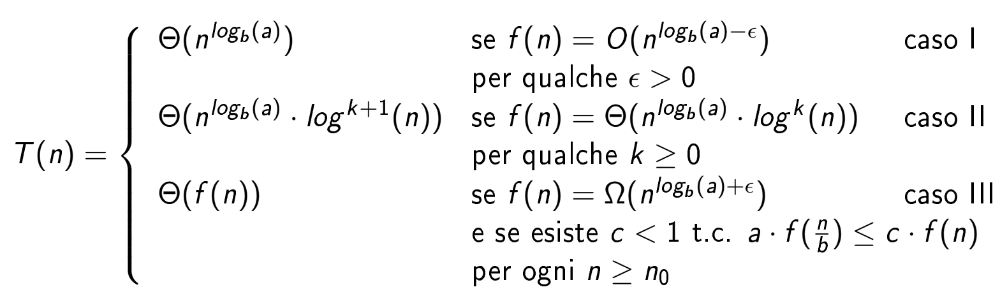

# Ricorrenze

## Esempi di forme di ricorrenze
- $T(n) = 2*n^2 + 3*n + 5$ -> forma esplicita e precisa
- $T(n) = a*n^2 + b*n$ -> forma esplicita e generica
- $T(n) = \Theta(n)$ -> forma asintotica

ogni T(n) esplicita ha un'ordine di grandezza

per trasformare una ricorrenza in una funzione da implicita a esplicita si possono usare 3 metodi:
- albero di ricorsione (o sviluppo in serie)
- Master Theorem
- metodo di sostituzione (o induzione)

## Albero di ricorsione
si sviluppa la ricorrenza per cercare di estrarne il comportamento

Esempio:
$T(n) = T(frazione\ di\ n) + f(n)$

Osservazione: la chiamata più piccola possibile è T(1) = 1 (somma di casi base o parti non ricorsive)

### Esempi di sviluppi di alberi di ricorsione
- **$T(n) = T(\frac{n}{2}) + 1$** -> 1 chiamata ricorsiva su $\frac{n}{2}$ elementi e ognuna di esse costa 1

con $\lfloor \log_2(n) \rfloor$ -> numero di volte che si può dividere n prima di non poterlo più fare e avere $T(1)$ ($\lfloor n \rfloor$ rappresenta l'arrotondamento alla parte intera di $n$)

- **$T(n) = 2*T(\frac{n}{2}) + n$** -> 2 chiamate ricorsive ognuna delle quali viene fatta su circa la metà dei suoi elementi $(\frac{n}{2})$ + 1 chiamata non ricorsiva che costa tanti quanti sono gli elementi di quell'istanza $(n)$

- **$T(n) = 3*T(\frac{n}{2}) + n^2$** -> 3 chiamate ricorsive ognuna delle quali viene fatta su circa la metà dei suoi elementi $(\frac{n}{2})$ + 1 chiamata non ricorsiva che costa tanti quanti sono gli elementi di quell'istanza $(n^2)$

## Master Theorem
Formula generale per le ricorrenze:

$T(n) = a*T(\frac{n}{b}) + f(n)$

Sviluppo in serie generale se n è potenza esatta di b (non float):

$T(n) = \sum_{i=0}^{log_b(n)-1} a^i * f\left(\frac{n}{b^i}\right) + O\left(n^{log_b(a)}\right)$

### Il $T(n)$ finale dipende molto da $f(n)$ quindi si distinguono 3 casi quando si generalizza:

- $f(n) = O(n^{(\log_a{(b)} - \epsilon)})$

- $f(n) = \Theta(n^{(\log_a{(b)})})$

- $f(n) = \Omega(n^{(\log_a{(b)} + \epsilon)})$

## Metodo di sostituzione
Quando il Master Theorem non basta si può usare il metodo di sostituzione
Indovinare il risultato e poi dimostrarlo per induzione

Strategia generale:
1. si prova il Master Theorem
2. se non funziona:
    1. sviluppare in serie