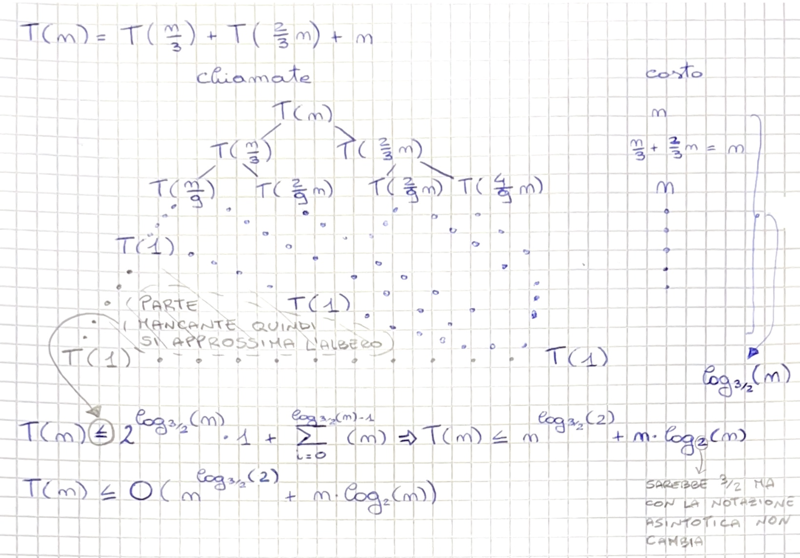
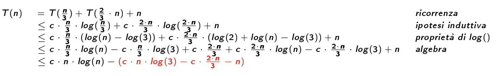

# Ricorrenze

## Esempi di forme di ricorrenze
- $T(n) = 2\cdot n^2 + 3\cdot n + 5$ -> forma esplicita e precisa
- $T(n) = a \cdot n^2 + b\cdot n$ -> forma esplicita e generica
- $T(n) = \Theta(n)$ -> forma asintotica

Ogni $T(n)$ esplicita ha un'ordine di grandezza.  
Per trasformare una ricorrenza in una funzione da implicita ad esplicita si possono usare 3 metodi:
- albero di ricorsione (o sviluppo in serie)
- Master Theorem
- metodo di sostituzione (o induzione)

## Albero di ricorsione
Si sviluppa la ricorrenza per cercare di estrarne il comportamento.  
Esempio: $T(n) = T(frazione\ di\ n) + f(n)$  
Costo totale $T(n) =$ altezza dell'albero $+$ costo totale  
Osservazione: la chiamata più piccola possibile è $T(1) = 1$ (somma di casi base o parti non ricorsive)

### Esempi di sviluppi di alberi di ricorsione
- **$T(n) = T(\frac{n}{2}) + 1$** --> 1 chiamata ricorsiva su $\frac{n}{2}$ elementi e ognuna di esse costa 1

con $\lfloor \log_2(n) \rfloor$ --> numero di volte che si può dividere n prima di non poterlo più fare e avere $T(1)$ ($\lfloor n \rfloor$ rappresenta l'arrotondamento alla parte intera di $n$)

- **$T(n) = 2*T(\frac{n}{2}) + n$** --> 2 chiamate ricorsive ognuna delle quali viene fatta su circa la metà dei suoi elementi $(\frac{n}{2})$ + 1 chiamata non ricorsiva che costa tanti quanti sono gli elementi di quell'istanza $(n)$

- **$T(n) = 3*T(\frac{n}{2}) + n^2$** --> 3 chiamate ricorsive ognuna delle quali viene fatta su circa la metà dei suoi elementi $(\frac{n}{2})$ + 1 chiamata non ricorsiva che costa tanti quanti sono gli elementi di quell'istanza $(n^2)$

## Master Theorem
Formula generale per le ricorrenze:  
$T(n) = a \cdot T(\frac{n}{b}) + f(n)$

Sviluppo in serie generale se n è potenza esatta di b (non float):  
$T(n) = \sum_{i=0}^{log_b(n)-1} (a^i) \cdot f\left(\frac{n}{b^i}\right) + O\left(n^{log_b(a)}\right)$

### Il $T(n)$ finale dipende molto da $f(n)$ quindi si distinguono 3 casi quando si generalizza:
- $f(n) = O(n^{(\log_b{(a)} - \epsilon)})$ --> $f(n)$ polinomicamente di grado inferiore a $n^{(\log_b{(a)})}$
- $f(n) = \Theta(n^{(\log_b{(a)})})$ --> $f(n)$ polinomicamente di grado uguale a $n^{(\log_b{(a)})}$
- $f(n) = \Omega(n^{(\log_b{(a)} + \epsilon)})$ --> $f(n)$ polinomicamente di grado superiore a $n^{(\log_b{(a)})}$

**Esempi**:
1. **$T(n) = T(\frac{n}{2}) + 1$** ---> $a = 1$, $b = 2$, $f(n) = 1$  
    exp = $\log_b(a) = \log_2(1) = 0$  
    $f(n) = n^{exp} \longleftrightarrow 1 = 1 \longrightarrow$ caso 2 Master Theorem  
    $f(n) = \Theta(n^{exp}) \longrightarrow T(n) = \Theta(\log(n))$  
    con $a = 1, b = 2$

2. **$T(n) = 2*T(\frac{n}{2}) + n$** ---> $a = 2$, $b = 2$, $f(n) = n$  
    exp = $log_2(2) = 1$  
    $f(n) = n^{exp} \longleftrightarrow n = n^1 \longrightarrow$ caso 2 Master Theorem  
    $f(n) = \Theta(n^{(\log_2{(2)})}) \longrightarrow$ caso 2 del Master Theorem -> $T(n) = \Theta(n*\log(n))$  
    con $a = 2, b = 2, k = 0$

3. **$T(n) = 3*T(\frac{n}{2}) + n^2$** ---> $a = 3$, $b = 2$, $f(n) = n^2$  
    exp = $\log_2(3) = 1.58$  
    $f(n) > n^{exp} \longleftrightarrow n^2 > n^{1.58} \longrightarrow$ caso 3 Master Theorem  
    $f(n) = \Omega(n^{(\log_2{(3)} + \epsilon)}) \longrightarrow T(n) = \Theta(n^2)$  
    con $a = 3, b = 2$

4. **$T(n) = 4*T(\frac{n}{2}) + n^2 * \log_2(n)$** ---> $a = 4$, $b = 2$, $k = 1$, $f(n) = n^2 \cdot \log_2(n)$  
    exp = $\log_2(4) = 2$  
    $f(n) = n^{exp} \cdot \log^k(n) \longleftrightarrow n^2 \cdot \log_2(n) = n^2 \cdot \log_2(n) \longrightarrow$ caso 2 Master Theorem  
    $f(n) = \Theta(n^2 \cdot \log_2(n)) \longrightarrow T(n) = \Theta(n^2 \cdot \log^2(n))$  
    con $a = 4, b = 2, k = 1$
    

## Metodo di sostituzione
Quando il Master Theorem non basta si può usare il metodo di sostituzione: indovinare il risultato e poi dimostrarlo per induzione

**Esempio**:
$T(n) = T(\frac{n}{3}) + T(\frac{2}{3}\cdot n) + n$
1. Uso il metodo di sviluppo poichè non so minimamente di che forma è la ricorrenza

2. Provo ad indovinare se $T(n) = O(n \cdot \log_2(n))$ assumendo che $T(n) \leq c \cdot n \cdot \log_2(n)$ per qualche $c > 0$ :

poichè $\log_2(3) = 1.58$ e $\frac{2}{3} = 0.6$ la condizione $c > 0$ si verifica quindi posso concludere che $T(n) = O(n \cdot \log_2(n))$

3. Si può proseguire con le sostituzioni per verificare se $T(n) = \Omega(n \cdot \log_2(n))$ :
    - se si -> $T(n) = \Theta(n \cdot \log_2(n))$
    - se no -> $T(n) = O(n \cdot \log_2(n))$

## Strategia generale:
1. provare a risolvere la ricorrenza con il Master Theorem e se non funziona passare allo step 2
2. sviluppare in serie l'albero di ricorsione per poi verificare il risultato, se necessario, con una o più sostituzioni (più sostituzioni per verificare se $O(), \Omega(), \Theta()$ o se si è sbagliato)