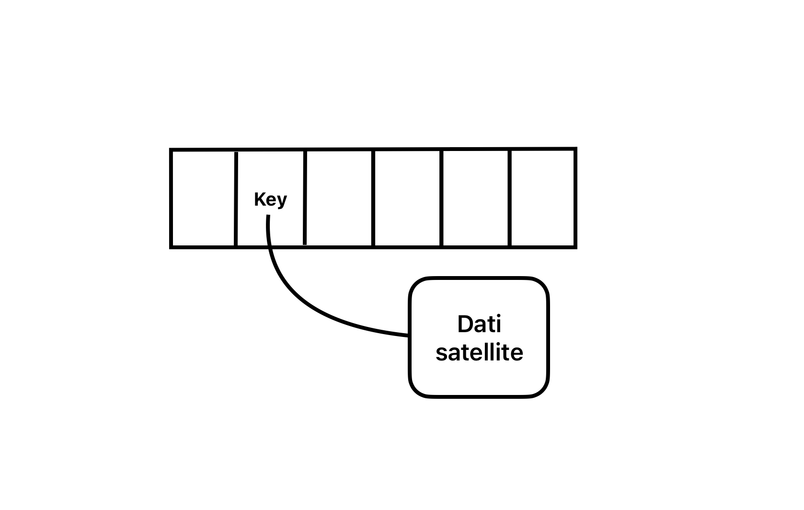

# Liste, pile, code

## Strutture dati
Le strutture dati si possono dividere in elementari (array, liste) e non elementari, poi esistono le strutture dati basate su ordinamento e quelle non basate su ordinamento.

### Tassonomia delle strutture dati
**Tassonomia** (modo in cui le informazioni vengono raggruppate, classificate ed etichettate in un'ambiente condiviso) **delle strutture dati** in 3 dimensioni ortogonali tra loro:
- **statica o dinamica**:
    - **statica** (grafi, array): se la dimensione è fissata a priori
    - **dinamica** (liste): se la dimensione può variare durante l'esecuzione (a runtime)
- **compatta o sparsa**:
    - **sparse** (liste): gli elementi sono virtualmente vicini, ma fisicamente non sappiamo dove si trovano
  - **compatta** (array): gli elementi si trovano in posizioni fisiche di memoria contigue
- **basate o non basate su ordinamento di chiavi**:
    - **basate su ordinamento** (alberi binari di ricerca): se gli elementi sono ordinati secondo una chiave
    - **non basate su ordinamento** (liste, grafi): se non c'è alcuna relazione con una chiave

### Differenze tra chiave e dato satellite
- **chiave**: campo che identifica univocamente un elemento o dato satellite
- **dato satellite**: elementi associati alla chiave



### Strutture dati concrete e astratte
strutture dati concrete: array, liste, pile, code, alberi, grafi  
strutture dati astratte: insiemi, dizionari, code di priorità -> costruite a partire da strutture dati concrete

## Puntatori e liste
**Lista concatenata**: struttura dati dinamica e sparsa dove ogni elemento ha un campo dati e un campo puntatore al successivo. Si associano le operazioni di inserimento, cancellazione e ricerca (visto come array dinamico e sparso).

**Puntatori**: variabile che contiene l'indirizzo in memoria, si associa al tipo di dato puntato. Si possono avere puntatori a variabili, puntatori a funzioni, puntatori a strutture dati.


### Gestione delle liste in memoria


### Codici per le liste
```pseudocode
typedef struct {
    int key;
    struct elemLista *succ;
    struct elemLista *prec;
} elemLista;


typedef struct {
    struct elemLista *head;
    int numel;
} List;


List *L;
L.head = nil;
L.numel = 0;
```

Si consideri il caso di liste non ordinate, doppiamente collegate:

```pseudocode
proc ListInsert (L, x) {
    x.next = L.head
    if (L.head != nil) {
        L.head.prev = x
    }
    L.head = x
    x.prev = nil
}
```

```pseudocode
proc ListSearch (L, k) {
    x = L.head
    while (x != nil and x.key != k) {
        x = x.next
    }
    return x
}
```

```pseudocode
proc ListDelete (L, x) {
    if (x.prev != nil) {
        x.prev.next = x.next
    } else {
        L.head = x.next
    }
    if (x.next != nil) {
        x.next.prev = x.prev
    }
}
```

## Pile
**Pila (o stack)**: struttura dati dinamica e sparsa che permette di inserire e cancellare elementi solo in cima (LIFO). Si associano le operazioni di push e pop.

### Pile su array
S -> array di interi (interpretata come stack)

```pseudocode
proc Empty (S) {
    return S.top == 0
}
```

```pseudocode
proc Push (S, x) {
    S.top = S.top + 1
    S[S.top] = x
}
```

```pseudocode
proc Pop (S) {
    if Empty(S) {
        error "underflow"
    } else {
        S.top = S.top - 1
        return S[S.top + 1]
    }
}
```

## Code
**Coda (o queue)**: struttura dati dinamica e sparsa che permette di inserire elementi in coda e cancellare elementi in testa (FIFO). Si associano le operazioni di enqueue e dequeue.