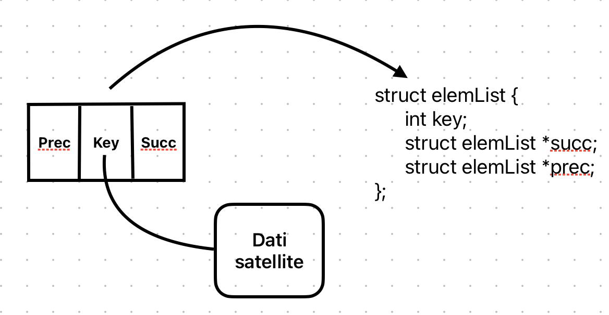
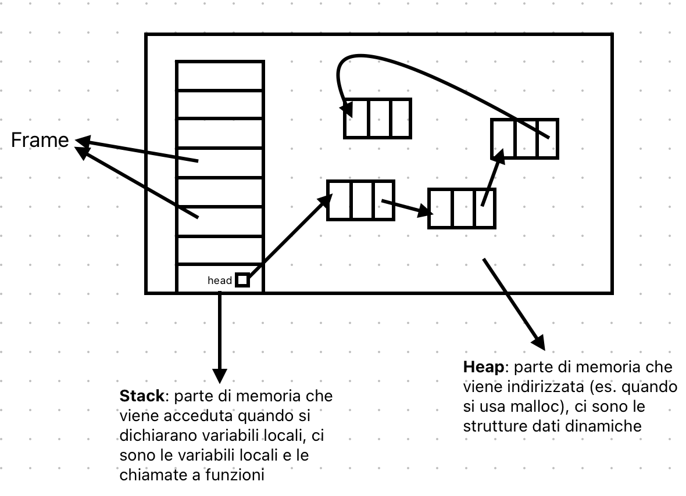

# Liste, pile, code

## Puntatori e liste
**Lista concatenata**:
- struttura dati dinamica, sparsa e non basata sull'ordinamento
- ogni elemento ha un campo dati e un campo puntatore al successivo
- si associano le operazioni di inserimento, cancellazione e ricerca (visto come array dinamico e sparso)

**Puntatori**: variabile che contiene un indirizzo in memoria, si associa al tipo di dato puntato (quindi un puntatore a un intero è diverso da un puntatore a un tipo di dato complesso)



### Gestione delle liste in memoria


### Codici per le liste

Si consideri il caso di liste non ordinate, doppiamente collegate (ogni elemento ha un puntatore al successivo e al precedente):

```pseudocode
typedef struct {
    int key;
    struct elemLista *succ;
    struct elemLista *prec;
} elemLista;


typedef struct {
    struct elemLista *head;
    int numel;
} List;


List *L;
L.head = nil;
L.numel = 0;
```
#### Algoritmi per le liste
```pseudocode
proc ListInsert (L, x) {
    x.next = L.head
    if (L.head != nil) {
        L.head.prev = x
    }
    L.head = x
    x.prev = nil
}
```

```pseudocode
proc ListSearch (L, k) {
    x = L.head
    while (x != nil and x.key != k) {
        x = x.next
    }
    return x
}
```

```pseudocode
proc ListDelete (L, x) {
    if (x.prev != nil) {
        x.prev.next = x.next
    } else {
        L.head = x.next
    }
    if (x.next != nil) {
        x.next.prev = x.prev
    }
}
```

## Pile
**Pila (o stack)**: struttura dati dinamica e sparsa che permette di inserire e cancellare elementi solo in cima (LIFO). Si associano le operazioni di push e pop.

### Pile su array
S -> array di interi (interpretata come stack)

```pseudocode
proc Empty (S) {
    return S.top == 0
}
```

```pseudocode
proc Push (S, x) {
    S.top = S.top + 1
    S[S.top] = x
}
```

```pseudocode
proc Pop (S) {
    if Empty(S) {
        error "underflow"
    } else {
        S.top = S.top - 1
        return S[S.top + 1]
    }
}
```

## Code
**Coda (o queue)**: struttura dati dinamica e sparsa che permette di inserire elementi in coda e cancellare elementi in testa (FIFO). Si associano le operazioni di enqueue e dequeue.