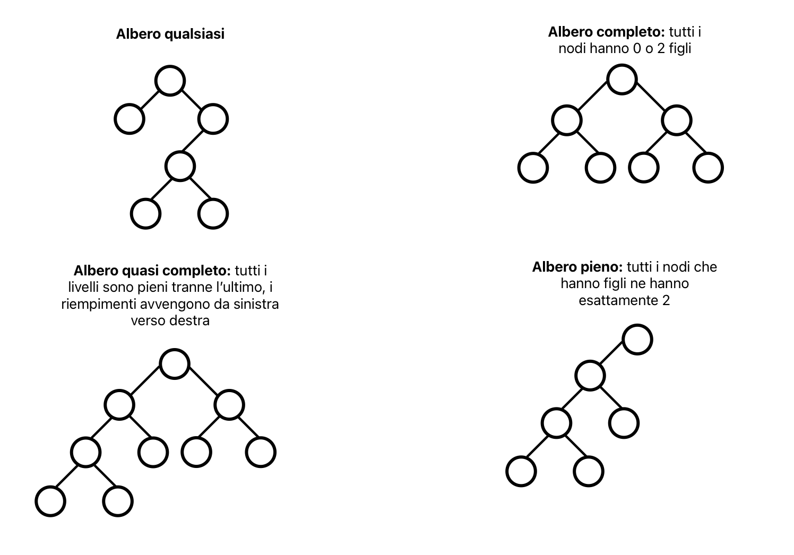
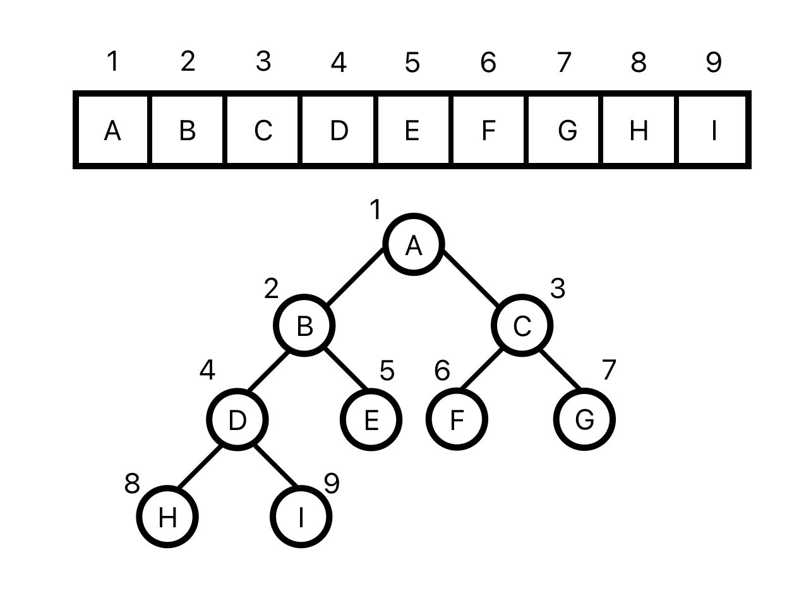
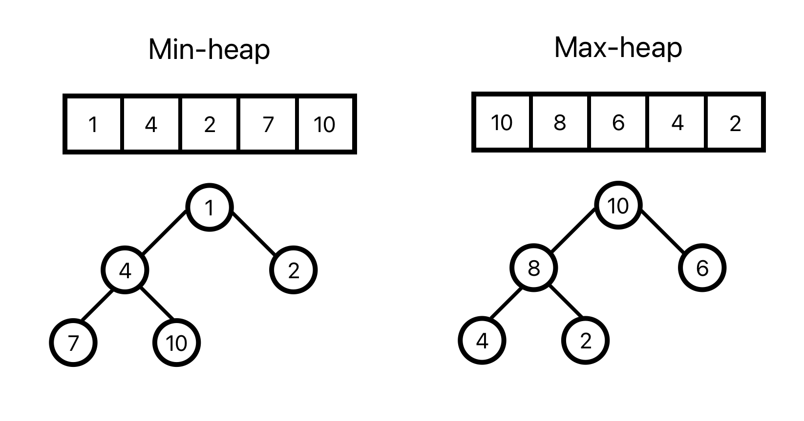

# Heap, HeapSort, Code di Priorità

## Heap
Le heap sono strutture dati astratte necessariamente compatte (basata su array), parzialmente basate sull'ordinamento, mantiene le chiavi semi-ordinate

Utilizzo: 
- come base per implementare **code di priorità** (struttura dati astratta)
- algoritmi di ordinamento **heapSort**, risolve i problemi di:
    - MergeSort -> non in place
    - QuickSort -> tempo quadratico nel caso peggiore

## Heap binarie su array
**(min/max) heap** -> Array H visto come un albero binario quasi completo

```pseudocode
typedef struct {
    int H[..];
    int length;
    int heapsize;
} Heap
```



**Caratteristiche**:
- i nodi dell'albero sono gli elementi dell'array
- `H[1]` -> la radice dell'albero
- `H.length` -> lunghezza massima raggiungibile
- `H.heapsize` -> dimensione corrente
- 0 ≤ `H.heapsize` ≤ `H.length`
- la Heap è un array, da non confondere con l'albero binario che viene usato solo come rappresentazione visuale e per terminologia (radice, nodi, altezza)

Convenzioni:
- **altezza**: altezza dell'albero (`H.length`)
- **radice**: primo elemento dell'array (`H[1]`)
- **nodo**: elemento dell'array (`H[i]`)

```pseudocode
proc Parent(i) {
    return i/2 // divisione intera
}
```

```pseudocode
proc Left(i) {
    return 2*i
}
```

```pseudocode
proc Right(i) {
    return 2*i + 1
}
```



- max-heap: il valore della chiave di un elemento è sempre maggiore di quella di entrambi i suoi figli (`H[Parent(i)]` ≥ `H[i]`)  
- min-heap: il valore della chiave di un elemento è sempre minore di quella di entrambi i suoi figli (`H[Parent(i)]` ≤ `H[i]`)
- altezza: lunghezza del cammino più lungo (numero di archi) dalla radice a una foglia

Esempio di min-heap e max-heap:




Relazione tra la cardinalità di una heap e l'altezza:
```
    |    h    |     min     |     max     |
    |---------|-------------|-------------|
    |    0    |      1      |      1      |
    |    1    |      2      |      3      |
    |    2    |      4      |      7      |
    |    .    |      .      |      .      |
    |    .    |      .      |      .      |
    |    .    |      .      |      .      |
    |    h    |     2^h     | 2^(h+1) - 1 |
```
2^h ≤ n ≤ 2 h+1 − 1 ⇒ 2 h ≤ n < 2 h+1 ⇒ h ≤ log(n) < h + 1  
Quindi, dalla prima si ottiene che h ≤ log(n) cioè h = O(log(n)), e dalla
seconda che h > log(n) − 1 cioè h = Ω(log(n)). Pertanto h = Θ(log(n))

```pseudocode
proc MinHeapify (H, i) {
    l = Left(i)
    r = Right(i)
    smallest = i
    if ((l ≤ H.heapsize) and (H[l] < H[i]))
        then smallest = l
    if ((r ≤ H.heapsize) and (H[r] < H[smallest]))
        then smallest = r
    if smallest 6 = i {
        then
        SwapValue(H, i, smallest)
        MinHeapify(H, smallest)
    }
}

```

tail ricorsione di MinHeapify: una funzione è in tail ricorsione se l'ultima operazione è la chiamata ricorsiva (si comportacome un'iterazione)

proprietà di MinHeapify:
- **terminazione**: termina per due motivi: se i non cambia durante un'esecuzione o se è diventato più grande della dimensione della heap
- **correttezza**: se i figli sono heap e l'elemento è minore di entrambi allora l'heap è corretto
- **complessità**: considerazioni costo:
    - costo dipende dall'altezza h del nodo su cui viene chiamata -> O(h)
    - pertanto il costo massimo è O(numero di ) -> $\Theta(log(n))$
    - ma queste considerazioni nascondono la vera struttura
    - voglio comunuqe scrivere il costo in termini di ricorrenza
    - $T(n) = T(\frac{2}{3} n) + O(1)$ -> $\Theta(log(n))$ per Master Theorem caso 2

Costruzione min-heap:
```pseudocode
proc BuildMinHeap(H) {
    H.heapsize = H.length
    for (i = H.length/2 downto 1) MinHeapify(H, i)
}
```
i = H.length/2  -> primo indice dove ha senso chiamare MinHeapify

Proprietà di BuildMinHeap:
- **terminazione**: terminazione ovvia per il ciclo for
- **correttezza**: se i figli sono heap e l'elemento è minore di entrambi allora l'heap è corretto
- **complessità**: almeno $\frac{1}{2}\Theta(n)$

## HeapSort:
```pseudocode
proc HeapSort(H) {
    BuildMinHeap(H)
    for (i = H.length downto 2) {
        SwapValue(H, i, 1)
        H.heapsize = H.heapsize - 1
        MinHeapify(H, 1)
    }
}
```
algoritmo di ordinamento in place non stabile con complessità $\Theta(n \cdot log(n))$

## Code di Priorità:
Struttura dati astratta basata su ordinamento e necessariamente compatta (con allocazione vicina come array) dove viene associata ad ogni elemento una chiave (priorità) ed estrae l'elemento con priorità minima