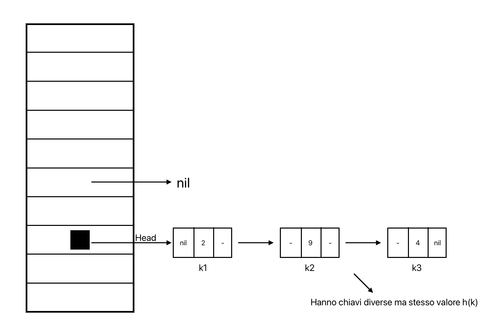

# Tabelle Hash
Le tabelle hash sono strutture dati astratte, dinamiche, parzialmente compatte e non basate sull'ordinamento

Uso: dato un numero di oggetti **relativamente piccolo**, ognuno dei quali è denotato da una chiave con universo **relativamente grande**, si vuole memorizzare in maniera dinamica gli oggetti e implementare operazioni di inserimento, cancellazione, ricerca

La tabella hash ad accesso diretto (uso di array) ha ottime complessità ($\Theta(1)$ per tutte le operazioni) ma solo se l'universo è piccolo -> si cercano soluzioni migliori

Essendo il numero di chiavi effettivamente utilizzate molto minore rispetto a quelle possibili, si può creare una **funzione di hash** che mappi le chiavi in un intervallo di indirizzamento più piccolo

T = array di m posizioni  
Problema: memorizzare una chiave k molto più grande di m  
Soluzione: funzione di hash che indirizza l'elemento k alla posizione h(k)  
Problema 2: conflitti -> quando `k1` ≠ `k2` ma `h(k1)` = `h(k2)`  
Soluzioni:  
1. chaining -> in ogni cella della tabella c'è un puntatore alla testa di una lista
2. open hashing -> provare più posizioni finchè non se ne trova una libera o se la tabella è piena

## Tabelle Hash con Chaining
Tecnica che risolve i conflitti di una tabella hash usando un puntatore alla testa di una lista in ogni cella (testa memorizzata in `T[h(k)]`, quando è vuota punta a `nil`)



### Operazioni
```pseudocode
proc HashInsert (T, k) {
    let x be a new node with key k
    i = h(k)
    ListInsert(T[i], x)
}
```
complessità: nel caso peggio ->  $\Theta(1)$

```pseudocode
proc HashSearch (T, k) {
    i = h(k)
    return ListSearch(T[i], k)
}
```
complessità: nel caso peggiore -> $\Theta(n)$

```pseudocode
proc HashDelete (T, k) {
    i = h(k)
    x = ListSearch(T[i], k)
    ListDelete(T[i], x)
}
```
complessità: nel caso peggiore -> $\Theta(n)$

Caso peggiore: si ha quando tutti gli elementi vanno nella stessa cella  
Caso medio: si ha quando gli elementi sono distribuiti uniformemente

Il caso medio dipende dalla funzione di hash, cioè quanto bene la funzione distribuisce le chiavi sulle m posizioni  
Ipotizzando di avere **hashing uniforme semplice** (distruzione uniforme degli elementi sulle chiavi), h inserisce una chiave k in una posizione della tabella con la stessa probabilità con la quale la inserisce in una qualsiasi altra posizione, con o senza altre chiavi  
Probabilità che una chiave k vada in una posizione i è `P(h(k) = i)` $= \frac{1}{m} \space \forall \space i \in \{1,...,m\}$

## Funzioni di hash per il chaining
- metodo della divisione: garantisce uniforme semplicità quando m è primo (h(k) = k mod m+1)
- metodo della moltiplicazione: garantisce uniformità quando m è una potenza di 2 (h(k) = floor(m(k*A - floor(k*A) ))+1)
- metodo dell'addizione: quando le chiavi sono stringhe (conversione in ASCII e somma dei valori)
- mid square: h(k) = le R cifre centrali del numero $k^2$

```pseudocode
proc HashComputeModulo (w, B, m) {
    let d = |w|
    z[0] = 0
    for (i = 1 to d) z[i+1] = ((z[i] * B) a[i]) mod m
    return z[d] + 1
}
```

## Open hashing
Tecnica che elimina le liste quindi il chaining  
- sequenza di probing -> provare più di una posizione sulla tabella finchè non si trova una posizione libera o la tabella è piena
hashing uniforme -> tutte le posizioni della tabella devono essere provate

### Operazioni
```pseudocode
proc OaHashInsert (T, k) {
    i = 0
    repeat {
        j = h(k, i)
        if T[j] = nil {
            then
            T[j] = k
            return j
        }
        else i = i + 1
    } until (i = m)
    return “overflow”
}
```

```pseudocode
proc OaHashSearch (T, k) {
    i = 0
    repeat {
        j = h(k, i)
        if T[j] = k
            then
            return j
        else i = i + 1
    } until (T[j] = nil or i = m)
    return nil
}
```
