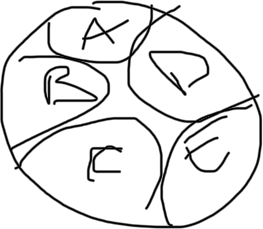
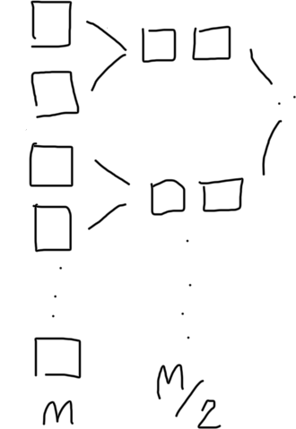

# Strutture per insiemi disgiunti

Sono una struttura dati astratta, parzialmente dinamica, parzialmente sparsa, non basata sull'ordinamento

Caratteristica principale -> operazioni ad esso associate sono:
- **MAKE-SET()**: crea un nuovo insieme disgiunto
- **UNION()**: unisce due insiemi disgiunti
- **FIND-SET()**: restituisce un rappresentante dell'insieme al quale appartiene un'elemento

Ogni insieme è dotato di un elemento rappresentativo, detto rappresentante  
Gli insiemi crescono in due modi
- quando vengono creati gli insiemi
- quando vengono uniti due insiemi

Visualizzazione astratta di un insieme di insiemi disgiunti e la sua evoluzione

dopo un'operazione di unione (es. union(a, b))

dopo un certo numero di unioni potrei essere arrivato qui


Esempio numerico:  
$S_1 = \{5, 12, 50\}$  
$S_2 = \{7\}$  
$S_3 = \{13, 2\}$  
ognuno di essi può essere rappresentato da uno dei suoi elementi e vogliamo l'informazione sull'insieme stesso ma non ha una struttura interna quindi $S$ ha almeno un array con tutte queste chiavi

## Insiemi disgiunti: liste
Uso di liste collegate per gestire $S$  
S $\in S$ è una lista con:
- S.head
- S.tail
ogni elemento x è dotato di:
- x.next
- x.head


l'informazione che contiene ogni $S$[i] è un puntatore a i (casella x che contiene la chiave i) -> $S$[i].set


- MakeSet(x) -> crea nuovo oggetto S (S.head = S.tail = x) quindi costa $O(1)$
- FindSet(x) -> restituisce il rappresentante dell'insieme di x (dato x, si cerca prima x.head poi x.head.head) -> $O(1)$
- Union(x, y) -> unisce due insiemi in uno già esistente ed eliminando l'altro (es. Union(5, 7) -> $S_1 = \{5, 12, 50, 7\}, S_3 = \{13, 2\}$) -> $\Theta(n)$

## Operazioni con insiemi disgiunti
```pseudocode
proc MakeSet (calS, S, x, i) {
    calS[i].set = x
    S.head = x
    S.tail = x
}
```

```pseudocode
proc FindSet (x) {
    return x.head.head
}
```

```pseudocode
proc Union (x, y) {
    S1 = x.head
    S2 = y.head
    if (S1 ≠ S2) {
        then
        S1.tail.next = S2.head
        z = S2.head
        while (z ≠ nil) {
            z.head = S1
            z = z.next
        }
        S1.tail = S2.tail
    }
}
```

## Complessità -> Analisi ammortizzata
Calcolare il costo medio di un'operazione su un insieme di insiemi disgiunti piuttosto che il costo per operazione

nell'implementazione con liste il caso peggiore si ha quando le operazioni iniziano con n MakeSet seguite da n-m Union nel peggior ordine possibile

1. non ci sono findSet
2. tutte le unionsono n-1 -> m = 2*n-1

la prima union costa 1, la 2 costa 2, ..., fino all'ultima che costa n -> totale è $\Theta(n^2)$

sapendo che m operazioni di cui n sono MakeSet() danno il caso peggiore nella situazione vista prima e che in quella situazione, m = 2n-1 = $\Theta(n)$, il costo medio ammortizzato di un'operazione è $\frac{\Theta(n^2)}{\Theta(n)} = \Theta(n)$

## Insiemi disgiunti: liste con unione pesata (strategia o euristica)
un euristica é una strategia migliorativa, non una implementazione diversa ha un effetto soprattutto dal punto di vista pratico  
un algoritmo euristico é un algoritmo che da una soluzione non ottimale ad un problema la cui soluzione ottimale esiste e lo si fa per scelta per evitare il costo computazionale che avrebbe avuto quella esecuzione

Se si mantengono in ogni insieme S anche il numero degli elementi dell'insieme (rank) -> si può implementare Union() perchè gli aggiornamenti dei puntatori si facciano sempre sull'insieme più piccolo

```pseudocode
proc MakeSet (calS, S, x, i) {
    calS[i].set = x
    S.head = x
    S.tail = x
    S.rank = 0
}
```

```pseudocode
proc Union (x, y) {
    S1 = x.head
    S2 = y.head
    if (S1 ≠ S2) {
        then
        if (S2.rank > S1.rank) {
            then SwapVariable(S1, S2)
        }
        S1.tail.next = S2.head
        z = S2.head
        while (z ≠ nil) {
            z.head = S1
            z = z.next
        }
        S1.tail = S2.tail
        S1.rank = S1.rank + S2.rank
    }
}
```

nell'implementazione con lista e unione per rango il caso pessimo occorre qunado uniamo sempre liste della stessa lunghezza


1. la prima costa n, la seconda n/2, la terza n/4, ..., l'ultima 1 -> costo totale per arrivare a una sola lista è $\Theta(n)$
2. costo totale delle $\Theta(n)$ unioni è $\Theta(n \cdot log(n))$

allora so che le n operazioni sono distribuite tra:  
n (MakeSet) + $\Theta$ (findSet) + $\Theta(n)$ (Union) è costante

$\Theta(n)$ + $\Theta(n)$ + $\Theta(n \cdot log(n)) = \Theta(n \cdot log(n))$

## Insiemi disgiunti: foreste di alberi
nella rappresentazione a foresta di alberi gli elementi vivono come prima nelle strutture S e sono puntati in un albero  
i rank sono i limiti superiori dell'altezza dell'albero


nodo x (elemento) ha informazioni:
- x.p -> padre
- x.rank -> rango


nodo di un albero k-ario non ha nessun puntatore ai figli  

poichè gli alberi k-ari hanno una struttura libera è facile implementare l'unione

### Complessità
$O(m \cdot \alpha(n))$ con $\alpha(n)$ funzione inversa di Ackermann che cresce lentamente (tanto da essere costante) quindi il costo è $O(m)$