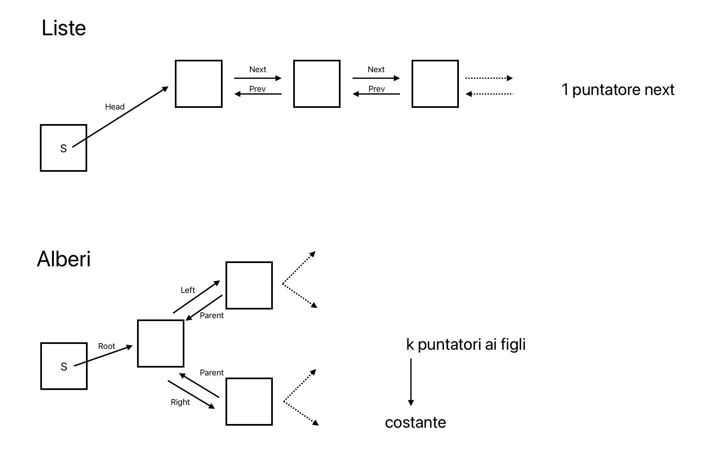

# Alberi
Gli alberi sono strutture dati dinamiche, sparse e, secondo l'uso che ne viene fatto, possono essere basate sull'ordinamento o meno.

Gli alberi generalizzano le liste ma se ne fa un uso diverso.

