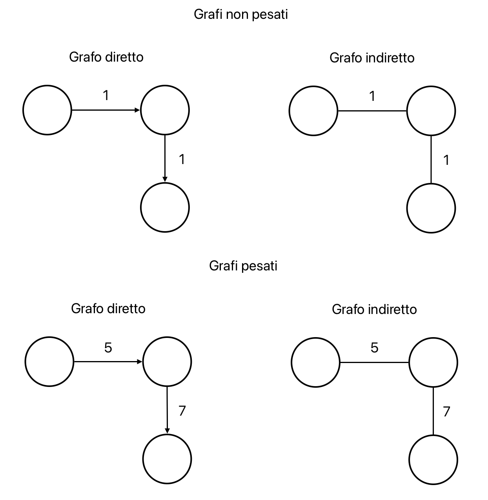
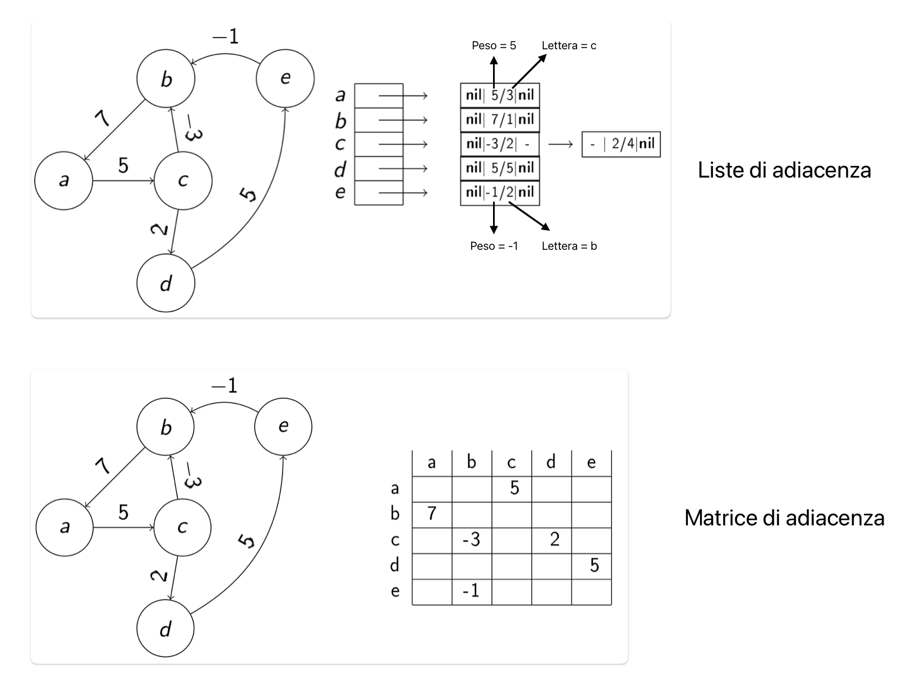

# Grafi
I grafi sono strutture dati **statiche**, sparse o compatte e non basate sull'ordinamento.  
Il fatto di essere statiche comporta che non ci siano operazioni di inserimento o cancellazione di elementi.

Un grafo è una tripla G = (V, E, W) dove:
- V = insieme di vertici
- E $\sube$ V x V = insieme di archi
- W: E $\to$ R = funzione che assegna un peso ad ogni arco

Se da un vertice u si può raggiungere un vertice v --> u ⇝ v

Gradi di un grafo:
- **Grado entrante**: numero di archi entranti in un vertice
- **Grado uscente**: numero di archi uscenti da un vertice

Proprietà **statiche** di un grafo:
- **Diretto**: gli archi sono orientati
- **Indiretto**: gli archi non sono orientati
- **Pesato**: gli archi hanno un peso (W non costante)
- **Non pesato**: gli archi non hanno un peso (W costante -> G = (V, E))

Proprietà **dinamiche** di un grafo:
- **Sparso**: |E| << |V|$^2$ --> numero di archi molto minore rispetto al numero di vertici
- **Denso**: |E| ≈ |V|$^2$ --> numero di archi simile al numero di vertici

Rappresentazione di un grafo:
- **liste di adiacenza**: si usa un'array `Adj[1, ..., |V|]` dove ogni elemento punta ad una lista (preferibile per grafi sparsi)
- **matrice di adiacenza**: si usa una matrice `A[1, ..., |V| x 1, ..., |V|]` dove `A[u,v] = w` e w è il peso dell'arco (preferibile per grafi densi)

## Trattamento di un algoritmo su grafo
- `u.att` = indica un attributo `att` associato con un vertice v (es. colore, tempo di risposta, ...)

Per calcolare le complessità bisogna tenere conto di E e V presi singolarmente e nei casi peggiori si avrà:
- $\Theta(|V| + |E|)$
- $O(|V| + |E|)$