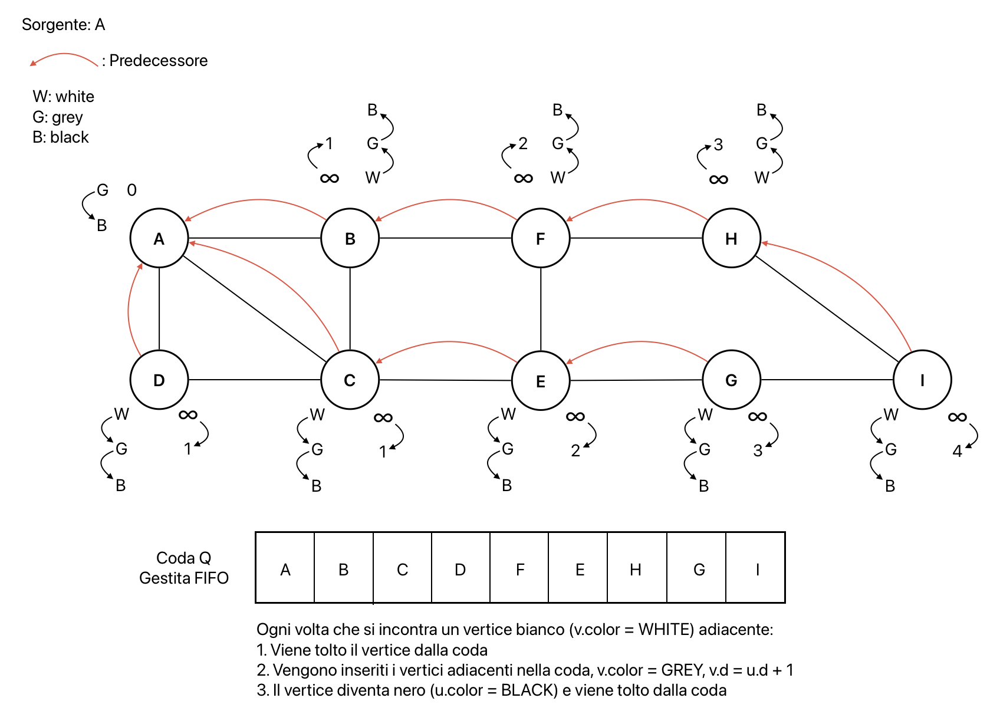

# Grafi: visita in ampiezza
È dato un grafo G = (V, E) diretto o indiretto, non pesato, ed un vertice sorgente s $\in$ V  
**Obiettivo**: conoscere quanti archi sono necessari per raggiungere qualunque altro vertice (raggiungibile) da s  
**Soluzione**: si usa una visita di G in ampiezza (BFS - Breadth First Search)

## BFS - Breadth First Search
Esplorazione degli archi di G e scoperta di nuovi vertici raggiungibili da quelli conosciuti.  
Si usano i colori bianco, grigio e nero:
- **bianco**: vertice non ancora scoperto, tutti i vertici sono bianchi all'inizio tranne s che è grigio
- **grigio**: vertice scoperto
- **nero**: quando tutti i vertici adiacenti sono stati scoperti

Attributi usati per ogni vertice u $\in$ V:
- `u.color`: colore del vertice
- `u.d`: distanza minima in numero di archi da s a u
- `u.π`: predecessore di u nel cammino minimo da s a u

L'algoritmo computa la distanza minima in numero di archi tra s ed ogni vertice scoperto e produce un albero di visita in ampiezza con tutti i vertici raggiungibili da s


```pseudocode
proc BreadthFirstSearch(G, s) {
    // inizializzazione
    for (u in G.V \ {s}) {
        u.color = WHITE
        u.d = infinity // distanza ancora sconosciuta
        u.π = Nil // predecessore ancora sconosciuto
    }
    s.color = GREY
    s.d = 0
    s.π = Nil
    Q = vuoto
    Enqueue(Q, s)
    // algoritmo di visita
    while (Q != vuoto) {
        u = Dequeue(Q)
        for (v in G.Adj[u]) {
            if (v.color == WHITE) {
                v.color = GREY
                v.d = u.d + 1
                v.π = u
                Enqueue(Q, v)
            }
        }
        u.color = BLACK
    }
}
```



**Distanza più corta** da v a s ($\delta$(s,v)): numero minimo di archi che sono necessari per raggiungere v da s

**Proprietà**:
1. $\delta$(s, s) = 0
2. $\delta$(s, v) = $\infty \longleftrightarrow$ v non è raggiungibile da s
3. per ogni coppia di vertici v,u t.c. esiste un arco (u, v) --> $\delta$(s, v) $\leq$ $\delta$(s, u) + 1

**Correttezza**: dopo l'esecuzione, per ogni v raggiungibile da s, v.d = $\delta$(s, v) e se v ≠ s, almeno uno dei percorsi più brevi da s a v si ottiene dal cammino più breve da s a v.π + l'arco (v.π, v)
- **caso base**: v = s -> all'entrata in Q s.d = 0 = $\delta$(s, s)
- **caso induttivo**: v scoperto da u quindi già in Q -> u.d ≥ $\delta$(s, u) quindi v.d = u.d + 1 e v.d ≥ $\delta$(s, u)

**Complessità**: per algoritmi su grafi si usa l'analisi aggregata (si guarda il numero di elementi/archi)
- **grafo connesso**: $\Theta(|V| + |E|)$
- **grafo non connesso**: $O(|V| + |E|)$ perchè potrebbero non vedersi tutti gli archi
- **grafo denso**: $\Theta(|V|^2)$ ma si accetta anche $\Theta(|V| + |E|)$