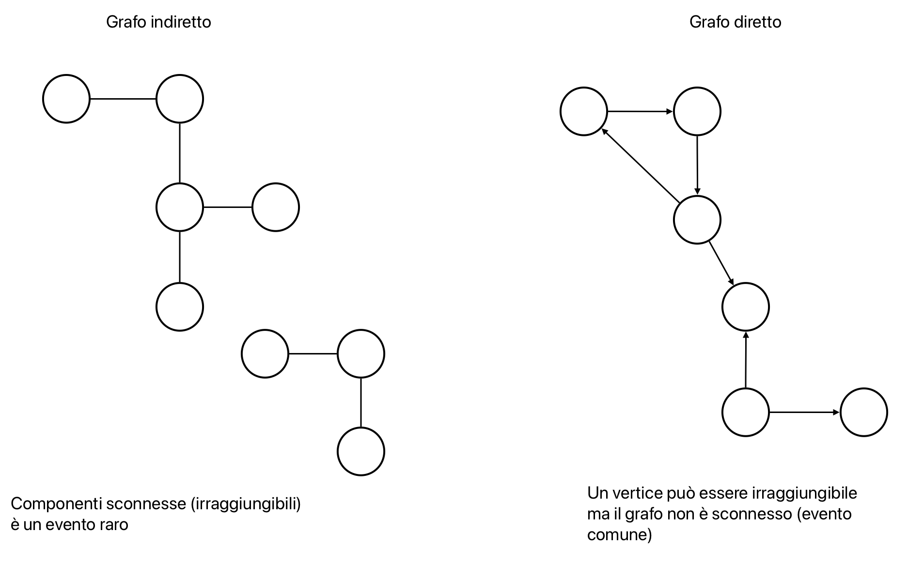
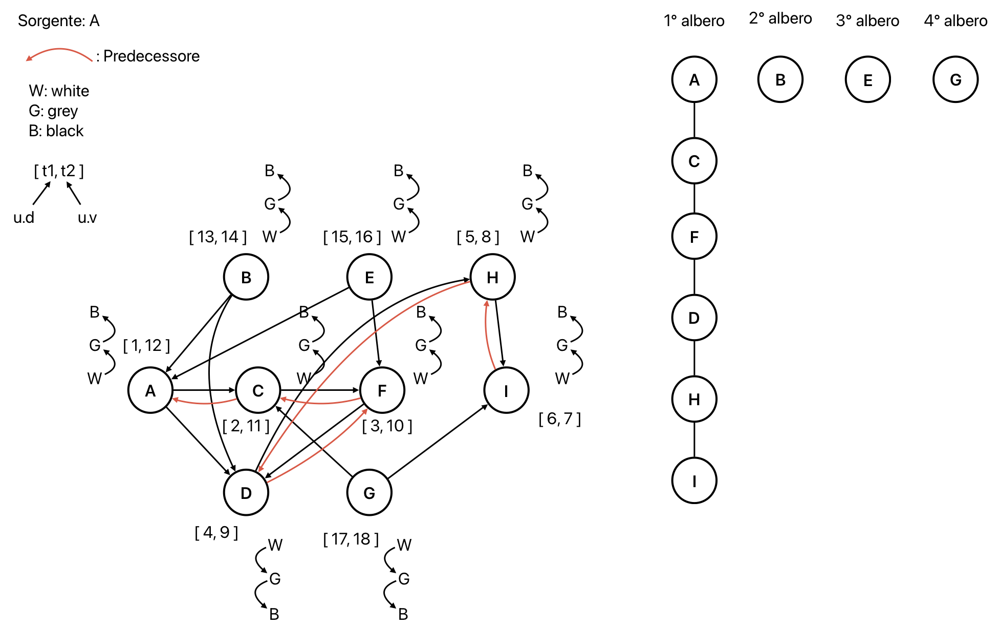
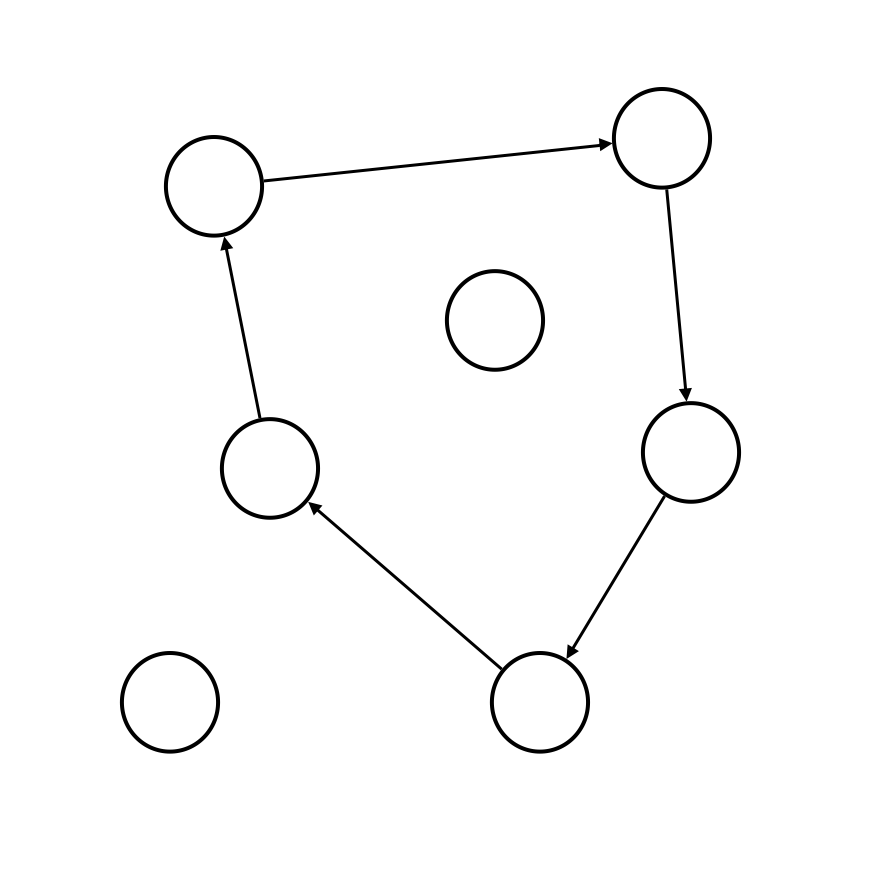
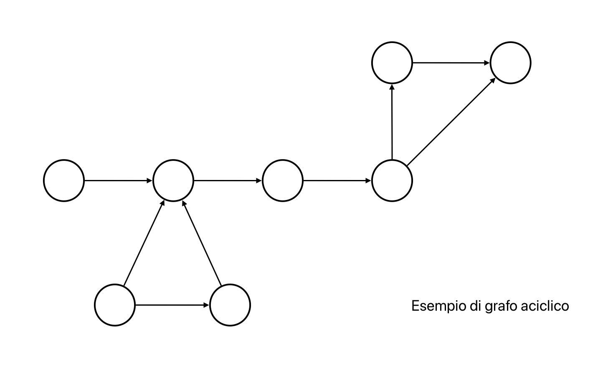
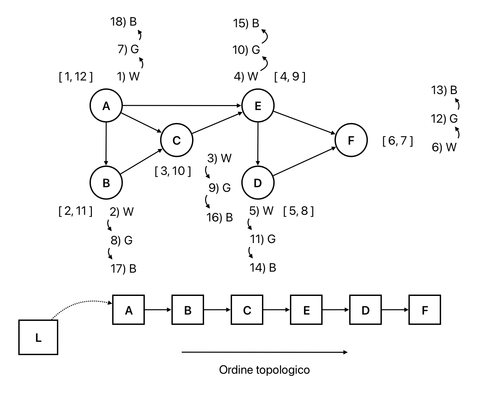
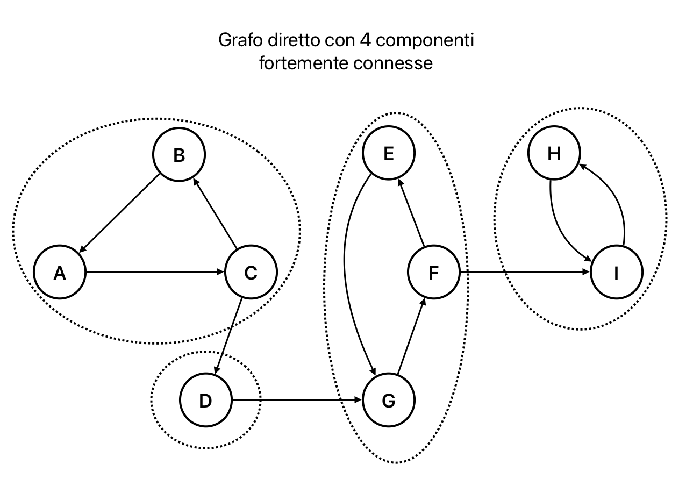
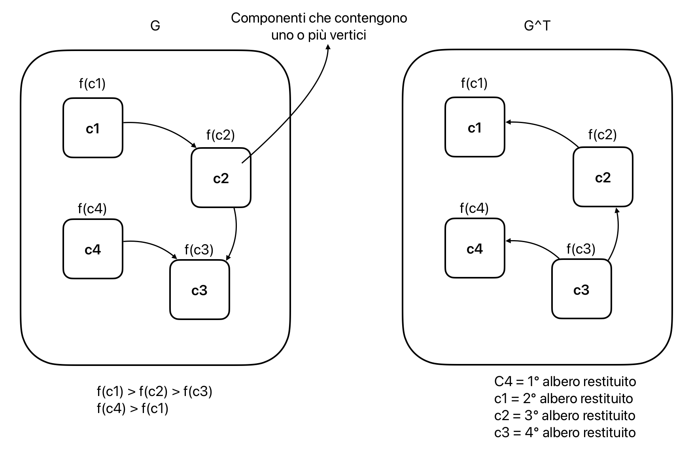

# Grafi: visita in profondità
Si considera un grafo G = (V, E) e se questo è diretto si può visitare in maniera diversa per avere informazioni più utili.

Con la visita in profondità si riescono a risolvere i seguenti 3 problemi (per grafi diretti):
1. stabilire se G è ciclico (se contiene almeno un ciclo)
2. costruire un ordinamento topologico di G (elencare tutti i vertici in modo che ogni vertice v è elencato solo se tutti i vertici dai quali v si può raggiungere sono già stati elencati)
3. conoscere ed enumerare tutte le componenti fortemente connesse di G (elencare tutti i sottoinsiemi tali che ogni vertice in ogni sottoinsieme raggiunge ogni altro vertice in quel sottoinsieme)



## Visita in profondità
**Obiettivo**: scoprire tutti i vertici raggiungibili da ogni potenziale sorgente s  
**Output**: foresta di alberi, uno per ogni sorgente

**Differenza con la visita in ampiezza**: i vertici vengono scoperti il prima possibile a partire da quelli già scoperti (è ricorsiva)

**Ricorda che**:
- G è un grafo diretto e i grafi sono statici
- la struttura dati che li memorizza permette di scrivere informazione utile alla visita

**Assunzioni**:
- G rappresentato con liste di adiacenza
- `u.color` -> colori per distinguere i vertici ancora da scoprire e quelli già scoperti
- `v.π` -> predecessore di v
- `v.d` -> momento della scoperta di v
- `v.f` -> momento di abbandono di v (tutto il sotto-grafo è stato scoperto)
- campi `v.d` e `v.f`:
    - interi tra 1 e 2•|V|
    - chiamati tempi (di scoperta e di abbandono)
    - ogni nuovo evento (scoperta o abbandono) provoca un incremento di tempo

```pseudocode
proc DepthFirstSearch (G)
    for (u in G.V) {
        u.color = WHITE
        u.π = Nil
    }
    time = 0
    for (u in G.V) {
        if (u.color == WHITE)
            DepthVisit(G, u)
    }
```

```pseudocode
proc DepthVisit (G, u) {
    time = time + 1
    u.d = time
    u.color = GREY
    for (v in G.Adj[u]) {
        if (v.color == WHITE) {
            v.π = u
            DepthVisit(G, v)
        }
    }
    u.color = BLACK
    time = time + 1
    u.f = time
}
```



Ogni volta che `DepthVisit(G, u)` viene chiamata in `DepthFirstSearch(G)` si scopre un nuovo albero della foresta.

**Complessità**: 
- `for (u in G.V)` -> $\Theta(|V|)$
- `for (u in G.V) con DepthVisit(G, u)` -> $\Theta(|V| + |E|)$
- `for (v in G.Adj[u])` -> $\Theta(|E|)$
- Complessità totale: $\Theta(|V| + |E|)$

## Grafi diretti: cicli
Ciclo: percorso di vertici `v[1], v[2], ..., v[k]` t.c $\forall$ `i` $\exists$ l'arco (v[i], v[i+1]) e v[1] = v[k]

Grafo diretto senza cicli = DAG (Directed Acyclic Graph)



### Cycle detection
Dato un grafo diretto G, l'algoritmo stabilisce se G contiene almeno un ciclo.
1. Si esegue `DepthFirstSearch(G)` modificato in modo che si interrompa se visita un nodo grigio
2. Restituisce `true` se visita un nodo grigio, `false` altrimenti

```pseudocode
proc CycleDet (G)
    cycle = false
    for (u in G.V)
        u.color = WHITE
    for (u in G.V) {
        if (u.color == WHITE)
            DepthVisitCycle (G, u)
    }
    return cycle
```

```pseudocode
proc DepthVisit (G, u) {
    u.color = GREY
    for (v in G.Adj[u]) {
        if (v.color == WHITE)
            DepthVisitCycle(G, v)
        // se nodo nero -> vado avanti
        // se nodo grigio -> ciclo e mi fermo
        if (v.color == GREY)
            cycle = true
    }
    u.color = BLACK
}
```

**Correttezza**: l'algoritmo è corretto solo se restituisce True se G è ciclico altrimenti False.
- caso G ciclico: qualnque nodo si prenda (per ipotesi si visitano tutti i nodi), se c'è un ciclo viene trovato dall'algoritmo e deve restituire True
- caso G aciclico: non ci sono cicli quindi è impossibile incontrare un nodo grigio e l'algoritmo deve restituire False

**Osservazioni**:
- controllare nodi neri non funziona
- controllare nodi grigi durante BFS non funziona

## Grafi diretti: ordinamento topologico
Su grafi aciclici si può costruire un ordinamento topologico dei vertici.  
Ordinamento topologico: restituire un ordinamento dei vertici t.c. nessun vertice viene listato prima di un altro dal quale si può accedere  
Esempio: il grafo rappresenta delle task che devono essere eseguite in ordine



### Topological sort
Prende in input un grafo connesso G diretto senza cicli  
Restituisce una lista collegata `v[1], ..., v[|V|]` di vertici topologicamente ordinati  
Per ogni coppia di vertici `v[i], v[j]`, `v[i]` si trova nella lista di `v[j]` prima di `v[j]` solo se `v[i]` precede topologicamente `v[j]`

Algoritmo:
1. Si chiama `DepthFirstSearch(G)` per calcolare i tempi di scoperta `v.d` e abbandono `v.f` $\forall$ v $\in$ G.V
2. Ogni nodo finito v (`v.color = BLACK`) viene inserito alla testa di una lista collegata
3. Restituire la lista collegata

```pseudocode
proc TopologicalSort (G)
    for (u in G.V)
        u.color = WHITE
    L = Nil
    time = 0
    for (u in G.V) {
        if (u.color == WHITE)
            DepthVisitTS (G, u)
    }
    return L
```

```
proc DepthVisitTS (G, u) {
    time = time + 1
    u.d = time
    u.color = GREY
    for (v in G.Adj[u]) {
        if (v.color == WHITE)
            DepthVisit(G, v)
    }
    u.color = BLACK
    time = time + 1
    u.f = time
    ListInsert(L, u)
}
```



**Correttezza**: un arco (u, v) è tale che u precede v in G.

## Grafi diretti: componenti fortemente connesse
**Componente fortemente connessa (SCC)**: su un grafo diretto G è un sottoinsieme massimale V' $\subseteq$ V t.c. $\forall$ u, v $\in$ V' esiste un cammino da u a v (u ⇝ v) e da v a u (v ⇝ u)

Esempio: studiando la SCC di un elemento della rete sociale, si possono trovare suggerimenti da fornire per nuovi legami.



**Grafo trasposto**: $G^T$ di G è ottenuto invertendo la direzione di ogni arco (complessità $\Theta(|V| + |E|)$)

L'importanza del grafo trasposto è data dal fatto che G e $G^T$ hanno le stesse SCC.

### Strongly connected components
1. Si chiama `DepthFirstSearch(G)` per calcolare i `v.f` $\forall$ v $\in$ G.V
2. Si calcola il grafo trasposto $G^T$
3. Si chiama `DepthFirstSearch(G^T)`, dove nel ciclo principale si considerano i vertici in ordine decrescente di `u.f`
4. Restituisce la lista degli alberi di visita dell'ultimo passaggio -> ogni albero è SCC

```pseudocode
proc StronglyConnectedComponents (G) {
    for (u in G.V) {
        u.color = WHITE
        u.π = Nil
    }
    time = 0
    for (u in G.V) {
        if (u.color == WHITE)
            DepthVisit(G, u)
    }
    time = 0
    L = Nil
    for (u in G^T.V in reverse finish time order -> u.f) {
        if (u.color == WHITE)
            DepthVisit(G^T, u)
        ListInsert(L, u)
    }
    return L
}
```



**Complessità**: $\Theta(|V| + |E|)$