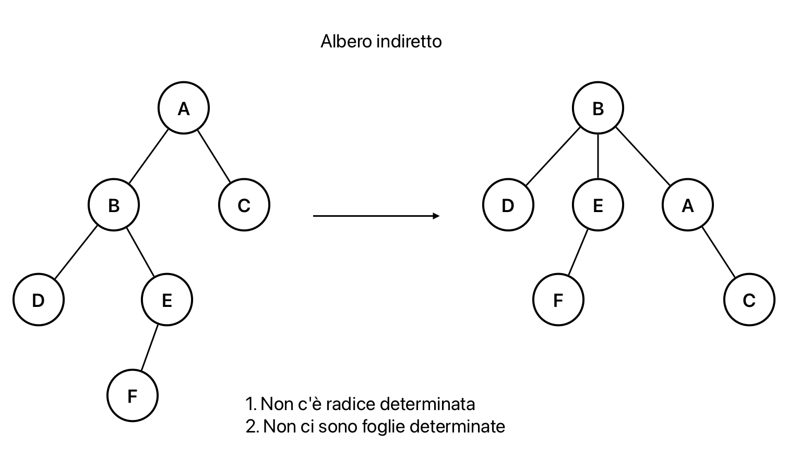
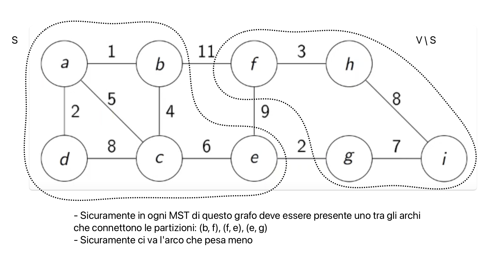
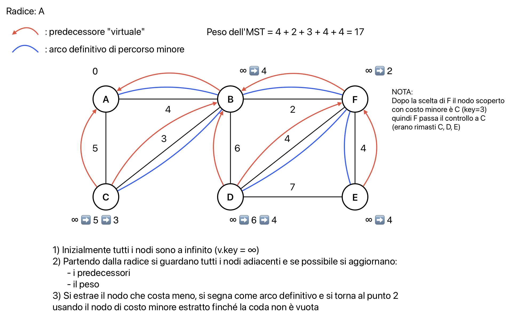
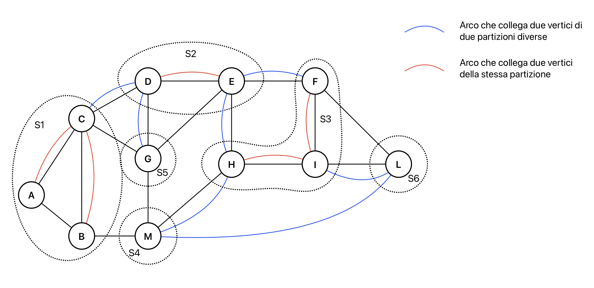
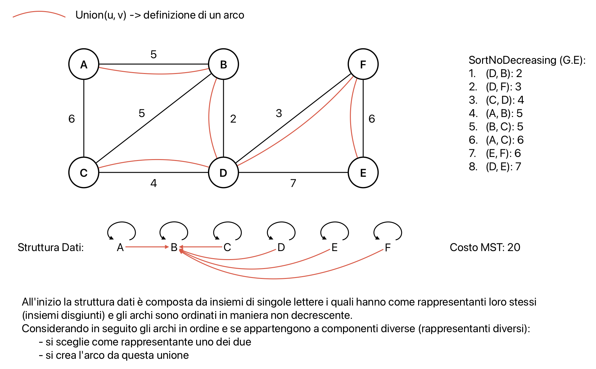

# Grafi e alberi di copertura minima
Si lavora su grafi pesati indiretti connessi rappresentati con G = (V, E, w)  
Esempi di utilizzo:
- rete di connessioni informatiche tra computer, dove il peso di ogni arco è il costo di connessione
- rete di distribuzione, dove i trasporti possono essere bidirezionali e il peso di ogni arco è il costo di trasporto

**Obiettivo**: trovare un percorso che minimizzi il costo

**Alberi di copertura minima (MST)**: sottoinsieme di archi che forma un albero indiretto, che copre tutti i vertici, e la cui somma dei pesi è minima

**Strategia usata**: algoritmi greedy -> fare ad ogni passo una scelta localmente ottimale in modo da ottenere una soluzione globalmente ottimale

**Caratteristiche alberi indiretti**:
- tutti i nodi possono essere radice
- tutti i nodi con un solo arco insistente possono essere foglie
- una volta determinata la radice si determinano le foglie



**Proprietà MST (Minimum Spanning Tree)**:
- è un insieme di archi t.c. formano un albero indiretto che tocca tutti i nodi del grafo
- eliminando un arco qualsiasi si ottengono due alberi sconnessi (taglio del grafo)
- se ci sono archi di peso uguale si possono avere più MST, altrimenti è unico



**Correttezza del taglio di un arco**:
1. Si prende un grafo e si partiziona in S e V\S dove si ha l'arco di peso minimo (a, b) che collega le due partizioni.
2. Si prende poi un il grafo ma con un arco qualsiasi (u, v) che anch'esso collega le due partizioni.
3. L'albero che si crea con (u, v) pesa di più di quello con (a, b) e quindi non è un MST.
4. L'arco (a, b) è chiamato **arco sicuro** di taglio (arco di peso minimo che attraversa due partizioni).

## Algoritmo di Prim
Parte da un vertice qualsiasi e ad ogni passo aggiunge un arco (ed un vertice) in modo che l'arco aggiunto sia un arco sicuro.  
**Struttura dati necessaria**: coda di priorità per mantenere gli archi in ordine di peso.

Ogni vertice di G ha due campi in più:
- `v.key` = peso minimo, inizializzato a ∞, degli archi che collegano qualche vertice di T con v
- `v.π` = vertice padre di v , inizializzato a Nil, nel MST risultante

Inizialmente tutti i vertici si trovano nella coda Q in maniera sparsa tranne la radice r che ha chiave 0

```pseudocode
proc MST-Prim (G, w, r) {
    // inizializzazione
    for (v in G.V) {
        v.key = ∞
        v.π = Nil
    }
    r.key = 0
    // costruzione coda
    Q = G.V
    while (Q ≠ vuoto) {
        u = ExtractMin(Q)
        // aggiorna la coda
        for (v in G.Adj[u]) {
            if ( (v in Q) and (w(u, v) < v.key) ) {
                v.π = u
                v.key = w(u, v) // -> DecreaseKey(Q, v)
            }
        }
    }
}
```

`v.π = Nil` e `v.π = u` codificano il risultato poichè indicano la direzionalità



**Correttezza**: si definisce T come l'insieme di tutte le coppie (v.π, v) con v.π definito e v $\notin$ Q  
**Invariante**: T è sempre sottoinsieme di qualche MST
- **caso base**: T è vuoto -> insieme vuoto è sottoinsieme di ogni insieme quindi anche di un MST di G
- **caso induttivo**: si considera T in ad un certo punto e T' = T ∪ {(v.π, v)} insieme ottenuto dopo una esecuzione del ciclo while:
    1. S = insieme di tutti i vertici coperti da T
    2. (S, V\S) è un taglio di G
    3. l'arco (v.π, v) è un arco sicuro di questo taglio

**Complessità**: dipende dal costo delle operazioni della coda Q (ExtractMin e DecreaseKey) la quale si può implementare in due modi:
1. uso di array senza ordine:
    - costruzione coda: $\Theta(|V|)$
    - estrazione del minimo: $\Theta(|V|)$
    - decremento: $\Theta(1)$
    - per i grafi densi si ha:
        - inizializzazione: $\Theta(|V|)$
        - costruzione coda: $\Theta(|V|)$
        - estrazione del minimo: $\Theta(|V^2|)$
        - decremento: $\Theta(|V^2|)$
        - totale: $\Theta(|V^2|)$
2. uso di heap binaria:
    - costruzione coda: $\Theta(|V|)$
    - estrazione del minimo: $\Theta(\log(|V|))$
    - decremento: $\Theta(\log(|V|))$
    - per i grafi sparsi con heap binaria si ha:
        - inizializzazione: $\Theta(|V|)$
        - costruzione coda: $\Theta(|V|)$
        - estrazione del minimo: $\Theta(|V| \cdot \log(|V|))$
        - decremento: $\Theta(|E| \cdot \log(|V|))$
        - totale: $\Theta(|E| \cdot \log(|V|))$
    - per i grafi densi con heap binaria si ha:
        - estrazione: $\Theta(|V^2| \cdot \log(|V|))$
        - resto uguale

Soluzione migliore per la complessità: il caso peggiore si ha con un grafo denso e per minimizzare il danno si usa una coda senza struttura però la scelta heap binaria è migliore di array senza ordine

## Algoritmo di Kruskal
**Idea dell'algoritmo**:
1. ordinare gli archi in ordine crescente di peso
2. analizzarli uno ad uno in questo ordine
3. stabilire se inserirli o meno nell'MST

T = insieme di archi scelti fino ad un certo punto  
A differenza di MST-Prim, in MST-Kruskal T non è obbligatoriamente un albero in ogni momento ma lo sarà sicuramente alla fine.

Un sottoinsieme S di V è **T-connesso** se (considerando solo archi in T):
- è un albero
- è massimale



**Taglio generalizzato**:  
Componenti T-connesse di V: S1, S2, ..., Sn  
La tupla (S1, S2, ..., Sn) generalizza il concetto di taglio  
Un arco (u, v) attraversa il taglio (S1, S2, ..., Sn) se u $\in$ Si e v $\in$ Sj con i $\neq$ j quindi se u e v appartengono a componenti diverse T-connesse

**Struttura dati necessaria**: insiemi disgiunti per garantire che un arco scelto attraversi il taglio  
Operazioni:
- MakeSet: costruisce un nuovo insieme (una componente T-connessa)
- FindSet: stabilisce se due elementi appartengono allo stesso insieme (se appartengono alla stessa componente T-connessa)
- Union: unisce due insiemi in uno solo (unisce due componenti T-connesse in una sola -> conseguenza di aver scelto un arco)

```pseudocode
proc MST-Kruskal (G, w) {
    T = vuoto
    for (v in G.V) 
        MakeSet(v)
    // ordina gli archi di G.E in ordine non decrescente di peso
    SortNoDecreasing(G.E)
    for ( (u, v) in G.E - in order) {
        if (FindSet(u) ≠ FindSet(v)) {
            T = T ∪ {(u, v)}
            Union(u, v)
        }
    }
    return T
}
```



**Correttezza**: con il primo MakeSet vengono già creati gli insiemi S1, S2, ..., S|V| e costituiscono un taglio generalizzato, poi si dimostra l'invariante:  
**Invariante**: ogni arco che viene aggiunto nel ciclo è un arco sicuro
- **caso base**: poichè gli archi sono prima ordinati il primo arco scelto è di peso minimo e sicuramente attraversa il taglio
- **caso induttivo**: si considerano due vertici (u, v) con rappresentanti diversi:
    - se FindSet dei due vertici è diverso, essi devono avere il rappresentante diverso per creare l'arco
    - se FindSet dei due vertici è uguale, i due vertici sono nello stesso insieme e l'arco non viene creato

**Complessità**: si distingue tra grafi densi e grafi sparsi e molto dipende dalle operazioni di insiemi disgiunti:
- grafi densi:
    - inizializzazione: $O(1)$
    - ordinamento: $\Theta(|E| \cdot \log(|E|)) = \Theta(|V|^2 \cdot \log(|E|)) = \Theta(|V|^2 \cdot \log(|V|))$
    - MakeSet: $O(|V|)$
    - diverse operazioni: $O(|V| + |E|)$
    - totale: $\Theta(|V|^2 \cdot \log(|V|))$
- grafi sparsi:
    - inizializzazione: $O(1)$
    - ordinamento: $\Theta(|E| \cdot \log(|E|))$
    - MakeSet: $O(|V|)$
    - diverse operazioni: $O(|V| + |E|)$
    - totale: $\Theta(|E| \cdot \log(|E|))$