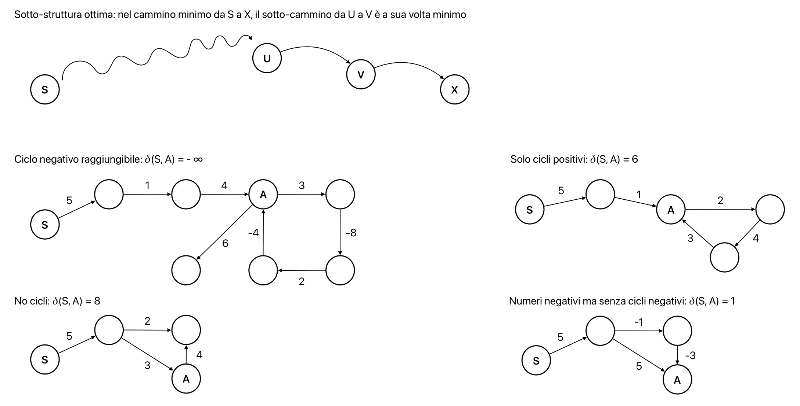
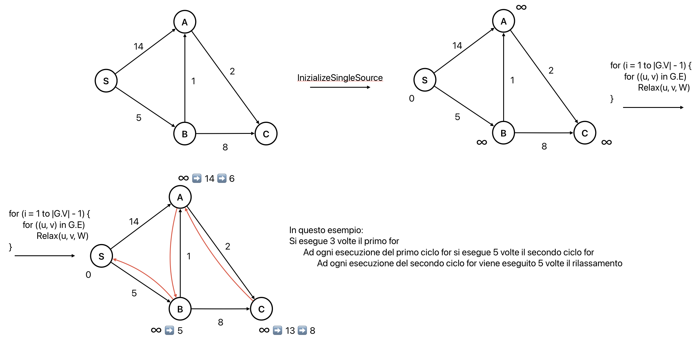
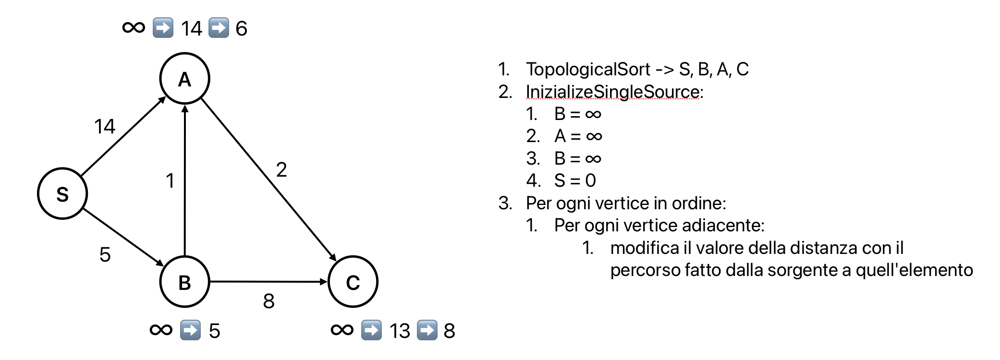
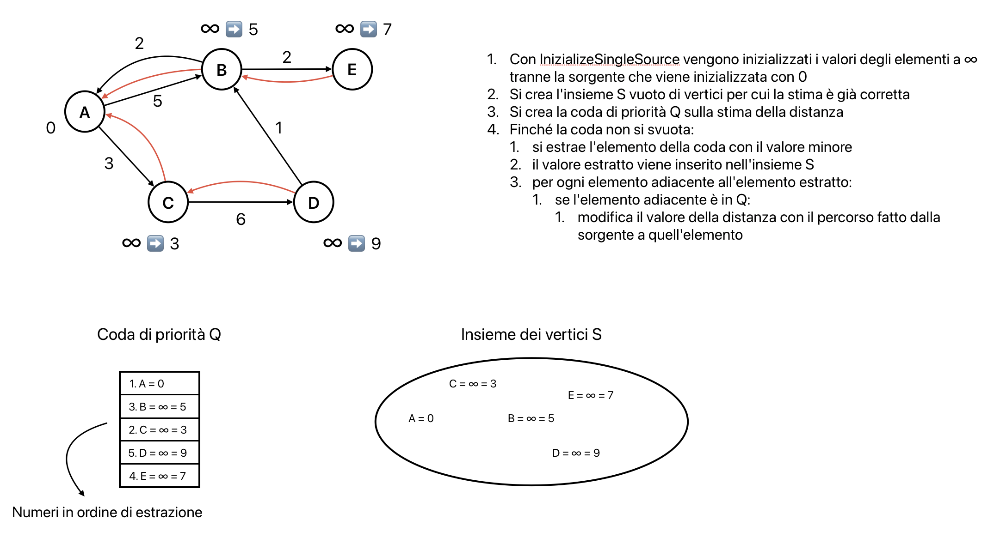

# Grafi: percorsi minimi con sorgente singola
È dato una grafo diretto, pesato e connesso G = (V, E, W) e un vertice s  
**Obiettivo**: trovare per ogni v $\in$ V il percorso di peso minimo da s a v



Dato un percorso minimo, tutti i suoi sotto percorsi sono anch'essi minimi  
Esempio: se il percorso tra S e X è un percorso minimo allora necessariamente il percorso tra U e V è un percorso minimo

Se ci sono pesi negativi:
- percorso minimo privo di senso
- percorso minimo esistente ma non gestito per alcuni algoritmi

**Ruolo dei cicli sui percorsi minimi**:
- se ha un ciclo negativo -> percorso minimo privo di senso e $\delta$(S, A) = - $\infty$
- se un vertice A è irraggiungibile da S (con o senza cicli) -> $\delta$(S, A) = + $\infty$
- se ha un ciclo positivo -> si elimina il ciclo per ottenere un nuovo percorso minimo

**Quindi un percorso minimo è sempre aciclico, indipendentemente dalla presenza o meno di cicli nel grafo**

Output di ogni algoritmo per grafi diretti, pesati e senza cicli negativi -> albero dei cammini di peso minimo (creazione dei percorsi dati da `v.π` per ogni vertice `v` $\in$ V\{s})

## Tecnica di rilassamento
Dato un arco (u, v) si testa se la stima su `v.d` (peso del percorso minimo) può essere migliorata dall'arco (u, v).  
Questa stima su `v.d` deve prima essere inizializzata.

```pseudocode
proc InizializeSingleSource (G, s) {
    for (v in G.V) {
        v.d = ∞
        v.π = Nil
    }
    s.d = 0
}
```

```pseudocode
proc Relax (u, v, W) {
    if (v.d > u.d + W(u, v)) {
        v.d = u.d + W(u, v)
        v.π = u
    }
}
```

Esempio: se il percorso minimo è `v.d = 10` e l'arco W(u, v) ha peso 5, allora `v.d = 5` e `v.π = u`

Questi due algoritmi vengono usati in ogni seguente algoritmo

## Algoritmo di Bellman-Ford
È l'algoritmo più generale di tutti.  
Input: pesi negativi e cicli negativi  
Output:
- se non ci sono cicli negativi raggiungibili da `s` restituisce i percorsi minimi ed i loro pesi
- se `s` nel raggiungere un vertice trova un ciclo negativo restituisce `false`

```pseudocode
proc BellmanFord (G, s) {
    // algoritmo vero e prorpio
    InizializeSingleSource(G, s)
    for (i = 1 to |G.V| - 1) {
        // rilassamento degli archi |V| - 1 volte
        for ((u, v) in G.E)
            Relax(u, v, W)
    }
    // controllo esistenza cicli negativi
    for ((u, v) in G.E) {
        if (v.d > u.d + W(u, v))
            return false
    }
    return true
}
```



**Complessità**: $\Theta(|V| \cdot |E|)$ cioè $O(|V|^3)$

**Correttezza**: si vuole dimostrare che:
- se G non ha cicli negativi -> $\forall$ v raggiungibile da s si ha che `v.d` = $\delta$(s, v) (peso "reale" di cammino minimo tra s e v) e l'algoritmo restituisce `true`
    - **Invariante**: dopo `i` esecuzioni del ciclo più esterno, `v[i].d` = $\delta$(s, v[i])
    - **caso base**: dopo 0 tentativi, `v[0] = s` t.c. `v[0].d = 0` = $\delta$(s, v[0]) -> conseguenza di `InizializeSingleSource`
    - **caso induttivo**: dopo `i-1` iterazioni, si ha come ipotesi induttiva `v[i-1].d` = $\delta$(s, v[i-1]). Poichè all'`i-esima` iterazione si rilassano tutti gli archi, si rilassa anche l'arco (v[i-1], v[i]) ma dopo ogni rilassamento il valore di `v[i].d` non può cambiare perchè è già minimo
- se G ha un ciclo negativo raggiungibile da s -> l'algoritmo restituisce `false`

## Percorsi minimi in grafi aciclici
In questo caso si può usare un'ottimizzazione dell'algoritmo di Bellman-Ford **per i grafi aciclici** ovvero DAGShortestPath.  
Questo prevede che un grafo aciclico può essere ordinato topologicamente (se precede v in un percorso minimo allora u precede v topologicamente)

```pseudocode
proc DAGShortestPath (G, s) {
    // ordinamento topologico
    TopologicalSort(G)
    InizializeSingleSource(G, s)
    for (u in G.V - in order) {
        for (v in G.Adj[u])
            Relax(u, v, W)
    }
}
```



**Complessità**: si può ricorrere all'analisi aggregata:
- ordinamento topologico: $\Theta(|V| + |E|)$
- rilassamento: $\Theta(|V| + |E|)$ -> V volte perchè il primo for viene eseguito |V| volte mentre E volte il secondo for perchè si scorrono al massimo tutti gli archi
- totale: $\Theta(|V| + |E|)$

**Correttezza**:
- **Invariante**: v deve essere raggiungibile da s, per un percorso minimo qualsiasi `s = v[0], v[1], ..., v[k] = v`, allora dopo l'`i`-esima escuzione del ciclo, si ha `v[i].d` = $\delta$(s, v[i])
- **caso base**: `s = v` e `v.d = 0` -> s non può raggiungere sè stesso quindi nessun arco da rilassare
- **caso induttivo**: siccome i vertici sono in ordine topologico, si ha che `v[i]` precede `v[j]` topologicamente se `i < j`. Quindi dopo il rilassamento di tutti gli archi uscenti da `v[i]` si ha che `v[j].d` = $\delta$(s, v[j]) perchè `v[i]` precede `v[j]` topologicamente

## Algoritmo di Dijkstra
Anche questo algoritmo è un'ottimizzazione dell'algoritmo di Bellman-Ford e prevede che **tutti i pesi degli archi siano tutti positivi o zero**.

```pseudocode
proc Dijkstra (G, s) {
    InizializeSingleSource(G, s)
    // insieme dei vertici per cui la stima è già corretta
    S = ∅
    // coda di priorità (sulla stima di distanza)
    Q = G.V
    while (Q ≠ ∅) {
        u = ExtractMin(Q)
        S = S ∪ {u}
        for (v in G.Adj[u]) {
            if (v in Q)
                Relax(u, v, W) // -> DecreaseKey(Q, v)
        }
    }
}
```



Come in MSTPrim, l'operazione di `Relax(u, v, W)` in realtà "nasconde" un `DecreaseKey(Q, v)` durante il cambio del valore di una chiave `v.d`.  
Questa operazione si applica solo ai vertici ancora nella coda Q.  
Dopo `InitializeSingleSource` il vertice `s` è il primo ad essere estratto dalla coda Q poichè `s.d = 0`.  
Nessun operazione inserisce elementi in Q, quindi il while viene eseguito $|V|$ volte.

**Correttezza**:
- **Invariante**: all'inizio di ogni iterazione del while (quindi dopo ogni estrazione `u = ExtractMin(Q)`) si ha che `v.d` = $\delta$(s, v) per ogni `v` $\in$ S
- **caso base**: all'inizio `S = ∅` e `Q = G.V` -> `s.d = 0` = $\delta$(s, s)
- **caso induttivo**: l'ipotesi di non avere pesi negativi permette di affermare che se si ha un percorso minimo tra `s` e `u` e si aggiunge l'arco (u, v) allora si ha un percorso minimo tra `s` e `v` poichè tutti gli elementi precedenti sono già stati rilassati

**Complessità**: come per MSTPrim, si può implementare con array o heap binarie e si possono considerare i due casi di grafi densi e sparsi:
- **se grafo denso -> si usa una coda senza struttura**: 
    - inizializzazione: $\Theta(|V|)$
    - costruzione coda: $\Theta(|V|)$
    - estrazione del minimo: $\Theta(|V|^2)$
    - decremento: $\Theta(|E|) = \Theta(|V|^2)$
    - totale: $\Theta(|V|^2)$
- **se grafo sparso -> si usa una heap binaria**:
    - inizializzazione: $\Theta(|V|)$
    - costruzione coda: $\Theta(|V|)$
    - estrazione del minimo: $\Theta(|V| \cdot \log(|V|))$
    - decremento: $\Theta(|E| \cdot \log(|V|))$
    - totale: $\Theta(|E| \cdot \log(|V|))$