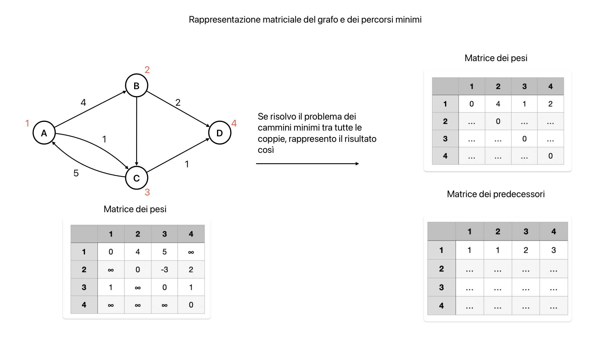
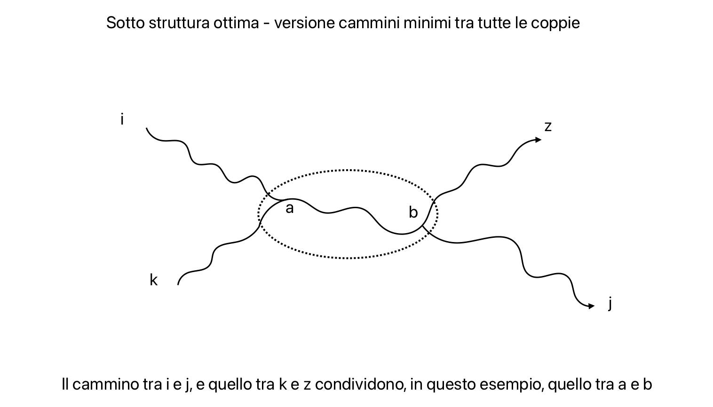
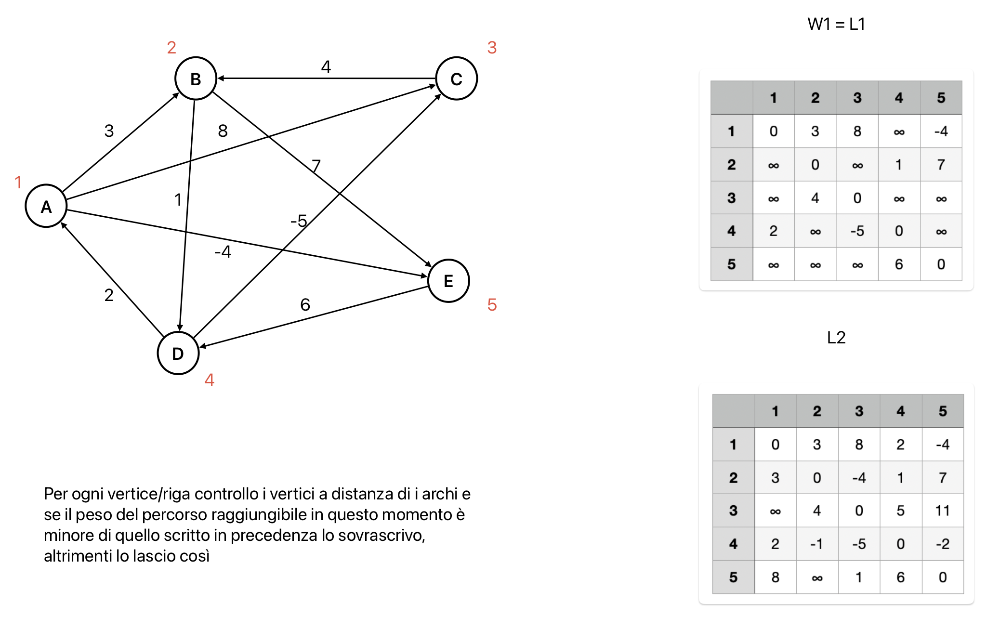
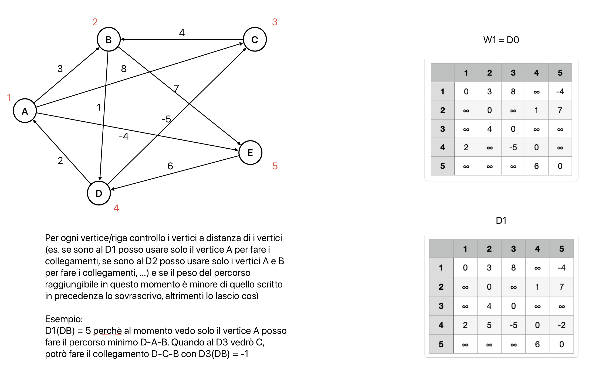

# Grafi: percorsi minimi tra tutte le coppie di vertici
È dato il grafo G = (V, E, W) pesato, diretto e connesso  
**Obiettivo**: trovare il percorso minimo per ogni coppia di vertici (nel caso in cui fossimo obbligati ad usare Bellman-Ford, quindi nel caso generale)

**Rappresentazione**: utilizzo della matrice delle distanze del grafo.  
Con questo tipo di rappresentazione il grafo G è rappresentato dalla matrice W di pesi.

**Risultato**:
- `D` -> matrice dei pesi
- `π` -> matrice dei predecessori (indicazione sul percorso minimo)





## Programmazione dinamica
Risolve in maniera efficiente un problema di ottimizzazione suddividendo dei problemi in sottoproblemi comuni.  
**Caratteristica della programmazione dinamica**: tutta la complessità di progettazione si accumula nella progettazione iniziale

## Algoritmo della moltiplicazione di matrici
Caratterizzazione della sottotruttura ottima basata su archi:  
- $L^m_{i j}$ = peso del cammino minimo tra il vertice `i` e il vertice `j` che si puó costruire usando al piú `m` archi
- $L^m_{i j} =$ p $\min(L^{m-1}_{i j}, \min_k(L^m_{i k} + W_{kj}))$ p $= \min_k(L^m_{i k} + W_{kj})$
- Struttura percorso minimo: i ----> k ----> j  
- $\min_k(L^m_{i k} + W_{kj})$ è la soluzione più conveniente usando k come ultimo predecessore

Esempio: il modo migliore per andare da `i` a `j` con al massimo due archi si trova cercando il modo migliore per andare da `i` a qualsiasi `k` e da `k` a `j` usando un solo arco (moltiplicazione tra una riga e una colonna)

### Algoritmo della moltiplazione di matrici: versione lenta
L'idea è di calcolare la matrice L per ogni numero di archi fino a n - 1 (numero di vertici - 1) e restituire la matrice L(n - 1) che contiene i pesi dei cammini minimi tra tutte le coppie di vertici.  
In questo algoritmo si guarda il numero di archi:
1. si prende il grafo e si guarda ogni vertice
2. per ogni vertice si guardano i vertici adiacenti **a distanza di i archi** dove i è l'`i`-esima esecuzione
```pseudocode
proc ExtendShortestPaths (L, W) {
    n = L.rows
    let L' be a new matrix
    for (i = 1 to n)
        for (j = 1 to n)
            L'ij = ∞
            for (k = 1 to n)
                L'ij = min{L'ij, Lik + Wkj}
    return L'
}
```

```pseudocode
proc SlowAllPairsMatrix (W) {
    n = L.rows
    L(1) = W
    for m = 2 to n - 1
        L(m) = ExtendShortestPaths(L(m-1), W)
    return L(n-1)
}
```



**Correttezza**: dopo $m - 1$ esecuzioni del ciclo più esterno, la matrice $L^m_{i j}$ contiene il peso del cammino minimo da `i` a `j` che usa al massimo `m` archi

**Complessità**: $\Theta(|V|^4)$

### Algoritmo della moltiplazione di matrici: versione veloce
L'idea è di calcolare la matrice L per ogni potenza di 2 fino a n - 1 (numero di vertici - 1) e restituire la matrice L(n - 1) che contiene i pesi dei cammini minimi tra tutte le coppie di vertici.
```pseudocode
proc ExtendShortestPaths (L, W) {
    n = L.rows
    let L' be a new matrix
    for (i = 1 to n)
        for (j = 1 to n)
            L'ij = ∞
            for (k = 1 to n)
                L'ij = min{L'ij, Lik + Wkj}
    return L'
}
```

```pseudocode
proc FasterAllPairsMatrix (W) {
    n = L.rows
    L(1) = W
    m = 1
    while (m < n - 1) {
        L(2m) = ExtendShortestPaths(L(m), L(m))
        m = 2m
    }
    return L(m)
}
```

**Complessità**: $\Theta(|V|^3 \cdot \log(|V|))$

## Algoritmo di Floyd-Warshall
Caratterizzazione della sottotruttura ottima **basata su vertici**: dati due vertici `i` e `j` e un insieme di vertici diversi da `i` e `j`, sul cammino minimo tra `i` e `j` potrebbero esserci altri vertici (vertici intermediari)

Nel cambiare il focus da numero di archi usabili a quali intermediari usare, si ha un algoritmo più efficiente:
- mi ricordo che i vertici sono ordinati 1, 2, ..., n
- caratterizzo il risultato parziale con "usando fino al vertice `k`-esimo"

Esempio di cammino minimo tra `i` e `j`:  
i ---> k ---> l ---> u ---> j  
k, l, u sono intermediari

**Notazione**: i ⇝1 j oppure i ⇝2 j -> cammino minimo passando, se serve, per i vertici 1 o 2

```pseudocode
proc FloydWarshall (W) {
    n = W.rows
    let D(0) = W
    for (k = 1 to n)
        let D(k) be a new matrix
        for (i = 1 to n)
            for (j = 1 to n)
                D(k)ij = min{D(k-1)ij, D(k-1)ik + D(k-1)kj}
}
```



**Osservazione**:
- il cammino minimo da `i` a `k` e quello da `k` a `j` non usano `k` come intermediario
- il numero dei vertici è minore del numero di archi quindi l'utilizzo di Floyd-Warshall è più efficiente perchè usa come sottostruttura ottima i vertici

**Complessità**: $\Theta(|V|^3)$