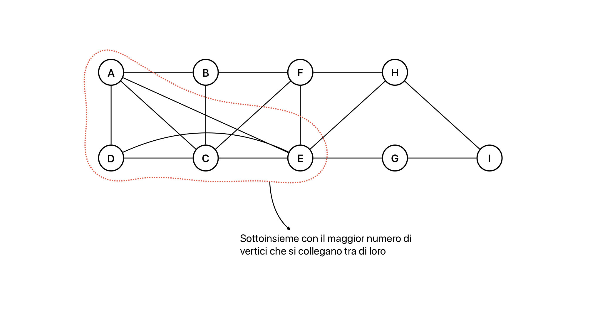
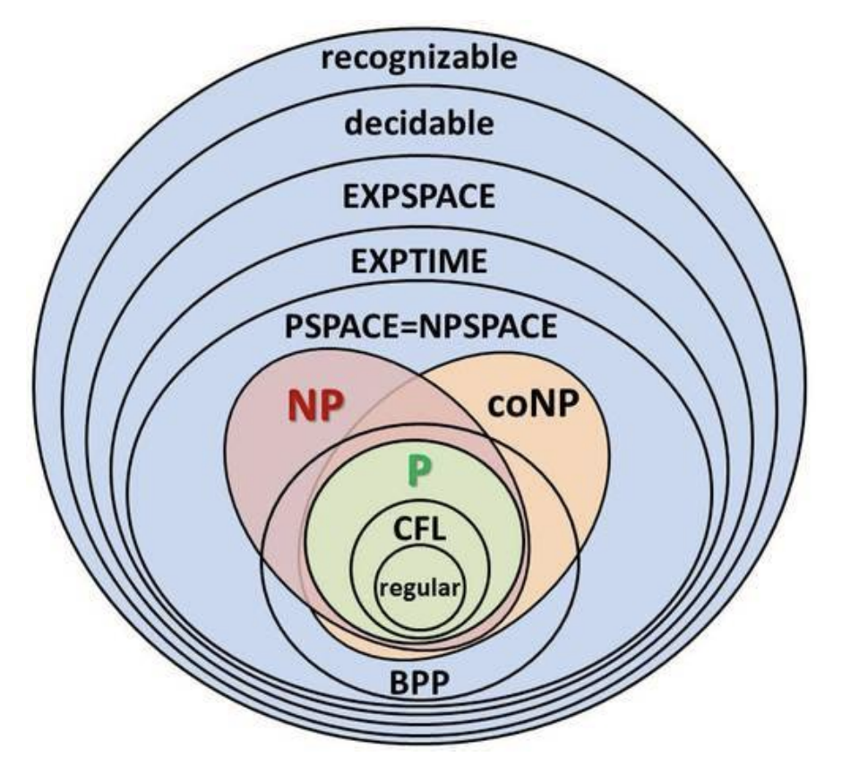

# Teoria della complessità: accenni ed esempi
Si considerano solo dei **problemi decisionali** (se output è {si; no}) e non generali.

## Classe P
In questo contesto esiste un insieme dei problemi:  
$P = \{problemi\ che\ possono\ essere\ risolti\ in\ tempo\ polinomiale\}$

Appartengono però tutti i problemi alla classe P?  
Si considera:
- un grafo indiretto non pesato G = (V, E)
- k-clique -> sottoinsieme di vertici di cardinaltà k t.c. per ogni coppia di vertici esiste un arco che li collega.

Si può dunque definire il problema di trovare la massima clique.

```pseudocode
proc kClique (G, k) {
    for (A in G.V, |A| = k) {
        Clique = true
        for (u, v in A) {
            if ((u, v) not in G.E)
                Clique = false
        }
        if (Clique = true)
            return true
    }
    return false
}
```



**Complessità**: $O(2^{|V|})$

Il problema della k-clique probabilmente non appartiene alla classe P.

## Classe NP
Dato un grafo G con un insieme di vertici, sarebbe difficile stabilire se si tratta di una k-clique?  
$NP = \{problemi\ la\ cui\ soluzione\ può\ essere\ verificata\ in\ tempo\ polinomiale\}$  
$P \subseteq NP$

```pseudocode
proc kCliqueCheck (G, A, k) {
    if (|A| != k)
        return false
    Clique = true
    for (u, v in A) {
        if ((u, v) not in G.E)
            Clique = false
    }
    if (Clique = true)
        return true
    return false
}
```

**Complessità**: $O(k^2)$

Sono infinitamente di più i problemi che non appartengono alla classe NP di quelli che vi appartengono.  
Un problema in particolare che non appartiene alla classe NP è il problema della geografia generalizzata.

### Problema della geografia generalizzata
Sono dati:
- un grafo G = (V, E), diretto, non pesato
- un vertice c ∈ V

Regole gioco:  
Due giocatori (I e II) si alternano al gioco, al quale comincia I, e consiste, ad ogni turno, nello scegliere un vertice non ancora usato e connesso a quello attuale; il giocatore che rimane senza mosse possibili perde, e l'altro vince.  
Il problema interessante in questo contesto è trovare una strategia vincente per un giocatore, diciamo I.  
**Strategia** = sequenza di mosse = sequenza di vertici.  
Una strategia è vincente se, seguendola, il giocatore vince qualunque cosa faccia l'altro.  
Per questo problema è conveniente supporre che G sia rappresentato con liste di adiacenza.

```pseudocode
proc HasIWinningStrategy (G, p, v) {
    if (p = I) {
        Wins = false
        for (u in G.Adj[v]) {
            if (u.mark = false) {
                u.mark = true
                Wins = Wins or not HasIWinningStrategy(G, II, u)
                u.mark = false
            }
        }
        return Wins
    }
    Wins = true
    for (u in G.Adj[v]) {
        if (u.mark = false) {
            u.mark = true
            Wins = Wins and HasIWinningStrategy(G, I, u)
            u.mark = false
        }
    }
    return Wins
}
```

**Funzionamento algoritmo**: se chiamato su un vertice v con p = I, restituisce true se esiste una mossa vincente per I  partendo da v

**Complessità**: $O(2^{|V|})$

## Classe PSPACE
Il problema della geografia generalizzata si trova nella classe di quei problemi la cui soluzione può essere trovata/vericata usando al massimo spazio polinomiale per la computazione.  
$PSPACE = \{problemi\ che\ possono\ essere\ risolti/verificati\ in\ spazio\ polinomiale\}$  
$NP \subset PSPACE$

