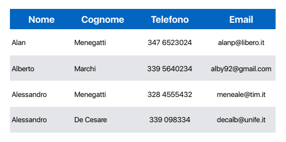

# Introduzione e Modellazione Concettuale

## Definizioni
- database -> insieme di dati correlati
- dati -> fatti che vengono memorizzati
- mini-mondo -> porzione del mondo reale che viene rappresentata nel database (es. voti di uno studente)
- DBMS (database management system) -> software che permetta la creazione e la gestione di database
- database system -> DBMS + dati nel database (a volte anche applicazioni per interagire con i dati)

## Tipi di database
- numerici e testuali
- multimediali
- geographic information system (GIS)
- data warehouse
- real-time and active

## Funzioni di un DBMS
- definire un database -> specificare tipi di dati, strutture e vincoli
- costruire un database -> popolare il database con dati
- manipolare un database -> query (domande per recuperare dati), aggiornamenti, modifiche e cancellazione dati, report
- condividere un database -> accesso concorrente a più utenti o applicazioni
- proteggere un database -> controllo degli accessi, protezione dei dati, backup e recovery
- operazioni sui dati -> funzioni per eseguire operazioni sui dati
- visualizzare i dati -> presentazione dei dati in diversi formati

Esempio di database -> rubrica telefonica

## Caratteristiche dell'approccio con database
### Natura autodescrittiva di un database system:
esistenza di un catalogo in cui il DBMS memorizza una descrizione (meta-data) del database per permettere al DBMS di lavorare con diversi database
### Isolamento (o indipendenza) tra programmi e dati:
poter cambiare la struttura del database o la memorizzazione dei dati senza dover cambiare i programmi che accedono al DBMS
### Astrazione dai dati:
uso di un modello di dati per nascondere i dettagli di memorizzazione e rappresentazione dei dati all'utente
### Supporto di viste (prospettive) multiple dei dati:
l'utente può vedere i dati in diverse prospettive a seconda delle sue esigenze
### Condivisione dei dati e gestione delle transazioni con utenti multipli:
utenti che accedono al database in modo concorrente con controllo degli accessi e delle transazioni (OLTP - online transaction processing, importante per i database)

## Utenti del database
possono essere:
### Attori sulla scena
utenti che usano e controllano il contenuto del database

- amministratori (autorizzare gli accessi, coordinare e monitorare l'uso e l'efficienza, acquistare sw e hw necessari)
- progettisti (progettare la struttura del database e comunicare con gli utenti finali e capire le necessità)
- utenti finali (chi usa il database)
    - utenti occasionali (esperti)
    - utenti parametrici (maggior parte)
    - utenti esperti (esperti che lo usano per esigenze proprie)
    - utenti indipendenti

### Lavoratori dietro le quinte
utenti che lavorano per la manutenzione del database ma non sono direttamente interessati

- progettisti ed implementatori del DBMS (creano funzionalità, interfacce, ecc.)
- sviluppatori di strumenti (creano strumenti per facilitare progettazione, controllo, comunicazione, prestazioni)
- operatori per la manutenzione (mentenere efficiente hw e sw per il DBMS)

## Vantaggi dei database
- ridondanza ridotta
- condivisione dati tra più utenti
- controllo degli accessi
- strumenti di memorizzazione efficienti per le query
- backup e recovery
- interfacce multiple per gli utenti
- rappresentazione di relazioni complesse tra i dati
- integrità dei dati
- standardizzazione dei dati
- tempi di sviluppoo ridotti
- flessibilità e scalabilità
- disponibilità di informazioni aggiornate

## Quando non usare un database
- costi eccessivi (acquisto di hw e sw, formazione, manutenzione, backup, recovery, sicurezza)
- non necessari (pochi utenti, velocità non garantite da un DBMS, dati semplici e non variabili nel tempo)
- database non sufficiente (dati troppo complessi, operazioni richieste dagli utenti non disponibili nel DBMS)