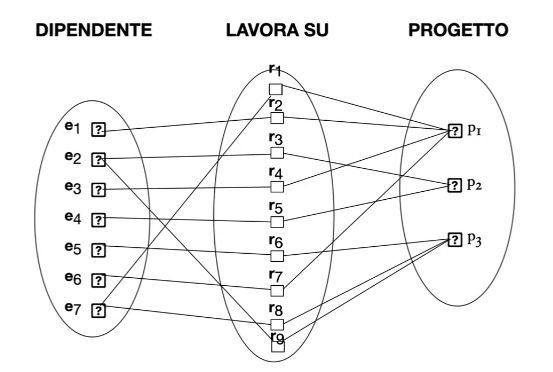
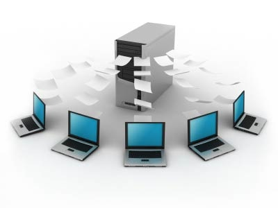
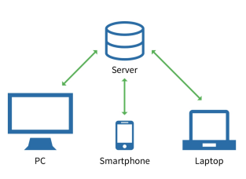
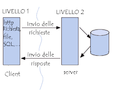
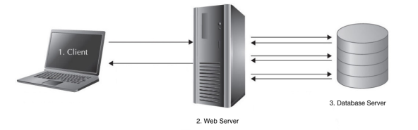

# Database System: Concetti ed Architettura

## Modelli dei dati
- modello dei dati -> insieme di concetti per descrivere la struttura di un database e i vincoli che deve rispettare
- operazioni del modello dei dati -> recuperi e aggiornamenti del database

### Categorie di modelli dei dati
- **concettuali** (high-level) -> concetti vicini alla percezione dei dati nel mondo reale (entità, oggetti)
- **fisico** (low-level) -> concetti che descrivono come i dati sono memorizzati nel computer
- **implementabili** (middle-level) -> concetti compresi dagli utenti non troppo distanti dall'organizzazione nel computer

## Schema vs Istanze vs Stato
- **schema** (o intensione) -> descrizione della struttura e dei vincoli da rispettare (non cambia spesso)
- diagramma di schema -> rappresentazione grafica dello schema
- costrutto dello schema -> componente o oggetto dello schema
- **istanza** -> dati effettivamente memorizzati in un database
- **stato** (o estensione) -> valore nel database in un certo momento (cambia ogni volta che il db viene aggiornato)
- stato iniziale -> database quando viene caricato
- stato valido -> stato che rispetta strutture e vincoli

## Architettura a 3 livelli
1. Supportare le caratteristiche di un DBMS
    - indipendenza tra programmi e dati
    - supporto di viste multiple d'utente
    - uso di catalogo per memorizzare metadati

2. Separare l'applicazione dell'utente dal database

3. Definire gli schemi del DBMS a 3 livelli
    - **schema interno** -> descrive la struttura fisica del database
    - **schema concettuale** -> descrive la struttura logica del database
    - **schema esterno** -> descrive la struttura di una vista dell'utente

Per gli schemi è necessaria una mappatura tra i livelli per trasformare le richieste ed i dati:

## Indipendenza dei dati
quando si cambia uno schema, gli altri non devono essere influenzati

- **indipendenza logica** -> cambiamenti dello schema logico senza influenzare gli schemi esterni
- **indipendenza fisica** -> cambiamenti dello schema fisico (interno) senza influenzare lo schema logico

## Linguaggi dei DBMS
- **DDL** (Data Definition Language) -> definizione dello schema logico (a volte anche per lo schema interno/esterno)
- Se schemi definiti separatamente:
    - **SDL** (Storage Definition Language) -> definizione dello schema interno (memorizzazione)
    - **VDL** (View Definition Language) -> definizione dello schema esterno (viste)
- **DML** (Data Manipulation Language) -> definire query e aggiornamenti (comandi incapsulati in linguaggi di programmazione (data sublanguage) o applicati direttamente (query language))
- **Linguaggi di alto livello** (non procedurali) -> specificano quali dati ceracre e come estrarli (linguaggi dichiarativi, SQL)
- **Linguaggi di basso livello** (procedurali) -> specificano come estrarre i dati, usano cicli, lavorano su un record per volta (C, Java, Python)

## Interfacce dei DBMS
- interfacce basete su:
    - menù con richieste composte da più step
    - app per mobile
    - moduli (form, comuni sul web)
- interfacce user-friendly (grafiche)
- lingua parlata (riconoscimento vocale, siri, alexa)
- parole chiavi (motori di ricerca)
- interfacce parametriche (richieste con parametri)
- interfacce per i DBA:
    - creare account
    - impostare autorizzazioni e parametri di sistema
    - modificare schemi o percorsi di accesso ai dati

## Database System Utilities
- caricare dati nel db
- fare il backup periodicamente
- riorganizzare la struttura del db
- monitorare le prestazioni
...

## Architettura centralizzate e Client-Server
- **DBMS Centralizzato** -> unico server, tutti i client si collegano a lui

- **DBMS Client-Server** -> server centrale, client si collegano a lui, server può collegarsi ad altri server

### Architettura Client-Server di base
- server specializzati (file, stampa, web, e-mail)
- client -> interfaccia utente che usa risorse del server, sono connessi al server tramite rete (LAN, wireless, ...), possono essere PC, smartphone, tablet, ... con installato solo il programma client
- DBMS server -> gestisce query e transazioni ai client

### Architettura Client-Server a 2 livelli per DBMS
- interfaccia utente e programmi applicativi eseguiti sulla macchina client
- l'interfaccia ODBC (Open Database Connectivity) permette di collegare il client al server tramite API (Application Programming Interface)
- un client può collegarsi a più DBMS

### Architettura Client-Server a 3 livelli
- usato per applicazioni web
- ha un livello intermedio (web server) che gestisce le richieste dei client e le inoltra al DBMS server e viceversa
- ha funzioni di sicurezza (cifratura dei dati prima della trasmissione e decrittazione sul client)

### Classificazione dei DBMS
- basata sul modello dei dati:
    - Legacy (reticolari, gerarchici)
    - Tradizionali (relazionali)
    - Emergenti (NOSQL, Key-Value, Document)
- altri criteri:
    - single-user vs multi-user
    - centralizzati (un pc con un db) vs distribuiti (più pc con più db)
