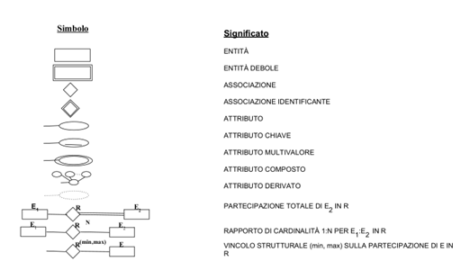

# Modellazione dei Dati mediante il Modello ER (Entity-Relationship o Entità-Associazione)

uso di Database "Azienda" come esempio

## Database Azienda

Richieste sintetiche dell'azienda (analisi requisiti):
- **Dipartimenti** (organizzazione dell'azienda) -> nome, codice, data di creazione, codice responsabile
- **Progetti** (ogni dipartimento controlla un numero di progetti) -> nome, codice, data di inizio, data di fine, budget, codice dipartimento
- **Dipendenti** -> nome, cognome, data di nascita, indirizzo, telefono, codice fiscale, stipendio, data assunzione, codice dipartimento

## Modello ER
Entità e Attributi:
- **Entità** -> oggetto del mondo reale (dipartimento, progetto, dipendente)
- **Istanza** -> singola occorrenza di un'entità (dipartimento "Vendite", progetto "Sviluppo App", dipendente "Mario Rossi")
- **Attributo** -> proprietà per descrivere un'entità (nome, cognome di un dipendente)
- **Valore** -> valore di un attributo per un'istanza (nome = 'Mario', cognome = 'Rossi', data di nascita = '01/01/1990')
- **Tipo di dati** -> insieme di valori per un attributo (stringa, numero (chiedersi se ci si può fare dei conti, se possibile è un numero altrimenti è una stringa))

## Tipi di Attributi
- **Semplici** -> non può essere suddiviso in parti più piccole (nome, cognome, CF, sesso)
- **Composti ()** -> può essere suddiviso in parti più piccole (indirizzo -> via, città, CAP)
- **Multivalore {}** -> può avere più valori (titoli di studio (può averne uno o più))

## Entità, Istanze e Attributi chiave
da scrivere

## Notazione ER
