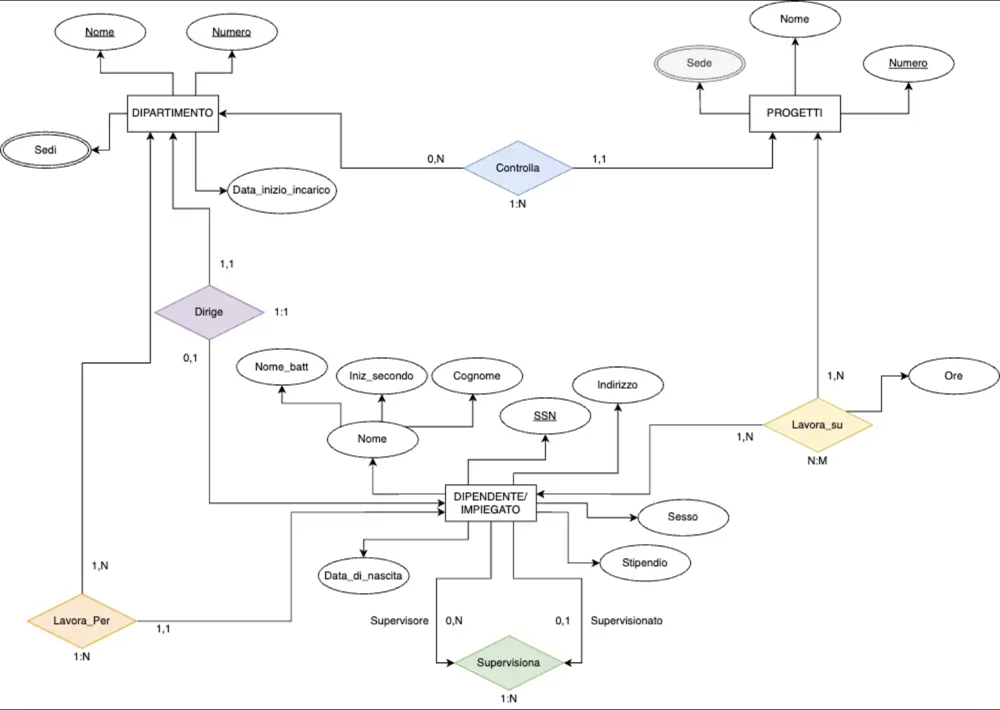
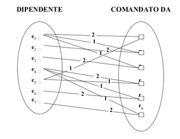
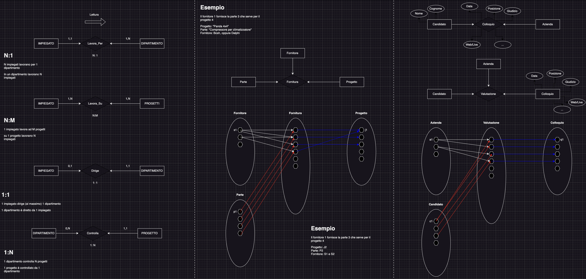

# Modellazione dei Dati mediante il Modello ER (Entity-Relationship o Entità-Associazione)

uso di Database "Azienda" come esempio

## Database Azienda

Richieste sintetiche dell'azienda (analisi requisiti):
- **Dipartimenti** (organizzazione dell'azienda) -> nome, codice, data di creazione, codice responsabile
- **Progetti** (ogni dipartimento controlla un numero di progetti) -> nome, codice, data di inizio, data di fine, budget, codice dipartimento
- **Dipendenti** -> nome, cognome, data di nascita, indirizzo, telefono, codice fiscale, stipendio, data assunzione, codice dipartimento

## Modello ER
Entità e Attributi:
- **Entità** (o tipi di entità) -> oggetto del mondo reale (dipartimento, progetto, dipendente)
- **Istanza** -> singola occorrenza di un'entità (dipartimento "Vendite", progetto "Sviluppo App", dipendente "Mario Rossi")
- **Attributo** -> proprietà per descrivere un'entità (nome, cognome di un dipendente)
- **Attributo chiave** -> attributo che identifica univocamente un'istanza di un'entità (codice fiscale di un dipendente)
- **Valore** -> valore di un attributo per un'istanza (nome = 'Mario', cognome = 'Rossi', data di nascita = '01/01/1990')
- **Tipo di dati** -> insieme di valori per un attributo (stringa, carattere, int (chiedersi se ci si può fare dei conti, se possibile è un numero altrimenti è una stringa), float, data)

## Tipi di Attributi
- **Semplici** -> non può essere suddiviso in parti più piccole, solo l'attributo semplice può essere un attributo chiave (nome, cognome, CF, sesso)
- **Composti ()** -> può essere suddiviso in parti più piccole (indirizzo -> via, città, CAP)
- **Multivalore {}** -> può avere più valori (titoli di studio (può averne uno o più))
- **Derivati** -> può essere calcolato da altri attributi (età, data di nascita)
- **Data** -> esiste un'attributo tutto suo (data di nascita, data di assunzione)

## Entità, Istanze e Attributi chiave
- istanza dell'entità -> ogni elemento di un'entità
- attributo chiave -> identifica univocamente un'istanza di un'entità (può essere composto, es. targa di un'auto)
- un'entità può avere più attributi chiave (es. targa e numero di telaio di un'auto)

Esempio: entità AUTO ed istanze  
AUTO: Targa(Provincia, Numero), NumeroTelaio, Marca, Modello, Anno, {Colore}  
auto1: ((FE, 541080), TK629, Fiat, Tipo, 1993, {verde met.})  
auto2: ((BO, 371166), TD729, Fiat, Panda, 2004, {nero, bianco})

## Notazione ER

## Esempio Database Azienda per gestire: Dipartimenti, Progetti e Dipendenti
Entità: Dipartimento, Progetto, Dipendente

## Associazioni
- **Associazione** -> relazione tra due o più entità con un significato (dipendente lavora in un dipartimento, progetto è assegnato a un dipartimento)
- **Istanza di associazione** -> mette in riferimento due o più istanze di entità (Dipendente lavora su Progetti per tot **ore**)
- **Grado di un'associazione** -> numero di entità coinvolte da un'associazione (lavora_su ha grado 2 -> coinvolge dipendente e progetti)
- **Associazione Ricorsiva** -> un'entità è associata a se stessa (dipendente è comandato (**supervisionato**) da un altro dipendente)

## Istanze dell'associazione LAVORA PER

## Istanze dell'associazione LAVORA SU

## Associazione Ricorsiva COMANDATO DA

## Entità Deboli ed Associazioni Identificative
- **Entità Debole** -> entità senza attributo chiave proprio --> allora deve partecipare ad un'associazione identificante con un'altra entità non debole
- **Associazione Identificativa** -> associazione che identifica un'entità debole associandola ad un'entità non debole (es. entità Parente con attributi nome e data_di_nascita, associata ad un'entità Dipendente con attributo id_dipendente. L'associazione identificativa è "parente_di")

## Vincoli sulle Associazioni
- **Cardinalità massima** ->  quanti collegamenti possono esserci tra le entità coinvolte (1:1, 1:N, M:N):
    - 1:1 (uno a uno)
    - 1:N (uno a molti) o N:1 (molti a uno)
    - M:N (molti a molti)
- **Cardinalità minima** -> quanti collegamenti devono almeno esserci tra le entità coinvolte (0, 1):
    - 0 (partecipazione opzionale)
    - 1 o più (partecipazione obbligatorio)

## Attributi per associazioni
- possono avere attributi propri (lavora_su -> ore)
- più associazioni possono avere le stesse entità coinvolte (dirige e lavora_per hanno le entità coinvolte dipendente e dipartimento)
- spostamenti di un attributo tra due entità associate:
    - 1:1 -> attributo può essere spostato in una qualsiasi delle due entità
    - 1:N -> attributo può essere spostato nell'entità di cardinalità maggiore
    - M:N -> attributo deve essere proprio dell'associazione

## Notazione (min, max) per le associazioni
Specifica la quantità minima e massima di istanze delle entità coinvolte in almeno min e al massimo max istanze dell'associazione

### Esempio:
1. Un dipartimento ha esattamente un direttore e un dipendente può dirigere (al massimo) un solo dipartimento:
    - Specificare (0,1) per la partecipazione di DIPENDENTE in DIRIGE
    - Specificare (1,1) per la partecipazione di DIPARTIMENTO in DIRIGE

2. Un dipendente può lavorare per uno ed uno solo dipartimento ma un dipartimento può avere un numero qualsiasi di dipendenti:
    - Specificare (1,1) per la partecipazione di DIPENDENTE in LAVORA PER
    - Specificare (0,n) per la partecipazione di DIPARTIMENTO in LAVORA PER

