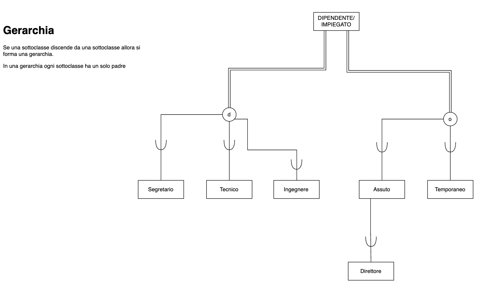
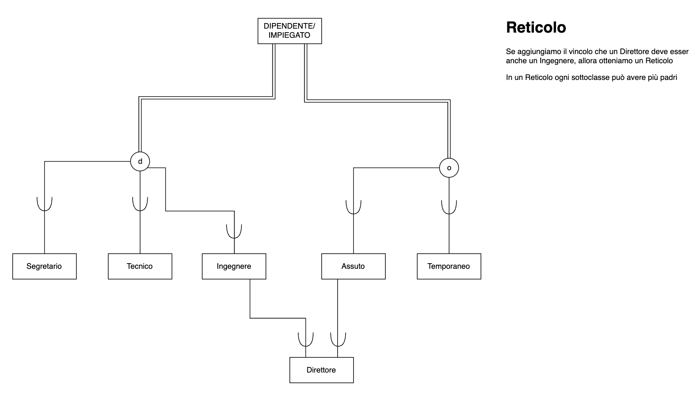
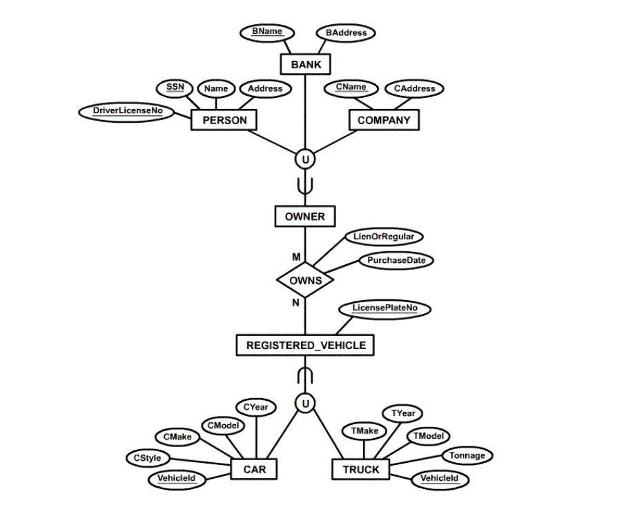

# Modello EER (Extended Entity-Relationship)

Modello ER esteso con concetti addizionali: sottoclassi/superclassi, specializzazione, categorie, propagazione (ereditarietà) degli attributi.  
Uso: per modellare applicazioni in maniera più dettagliata e specifica

## Sottoclassi e Superclassi
Un’entità potrebbe avere alcuni sottogruppi addizionali di istanze, aventi un
significato particolare per il mini-mondo di interesse

Esempio: DIPENDENTE potrebbe essere ulteriormente suddiviso in
SEGRETARIO, INGEGNERE, DIRETTORE, TECNICO, TEMPORANEO,
TEMPO_INDETERMINATO, ...

- ciascuno di questi gruppi è costituito da un sottoinsieme delle istanze
dell’entità DIPENDENTE
- ciascuno di questi gruppi viene chiamato una sottoclasse di
DIPENDENTE
- DIPENDENTE è chiamata superclasse di ciascuna di queste sottoclassi.

Queste sono dette associazioni di superclasse/sottoclasse.  
Esempio: DIPENDENTE/SEGRETARIO, DIPENDENTE/TECNICO

Un'istanza di una superclasse può appartenere a una o più sottoclassi.  
Esempio: un DIPENDENTE può essere sia INGEGNERE che TEMPORANEO

## Ereditarietà degli attributi
Un'entità di una sottoclasse eredita tutti gli attributi dell'entità di superclasse e anche le associazioni (anche le cardinalità)

Ricorda: le sottoclassi non possono avere attributi chiave poiché ereditano l'attributo chiave dalla superclasse

## Specializzazione
Specializzazione -> definire un insieme di sottoclassi di una superclasse  
Attributi specifici -> attributi di una sottoclasse che non appartengono alla superclasse (es. attributo Tipo dell'entità INGEGNERE)  
Una sottoclasse può partecipare ad associazioni specifiche che non coinvolgono la superclasse (es. INGEGNERE può partecipare a un'associazione con PROGETTO)

Esempio: DIPENDENTE è specializzata in SEGRETARIO e TECNICO

Come scrivere una specializzazione:

## Generalizzazione
Generalizzazione -> definire una superclasse che rappresenta un insieme di sottoclassi

Esempio: AUTO, CAMION generalizzate in VEICOLO; sia AUTO che CAMION
diventano sottoclassi della superclasse VEICOLO

## Vincoli di specializzazione/generalizzazione
- **sottoclassi definite da una condizione** -> se possibile determinare le istanze che appartengono a una sottoclasse
- **specializzazione definita da un'attributo** -> se tutte le sottoclassi hanno la condizione di appartenenza sullo stesso attributo (es. TipoLavoro è l'attributo che definisce la specializzazione {SEGRETARIO, TECNICO, INGEGNERE} di DIPENDENTE)
- **sottoclasse definita dall'utente** -> se nessuna condizione determina l'appartenenza
- **disgiunzione**:
    - **totale** (**o** di overlap nel diagramma): la stessa istanza può appartenere a più di una sottoclasse della specializzazione
    - **parziale** (**d** di disgiunte nel diagramma): un'istanza può appartenere a una sola sottoclasse della specializzazione
- **completezza**:
    - **totale** (**doppia linea** nel diagramma): ogni istanza della superclasse deve appartenere ad almeno una sottoclasse della specializzazione
    - **parziale** (**singola linea** nel diagramma): le istanze possono appartenere a nessuna sottoclasse

## Gerarchia
Gerarchia -> una sottoclasse può avere una sola superclasse (ereditarietà singola)

## Reticolo
Reticolo -> una sottoclasse può avere più di una superclasse (ereditarietà multipla)  
Sottoclasse condivisa -> una sottoclasse con più di una superclasse

## Categorie (tipi Unione)
Categorie -> quando una singola associazione superclasse/sottoclasse ha più di una superclasse  
Esempio: il proprietario di un veicolo può essere una persona, una banca o un'azienda
- la categoria (sottoclasse) PROPRIETARIO ha un sottoinsieme di istanze provenienti dall'unione di: PERSONA, BANCA, AZIENDA (superclassi)
- un membro della categoria deve esistere in almeno una delle superclassi

### Differenza tra Categorie e Sottoclassi condivise
- Categorie:
    - contiene l'unione di istanze di superclassi
    - un'istanza deve esistere in almeno una superclasse
- Sottoclassi condivise:
    - contiene l'intersezione di istanze di superclassi
    - un'istanza deve esistere in tutte le superclassi