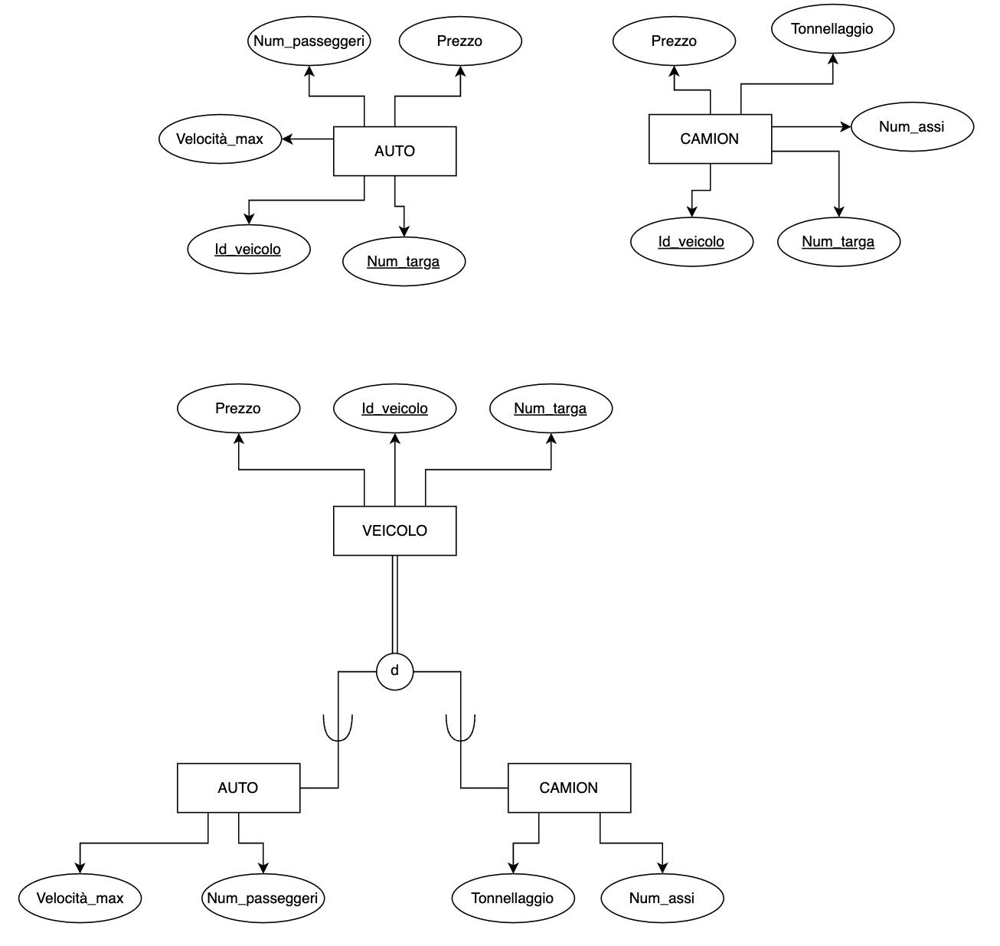

# Modello EER (Extended Entity-Relationship)

Modello ER esteso con concetti addizionali: sottoclassi/superclassi, specializzazione categorie, propagazione (ereditarietà) degli attributi

## Sottoclassi e Superclassi
Un’entità potrebbe avere alcuni sottogruppi addizionali di istanze, aventi un
significato particolare per il mini-mondo di interesse

Esempio: DIPENDENTE potrebbe essere ulteriormente suddiviso in
SEGRETARIO, INGEGNERE, DIRETTORE, TECNICO, TEMPORANEO,
TEMPO_INDETERMINATO, ...

- ciascuno di questi gruppi è costituito da un sottoinsieme delle istanze
dell’entità DIPENDENTE
- ciascuno di questi gruppi viene chiamato una sottoclasse di
DIPENDENTE
- DIPENDENTE è chiamata superclasse di ciascuna di queste sottoclassi.

Queste sono dette associazioni di superclasse/sottoclasse.

Esempio: DIPENDENTE/SEGRETARIO, DIPENDENTE/TECNICO

## Ereidtarietà degli attributi
Un'entità di una sottoclasse eredita tutti gli attributi dell'entità di superclasse e anche le associazioni (anche le cardinalità)

Ricorda: le sottoclassi non possono avere attributi chiave poiché ereditano l'attributo chiave dalla superclasse

## Specializzazione
definizione di sottoclassi di un'entità superclasse

Esempio: DIPENDENTE è specializzata in SEGRETARIO e TECNICO

Come scrivere una specializzazione:

## Generalizzazione
definizione di una superclasse per un insieme di sottoclassi

Esempio: AUTO, CAMION generalizzate in VEICOLO; sia AUTO che CAMION
diventano sottoclassi della superclasse VEICOLO

## Vincoli di specializzazione/generalizzazione
- 
- 
- 
- **disgiunzione** -> una istanza può appartenere a una sola sottoclasse
    - totale (o di overlap nel diagramma): ogni istanza deve appartenere ad una sottoclasse
    - parziale (d nel diagramma): un'istanza può appartenere a nessuna sottoclasse
- **completezza** -> ogni istanza deve appartenere ad almeno una sottoclasse
    - totale (doppia linea nel diagramma): ogni istanza deve appartenere ad almeno una sottoclasse
    - parziale (singola linea nel diagramma): un'istanza può appartenere a nessuna sottoclasse

## Gerarchia
vincolo che ciascuna sottoclasse abbia una sola superclasse (detta anche
ereditarietà singola)

## Reticolo
una sottoclasse può essere sottoclasse di più di una superclasse (detta anche
ereditarietà multipla)

### Sottoclasse condivisa
una sottoclasse con più di una superclasse (possibile solo in un reticolo)

## Esempio
