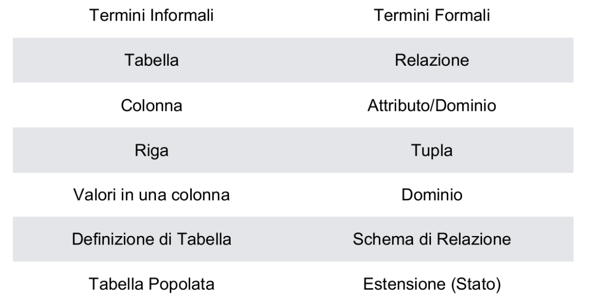
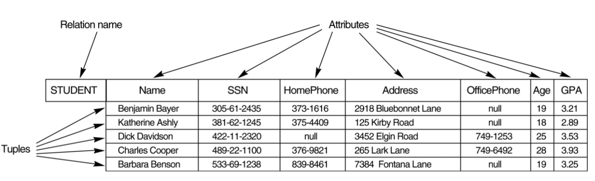
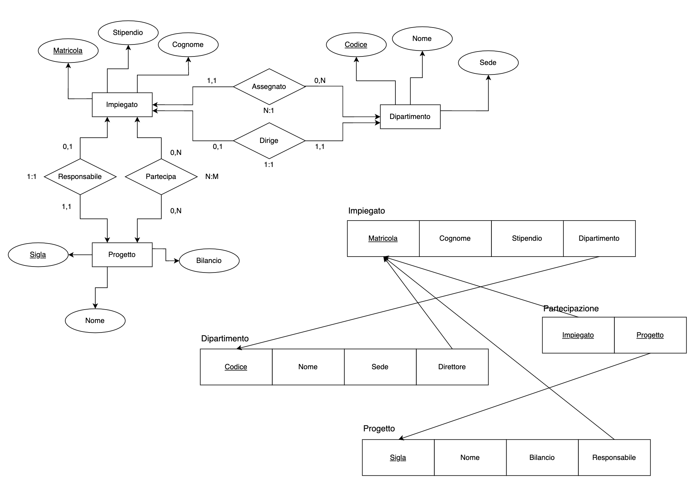

# Modello dei dati relazionali

Modello basato sul concetto di **Relazione** (concetto matematico basato sulla teoria degli insiemi)

## Relazione
Relazione -> tabella di valori vista come insieme di righe o colonne

- ogni riga rappresenta un'**istanza** di un'entità o di un'associazione
- ogni riga ha un valore per un elemento o per un insieme di elementi che identifica univocamente la riga
- si possono assegnare identificatori di riga (row-id) o numeri sequenziali per identificare le righe
- colonne tipicamente individuata con nome o intestazione colonna o nome dell'attributo

## Schema di una relazione
Schema di una relazione R definisce una relazione.  
Schema della relazione R = R(A1, A2, ..., An)
- R nome della relazione
- A1, A2, ..., An attributi della relazione

Esempio:
CLIENTI (ID-Cli, Nome-Cli, Indirizzo, Tel)  
CLIENTI è una relazione definita sui quattro attributi ID-Cli, Nome-Cli, Indirizzo e Tel.  
Ognuno possiede un dominio o un insieme di valori validi (es. ID-Cli -> numero di 6 cifre)

## Tupla
Tupla -> insieme ordinato di valori dove ogni valore è derivato da un dominio  
Esempio: ogni riga della tabella CLIENTI può essere vista come una tupla composta da 4 valori:  
<632895, “Giacomo Piva", "via Saragat 1, 44122, Ferrara", "+39 (0532) 974344">

Una relazione può essere usata come insieme di tuple (righe).  
Le colonne sono gli attributi della relazione.

## Dominio
Dominio -> ha una definizione logica (es. numeri di telefono -> insieme dei numeri di telefono validi)  
Può avere:
- un tipo di dati (es. numeri di telefono -> stringa di caratteri)
- formato (es. numeri di telefono ha formato +dd (dddd) dddddddd dove d è una cifra decimale)

attributo -> specifica il ruolo del dominio (es. dominio date -> attributo "DataFattura" o "DataScadenza")

## Stato della Relazione
Stato della relazione (o relazione) -> è formata dal prodotto cartesiano degli insiemi dominio (es. S1 x S2) dove ciascun insieme ha valori provenienti da un dominio (dominio usato per definire il ruolo dell'attributo in questione)  
Esempio: l'attributo Nome-Cli è definito sul dominio delle stringhe di 25 caratteri (ruolo delle stringhe nella relazione CLIENTI -> specificare il nome dei clienti)

Esempio formale:
- dato R(A1, A2, ..., An)
- r(R) $\subset$ dom(A1) x dom(A2) x ... x dom(An)
    - R -> schema della relazione
    - r di R -> stato della relazione (specifico "valore" o popolazione di R)
    - R -> intensione della relazione
    - r -> estensione della relazione

## Esempio:
- S1 = {0, 1} e S2 = {a, b, c}
- R $\subset$ S1 x S2
- r(R) = {<0, a>, <0, b>, <1, c>} è un possibile stato (o entensione) r della relazione R (o intensione), definita nei domini S1 e S2, contenente 3 tuple

Esempio:

## Caratteristiche delle Relazioni
- le tuple non si devono considerare ordinate in una relazione r(R)
- gli attributi in R(A1, A2, ..., An) ed i valori in ogni tupla t = <v1, v2, ..., vn> si devono considerare ordinati
- una relazione più generale non richiede ordinamento
- tutti i valori in una tupla sono atomici e NULL si usa per valori sconosciuti

### Notazione
valori in una tupla t: t[A[i]] = v[i] (A[i] valore dell'attributo i-esimo per la tupla t)  
valori di una sotto-tupla t: t[A[u], A[v], ..., A[w]] contiene i valori degli attributi A[u], A[v], ..., A[w]

## Vincoli di Integrità
Condizioni che devono essere rispettate da tutti gli stati di relazione validi ed esistono 3 vincoli:
- vincoli sulla Chiave
- vincoli di integrità dell'Entità
- vincoli di integrità Referenziale

### Vincoli sulla Chiave
- **Superchiave** di R: insieme di attributi che identificano univocamente una tupla (per ogni coppia di tuple t1 e t2, t1[A] != t2[A])
- **Chiave** di R: superchiave minimale -> se si rimuove un attributo dalla superchiave, non è più una superchiave  
Esempio: AUTO(NumTelaio, Targa, Modello, Casa)  
{NumTelaio} e {Targa} sono chiavi  
{NumTelaio, Targa} è una superchiave  
{NumTelaio, Casa} è superchiave ma non chiave
- **Chiave Primaria** di R: chiave scelta come riferimento per la relazione tra varie chiavi possibili

### Vincoli di integrità dell'Entità
Gli attributi chiave primaria di ogni schema di database relazionale (insieme S di schemi di relazione nello stesso database -> S = {R1, R2, ..., Rn}) devono avere valori diversi da NULL in ogni tupla

### Vincoli di integrità Referenziale
Vincolo che coinvolge due relazioni  
Specifica un riferimento tra tuple in due relazioni: relazione referenziante e relazione riferita
- tuple nella relazione referenziante R1 hanno attributi FK (chiave esterna) che fanno riferimento agli attributi chiave primaria PK della relazione riferita R2
- tupla t1 in R1 è in riferimento con una tupla t2 in R2 se t1[FK] = t2[PK]
Il valore della colonna (o colonne) FK in R1 può essere:
- NULL (FK in R1 non deve far parte della chiave primaria di R1)
- un valore che esiste in una tupla della relazione riferita R2
Esempio:  
CLIENTI (ID-Cli, Nome-Cli, Indirizzo, Tel)  
ORDINI (ID-Ord, Data, ID-Cli)  
Il vincolo di integrità referenziale richiede che ogni ID-Cli in ORDINI esista in CLIENTI

### Altri Vincoli
- **Vincoli di Integrità Semantici**: vincoli basati sulla semantica dell'applicazione  
Esempio: se in una scuola si ha l'attributo età e si vuole che sia compreso tra 18 e 65

## Operazioni sulle Relazioni
- **Inserimento** di una tupla (INSERT)
- **Cancellazione** di una tupla (DELETE)
- **Modifica** di una tupla (MODIFY, UPDATE)
- i vincoli di integrità devono essere rispettati anche dalle operazioni di aggiornamento
- una serie di operazioni di aggiornamento possono essere raggruppate insieme
- le operazioni di aggiornamento possono creare in automatico altri aggiornamenti

Se un'operazione di aggiornamento viola un vincolo di integrità:
- si annulla l'operazione che causa la violazione (REJECT)
- si esegue l'operazione, informando l'utente della violazione
- si eseguono altri aggiornamenti per correggere la violazione (CASCADE, SET NULL)
- si esegue una routine dall'utente per correggere la violazione