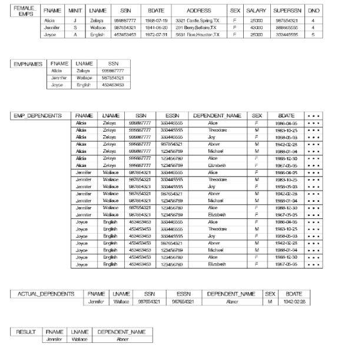
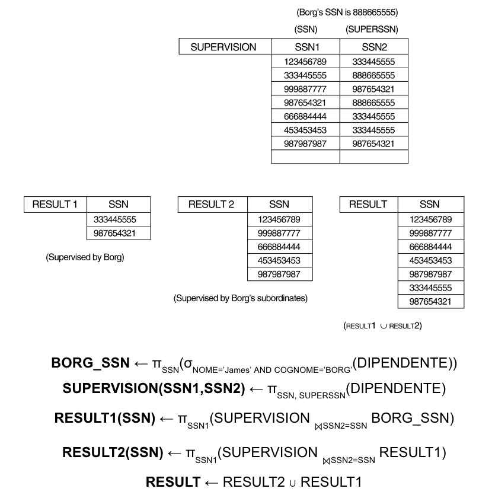
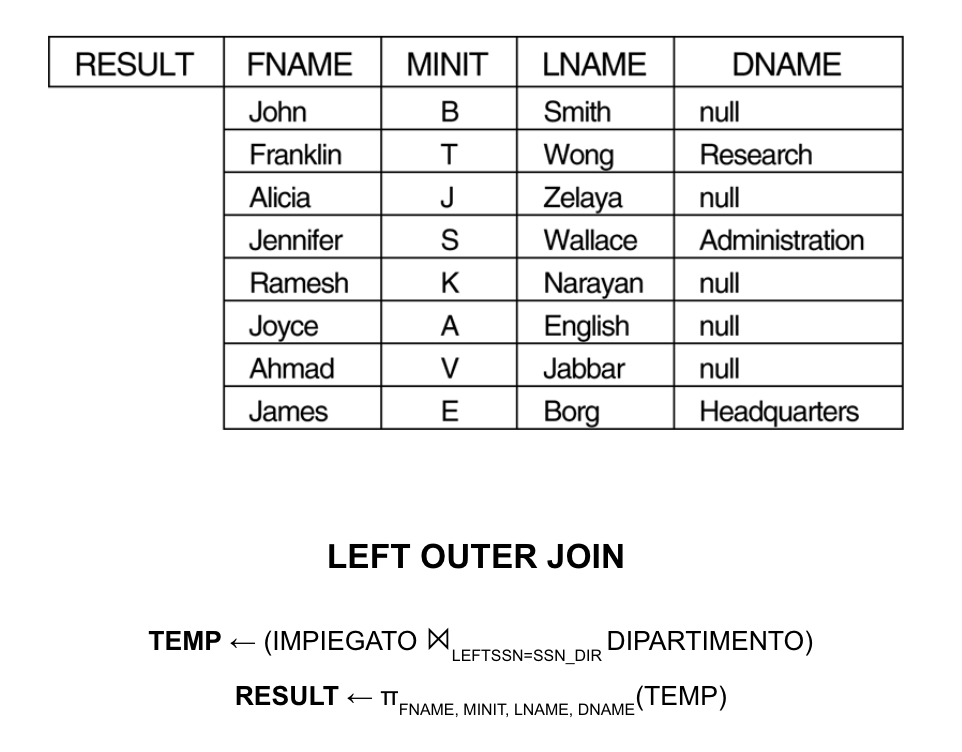

# Algebra e Calcolo Relazionale

Esempio di Applicazione con Database Azienda

## Algebra Relazionale
Algebra relazionale -> insieme di operazioni per il modello relazionale che consentono all'utente di specificare le interrogazioni fondamentali

Risultato interrogazione -> nuova relazione (può essere stata formata da una o più relazioni)

Espressione dell'algebra relazionale -> sequenza di operazioni dell'algebra relazionale, con risultato un'altra relazione che rappresenta il risultato di un'interrogazione del database

### Operazioni relazionali unarie
**Operazione di selezione (SELECT)**: per selezionare un sottoinsieme di tuple che soddisfano una condizione (filtro orizzontale)  
Notazione: σcondizione(R)  
Esempio: σEtà>30(DIPENDENTE) -> seleziona i dipendenti con età maggiore di 30 anni  
Proprietà:
- SELECT σcondizione(R) produce una relazione con lo stesso schema di R
- SELECT è commutativa: σcond1(σcond2(R)) = σcond2(σcond1(R))
- SELECT in cascata possono essere eseguite in qualunque ordine per la proprietà commutativa
- SELECT in cascata si possono sostituire con una SELECT che combina le condizioni con un operatore logico AND: σcond1(σcond2(R)) = σcond1 AND cond2(R)

**Operazione di proiezione (PROJECT)**: per selezionare alcuni attributi (colonne) da una relazione (tabella) scartando gli altri (filtro verticale), quest'operazione elimina eventuali duplicati delle tuple  
Notazione: πattributi(R)  
Esempio: πNome, Cognome(DIPENDENTE) -> seleziona solo i campi Nome e Cognome dalla tabella DIPENDENTE  
Proprietà:
- il numero di tuple risultanti è sempre minore o uguale al numero di tuple della relazione originale R
- se nell'elenco di tuple c'è una chiave di R allora il numero di tuple risultanti è uguale al numero di tuple della relazione originale R
- πattributi1(πattributi2(R)) = πattributi1(R) se attributi1 è contenuto in attributi2

**Operazione di ridenominazione (RENAME)**: da la possibilità di applicare un'operazione alla volta e creare relazioni con risultati intermedi con nomi diversi  
Notazione: ρnuovoNome(R)  
Esempio: trovare nome, cognome e stpendio dei dipendenti che lavorano nel dipartimento 5  
senza rename: πFName, LName, Salary(σDNO=5(DIPENDENTE))  
con rename:  
DEP5_EMPS $\leftarrow$ σDNO=5(DIPENDENTE)  
RESULT $\leftarrow$ πFName, LName, Salary(DEP5_EMPS)  

### Operazioni insiemistiche
**Operazione di unione (UNION)**: unisce due relazioni in una unica con tutte le tuple di una e dell'altra (rimuove eventuali duplicati)  
Notazione: R ∪ S  
Compatibilità dell'unione:
- R e S devono avere lo stesso numero di attributi e il dominio di ogni attributo di R deve essere lo stesso di quello di S
- la relazione risultante ha gli stessi nomi di attributi di R

**Operazione di intersezione (INTERSECTION)**: restituisce una relazione con le tuple presenti in entrambe le relazioni  
Notazione: R ∩ S  
Compatibilità dell'intersezione: stessa compatibilità dell'unione

**Operazione di differenza (MINUS)**: restituisce una relazione con le tuple presenti in R ma non in S  
Notazione: R - S  
Compatibilità della differenza: stessa compatibilità dell'unione

Proprietà delle operazioni UNION, INTERSECTION e MINUS:
- UNION e INTERSECTION sono commutative: R ∪ S = S ∪ R, R ∩ S = S ∩ R
- UNION e INTERSECTION sono associative: R ∪ (S ∪ T) = (R ∪ S) ∪ T, R ∩ (S ∩ T) = (R ∩ S) ∩ T
- MINUS non è commutativa: R - S ≠ S - R

**Operazione di prodotto cartesiano (prodotto incrociato)**: restituisce una relazione con tutti gli attributi di R e S e tutte le possibili combinazioni di tuple di R e S (R e S non devono essere compatibii all'unione)  
Notazione: |R x S| ha n x m tuple (n = numero di tuple di R, m = numero di tuple di S)  
Esempio:  
FEMALE_EMPS $\leftarrow$ σSEX=F(EMPLOYEE)  
EMPNAMES $\leftarrow$ πFName, LName, SSN(FEMALE_EMPS)  
EMP_DEPENDENTS $\leftarrow$ EMPNAMES x DEPENDENT

### Operazioni relazionali binarie
**Operazione di JOIN**: restituisce una relazione data da un prodotto cartesiano seguito da una selezione  
Notazione: R ⨝condizione S  
Esempio: trovare i nomi dei manager di ciascun dipartimento  
DIP_MGR $\leftarrow$ DIPARTIMENTO ⨝MGRSSN=SSN DIPENDENTE

**THETA JOIN**: JOIN con condizione arbitraria  
Notazione: R ⨝cond AND cond AND ... AND cond S

**EQUI-JOIN**: JOIN con unica operazione, quella di uguaglianza, e si ha come risultato una o più coppie di attributi con gli stessi valori in ogni tupla

**NATURAL JOIN**: JOIN (indicata con *) che non include i duplicati in una condizione di uguaglianza. Se due relazioni hanno attributi con lo stesso nome, la condizione di JOIN diventa una ridenominazione

L'insieme delle operazioni relazionali selezione (σ), proiezione (π), unione (U), differenza (-), prodotto cartesiano (x) è detto **insieme completo** in quanto è possibile esprimere qualsiasi operazione relazionale in termini di queste operazioni  
Esempio:  
R ∩ S = (R U S) - ((R - S) U (S - R))  
R ⨝condizione S = σcondizione(R x S)

**Operazione di divisione (DIVISION)**: date due relazioni R(Z) ÷ S(X) e Y = Z - X (Y è l'insieme degli attributi di R che non sono in S), il risultato della divisione è una relazione T(Y) con le tuple t di R tali che, per ogni tupla in S, esiste almeno una tupla in R che abbia gli stessi valori per gli attributi in X e Y

### Altre operazioni relazionali
**Funzioni aggregate e raggruppamento**: operazioni che permettono di calcolare valori aggregati (es. SUM, AVERAGE, MAXIMUM, MINIMUM, COUNT) su gruppi di tuple

**Uso dell'operatore funzionale ℱ**: operatore di funzione aggregata dove risulta una relazione con gli attributi di raggruppamento più un attributo per ogni elemento della lista di funzioni  
Notazione: attributi_raggruppamento ℱlista_funzioni (R) con
- attributi_raggruppamento: lista di attributi della relazione R
- lista_funzioni: lista di coppie (funzione, attributo)

Esempi:
- ℱMAXStipendio(DIPENDENTE) -> restituisce il massimo stipendio tra i dipendenti
- ℱMINStipendio(DIPENDENTE) -> restituisce il minimo stipendio tra i dipendenti
- ℱSUMStipendio(DIPENDENTE) -> restituisce la somma degli stipendi dei dipendenti

**Operazioni di chiusura ricorsiva**: operazioni che permettono di eseguire operazioni ricorsive su relazioni  
Esempio: cercare tutti i supervisori di un dipendente e a tutti i livelli (supervisore, supervisore del supervisore, ecc.)

**Operazione di join esterna (OUTER JOIN)**: quando si vuole includere le tuple che non hanno corrispondenza in una delle due relazioni (a differenza del JOIN che include solo le tuple che hanno corrispondenza in entrambe le relazioni)
- join esterno sinistro (LEFT OUTER JOIN): R ⨝LEFT S mantiene tutte le tuple della prima relazione R (se non c'è corrispondenza con la seconda relazione S, gli attributi di S sono NULL)
- join esterno destro (RIGHT OUTER JOIN): R ⨝RIGHT S mantiene tutte le tuple della seconda relazione S (se non c'è corrispondenza con la prima relazione R, gli attributi di R sono NULL)
- join esterno totale (FULL OUTER JOIN): R ⨝FULL S mantiene tutte le tuple di entrambe le relazioni

