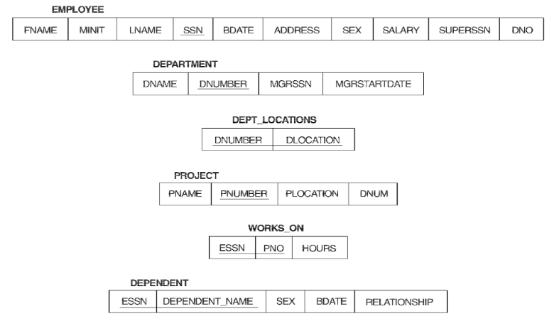
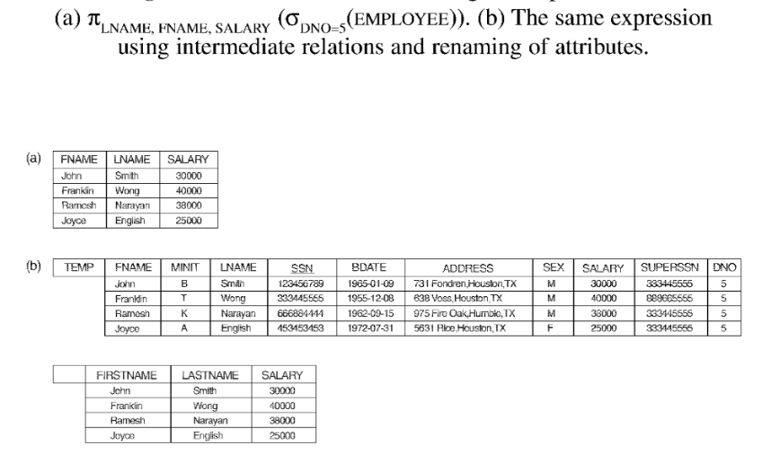
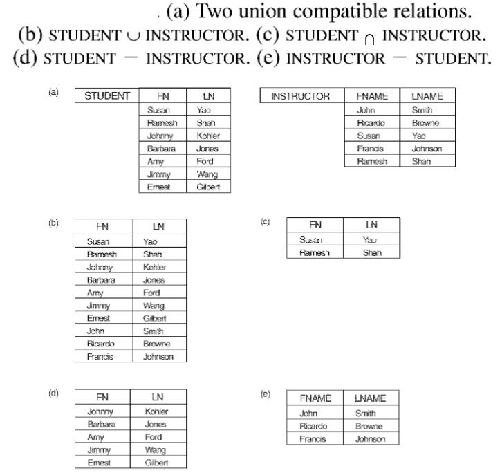

# Da modello concettuale a modello logico

## ER - Relazionale
### Entità
- per ogni entità E si crea una relazione R con tutti gli attributi semplici di E
- si sceglie uno degli attributi chiave di E come chiave primaria di R (se attributo chiave è composto -> l'insieme degli attributi formerà la chiave primaria di R)

### Entità deboli
- per ogni entità debole W con entità prioritaria E, si crea una relazione R con tutti gli attributi semplici di W e come chiave esterna gli attributi chiave primaria di E
- chiave primaria di R -> combinazione della chiave primaria dell'entità E e della chiave parziale dell'entità debole W

Esempio:  
Si crea la relazione A_CARICO includendo la chiave primaria SSN della relazione DIPENDENTE come chiave esterna.  
La chiave primaria di A_CARICO sarà la combinazione {SSN, NOME} con NOME chiave parziale dell'entità debole A_CARICO.

### Associazioni binarie 1:1
per ogni associazione A 1:1 si identificano le relazioni S e T:
1. Chiave esterna -> si sceglie una delle relazioni (es. S) e si include come chiave esterna la chiave primaria dell'altra relazione (es. T), si inseriscono poi tutti gli attributi di A in S
2. Unica relazione -> si uniscono le due entità e l'associazione in una singola relazione
3. Relazione associazione -> si crea una terza relazione R per avere un riferimento per le due relazioni S e T

### Associazioni binarie 1:N
per ogni associazione A 1:N si identificano le relazioni S (lato N) e T (lato 1):
- si include come chiave esterna in S la chiave primaria di T
- si includono tutti gli attributi semplici di A in S

### Associazioni binarie N:M
per ogni associazione A N:M si crea una relazione S che rappresenti A:
- si includono come chiavi esterne in S le chiavi primarie delle due relazioni coinvolte in A, la loro combinazione sarà la chiave primaria di S (non sempre)
- si includono tutti gli attributi di A in S

### Attributi multivalore
Per ogni attributo multivalore A si crea una nuova relazione R dove questa avrà un attributo corrispondente ad A e l'attributo K corrispodente alla chiave primaria di A.  
La chiave primaria di R sarà la combinazione di A e K

### Associazioni N-arie
per ogni associazione A n-aria (n > 2) si crea una relazione S per rappresentare A:
- si includono come chiavi esterne in S le chiavi primarie delle relazioni che rappresentano le n entità coinvolte in A
- si includono tutti gli attributi di A in S

## EER - Relazionale
### Specializzazioni e Generalizzazione
Conversione di ogni specializzazione di m sottoclassi {S1, S2, ..., Sm} e superclasse generalizzata C con attributi {k, A1, ..., An} (k attributo chiave di C) in uno schema relazionale secondo le seguenti opzioni:

#### opzione A
Relazioni multiple - superclasse e sottoclasse (per tutte le specializzazioni: tot., parz., disg., sovr.):
- si crea una relazione L per C con i suoi attributi Attr(L) e la sua chiave primaria PK(L) = k
- si crea una relazione L[i] per ogni sottoclasse S[i], 1 < i < m, con attributi Attr(L[i]) = {k} U {attr di S[i]} e chiave primaria PK(L[i]) = k

#### opzione B
Relazioni multiple - solo relazioni sottoclasse (per una specializzazione con sottoclassi totali):
- si crea una relazione L[i] per ogni sottoclasse S[i], 1 < i < m, con attributi Attr(L[i]) = {attr. di S[i]} U {k, A1, ..., An} e chiave primaria PK(L[i]) = k

#### opzione C
Relazione singola con un attributo tipo:
- si crea una relazione L con gli attributi Attr(L) = {k, A1, ..., An} U {attr. di S1} U ... U {attr. di Sm} U {t} e chiave primaria PK(L) = k
- l'attributo t è chiamato tipo e indica a quale sottoclasse appartiene ogni tupla

#### opzione D
Relazione singola con molti attributi tipo:
- si crea una relazione L con gli attributi Attr(L) = {k, A1, ..., An} U {attr. di S1} U ... U {attr. di Sm} U {t1, t2, ..., tm} e chiave primaria PK(L) = k
- ogni t[i], 1 < i < m, è un attributo booleano (flag) che indica se la tupla appartiene alla sottoclasse S[i]

