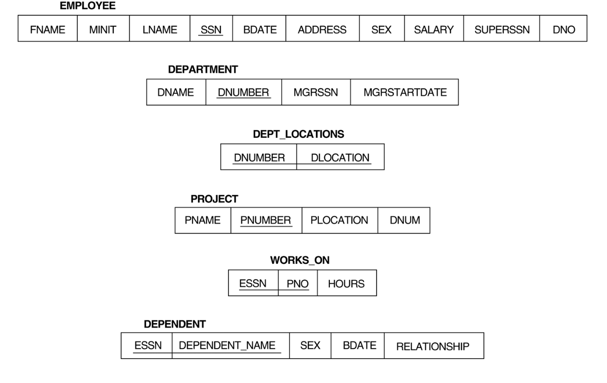

# SQL

Usato per creare (CREATE), rimuovere (DROP), aggiungere (ALTER) le descrizioni di tabelle (relazioni) del database

## Creazione schema
Crea un nuovo schema di un database dandogli un nome

```sql
CREATE SCHEMA Company;
```

## Creazione tabella
Crea una nuova relazione base dandogli un nome, specificando gli attributi e i loro tipi (INTEGER, FLOAT, DECIMAL(i,j), CHAR(n), VARCHAR(n)).  
In un attributo bisogna specificare un vincolo di NOT NULL

```sql
CREATE TABLE DEPARTMENT (
    DNAME VARCHAR(10) NOT NULL,
    DNUMBER INTEGER NOT NULL,
    MGRSSN CHAR(9),
    MGRSTARTDATE CHAR(9)
);
```

`CREATE TABLE` può essere usato anche per specificare gli attributi che sono chiavi primarie, chiavi secondarie e vincoli di integrità referenziale (foreign key = chiave esterna).  
Gli attributi chiave possono essere specificati con `PRIMARY KEY` o `UNIQUE`.

```sql
CREATE TABLE DEPARTMENT (
    DNAME VARCHAR(10) NOT NULL,
    DNUMBER INTEGER NOT NULL,
    MGRSSN CHAR(9),
    MGRSTARTDATE CHAR(9),

    PRIMARY KEY (DNUMBER),
    UNIQUE (DNAME),
    FOREIGN KEY (MGRSSN) REFERENCES EMPLOYEE(SSN)
);
```

## Rimuovere una tabella
`DROP TABLE` rimuove una relazione e la sua definizione e non può più essere usata in queries, modifiche o altri comandi

```sql
DROP TABLE DEPARTMENT;
```

## Modificare una tabella
`ALTER TABLE` aggiunge un attributo a una relazione e le sue tuple saranno NULL (il vincolo NOT NULL per questo attributo non è consentito)

```sql
ALTER TABLE EMPLOYEE ADD JOB VARCHAR(12);
```

## Opzioni di integrità referenziale (SQL2 e SLQ-99)
Nei vincoli di integrità referenziale (foreign key) si possono specificare RESTRIC, CASCADE, SET NULL o SET DEFAULT

```sql
CREATE TABLE DEPT (
    DNAME VARCHAR(10) NOT NULL,
    DNUMBER INTEGER NOT NULL,
    MGRSSN CHAR(9),
    MGRSTARTDATE CHAR(9),

    PRIMARY KEY (DNUMBER),
    UNIQUE (DNAME),
    FOREIGN KEY (MGRSSN) REFERENCES EMP ON DELETE SET DEFAULT ON UPDATE CASCADE
);

CREATE TABLE EMP (
    ENAME VARCHAR(30) NOT NULL,
    ESSN CHAR(9),
    BDATE DATE,
    DNO INTEGER DEFAULT 1,
    SUPERSSN CHAR(9),

    PRIMARY KEY (ESSN),
    FOREIGN KEY (DNO) REFERENCES DEPT ON DELETE SET DEFAULT CASCADE,
    FOREIGN KEY (SUPERSSN) REFERENCES EMP ON DELETE SET NULL ON UPDATE CASCADE
);
```

Tipi di dato addizionali:
- `DATE`: data nel formato `YYYY-MM-DD`
- `TIME`: tempo nel formato `HH:MM:SS`
- `TIME(i)`: tempo nel formato `HH:MM:SS:ii...i` dove i sono le frazioni di secondo
- `TIMESTAMP`: data e tempo nel formato `YYYY-MM-DD HH:MM:SS`
- `INTERVAL`: intervallo di tempo che può essere `DAY/TIME` o `YEAR/MONTH` ed il risultato è sempre in valore assoluto

## Modificare una tabella
Ci sono 3 comandi per le modifiche di una tabella: `INSERT`, `DELETE`, `UPDATE`

### INSERT
Inserisce una nuova tupla in una relazione.  
I valori degli attributi saranno inseriti nell'ordine in cui sono definiti gli attributi nella relazione.  
Si possono anche inserire solo alcuni attributi specificando il nome degli attributi e gli altri saranno NULL

```sql
U1: INSERT INTO EMPLOYEE VALUES ('Richard', 'K', 'Marini', '653298653',  '30-DEC-52', '98 Oak Forest, Katy,TX', 'M', 37000, '987654321', 4)

U1A: INSERT INTO EMPLOYEE (FNAME, LNAME, SSN) VALUES ('Richard', 'Marini', '653298653')
```

### DELETE
Rimuove tuple da una relazione.  
Se non si specifica una condizione, tutte le tuple della relazione saranno rimosse (diventando una tabella vuota).  
`WHERE-clause` è la condizione che seleziona le tuple da rimuovere.  
Se non è specificato CASCADE, la rimozione di tuple avviene solo in una tabella per volta.

```sql
U4A: DELETE FROM EMPLOYEE WHERE LNAME = 'Brown'
U4B: DELETE FROM EMPLOYEE WHERE SSN = '123456789'
U4C: DELETE FROM EMPLOYEE WHERE DNO IN (SELECT DNUMBER FROM DEPARTMENT WHERE DNAME = 'Research')
U4D: DELETE FROM EMPLOYEE
```

### UPDATE
Modifica i valori degli attributi di una o più tuple selezionate.  
`WHERE-clause` è la condizione che seleziona le tuple da modificare.  
`SET-clause` specifica gli attributi da modificare e i nuovi valori.  
Ogni comando modifica tuple nella stessa relazione

```sql
U5: UPDATE PROJECT SET PLOCATION = 'Bellaire', DNUM = 5 WHERE PNUMBER = 10
U6: UPDATE EMPOYEE SET SALARY = SALARY * 1.10 WHERE DNO IN (SELECT DNUMBER FROM DEPARTMENT WHERE DNAME = 'Research')
```

## Utilizzo di database Azienda



## Recupero queries
Le queries di recupero usano come statement `SELECT` (diverso dal `SELECT` usato nell'algebra relazionale) per specificare quali tuple devono essere recuperate.  
In SQL è permesso avere due o più tuple uguali in ogni loro attributo (a differenza dell'algebra relazionale).  
Una relazione SQL è un insieme di tuple (multi-set o bag di tuple) e non di tuple distinte (set di tuple).

Forma generale di una query di recupero (mapping o SELECT-FROM-WHERE):
```sql
SELECT attribute-list
FROM relation-list
WHERE condition
```

## Query semplici
Le query semplici usano le operazioni dell'algebra relazionale SELECT, PROJECT e JOIN.

Q0: recupera il compleanno e l'indirizzo dei dipendenti i cui nomi sono 'John B. Smith'
```sql
SELECT BDATE, ADDRESS
FROM EMPLOYEE
WHERE FNAME = 'John' AND MINIT = 'B' AND LNAME = 'Smith'
```

Q1: recupera il nome e l'indirizzo di tutti gli impiegati che lavorano per il dipartimento di 'Ricerca'
```sql
SELECT FNAME, LNAME, ADDRESS
FROM EMPLOYEE, DEPARTMENT
WHERE DNAME = 'Research' AND DNUMBER = DNO
```

Q2: per ogni progetto in 'Stafford', recupera i numeri di progetto, i numeri di dipartimento e il cognome, l'indirizzo ed il compleanno del manager del dipartimento
```sql
SELECT PNUMBER, DNUM, LNAME, ADDRESS, BDATE
FROM PROJECT, DEPARTMENT, EMPLOYEE
WHERE DNO = DNUMBER AND MGRSSN = SSN AND PLOCATION = 'Stafford'
```

## Aliases, * e DISTINCT, WHERE-clause mancante
In SQL è possibile usare gli stessi nomi per 2 o più attributi finchè gli attributi sono in relazioni diverse.  
Una query che riferisce due o più attributi con lo stesso nome deve usare il nome della relazione come prefisso e in seguito l'attributo.  
Esempio: `EMPLOYEE.FNAME` e `DEPARTMENT.FNAME`

### Aliases
Alcune queries hanno bisogno di riferire alla stessa relazione due volte.  
In questo caso si usano gli aliases per assegnare nomi alle relazioni (uso nome AS nuovo_nome).

Q8: per ogni dipendente, recupera il nome del dipendente e il nome del suo supervisore
```sql
SELECT E.FNAME, E.LNAME, S.FNAME, S.LNAME
FROM EMPLOYEE AS E, EMPLOYEE AS S
WHERE E.SUPERSSN = S.SSN
```

### WHERE-clause mancante
Se non è specificata una WHERE-clause, tutte le tuple della relazione saranno recuperate (equivalente a dire WHERE TRUE).

Q9: recupera gli SSN per tutti gli impiegati
```sql
SELECT SSN
FROM EMPLOYEE
```

Q10: recupera SSN e nome dipartimento degli impiegati
```sql
SELECT SSN, DNAME
FROM EMPLOYEE, DEPARTMENT
```

### Uso di *
`*` recupera tutti i valori degli attibuti di una tupla selezionata.

Q1C: recupera tutti i dipendenti con il numero di dipartimento 5
```sql
SELECT *
FROM EMPLOYEE
WHERE DNO = 5
```

Q1D: recupera tutti i dipendenti del dipartimento di 'Ricerca'
```sql
SELECT *
FROM EMPLOYEE, DEPARTMENT
WHERE DNAME = 'Research' AND DNO = DNUMBER
```

### Uso di DISTINCT
In SQL possono apparire delle tuple duplicate, per rimuoverle si usa `DISTINCT`.

Q11: recupera i salari dei dipendenti senza duplicati
```sql
SELECT DISTINCT SALARY
FROM EMPLOYEE
```

## Operazioni di Unioni