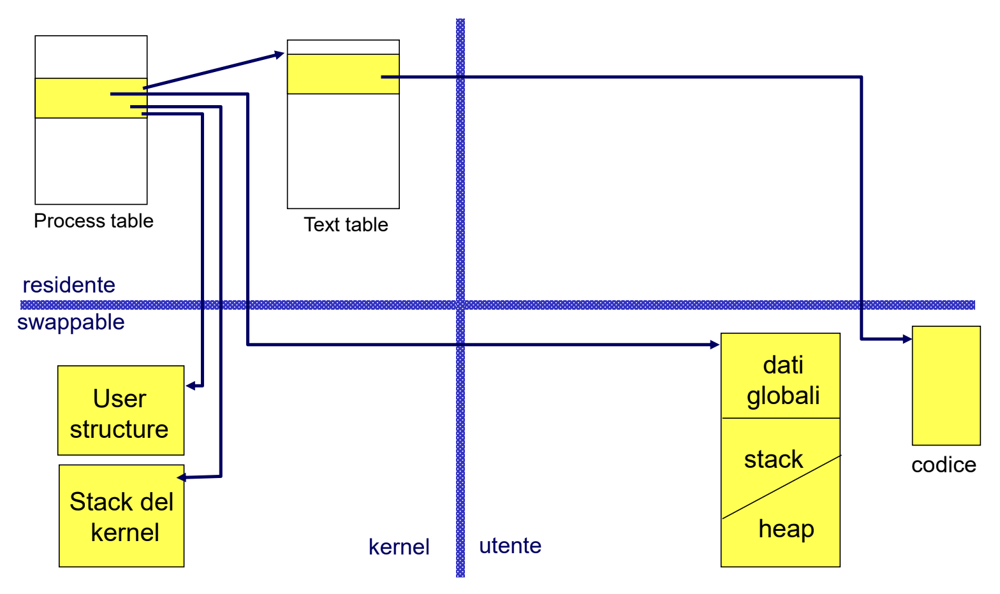
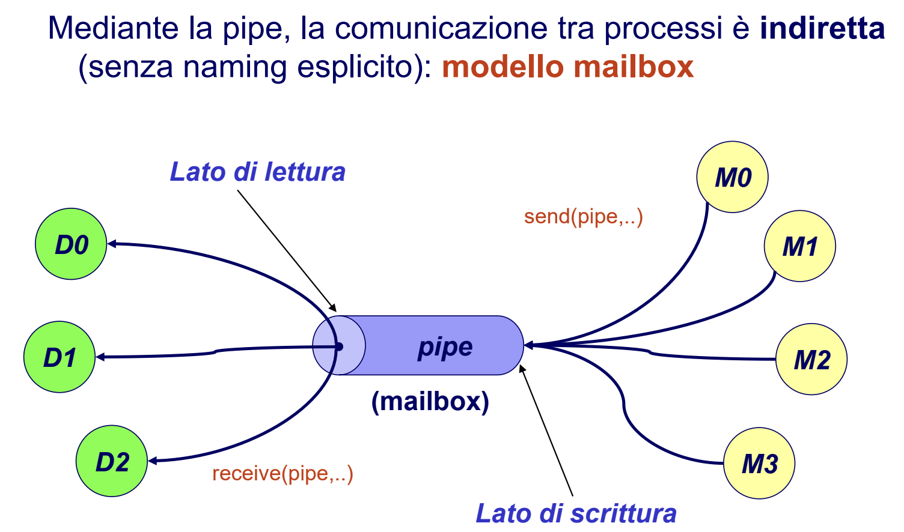

# Risposte domande SO

## 1 - Differenza tra processo pesante e processo leggero
Un processo leggero è un'entità di esecuzione che condivide codice e dati con altri thread ad esso associati.  
Un processo pesante è una task con un solo thread (task = insieme di thread che riferiscono lo stesso codice e gli stessi dati)

## 2 - Creazione di un thread, le sue fasi, ciclo di vita
Un processo padre può richiedere la creazione di un nuovo processo figlio creando gerarchie di processi. (vedere domanda 4)

## 3 - Differenze tra fork ed exec, cosa accade in entrambe
**Fork** -> consente a un processo di generare un processo figlio (padre e figlio condividono lo stesso codice, il figlio eredita una copia dei dati del padre).  
**Exec** -> permette di differenziare i codici dei due processi (padre e figlio), vengono sostituiti codice ed eventuali argomenti di invocazione del processo che chiama la system call, con codice e argomenti di un programma specificato come parametro della system call (NO generazione di nuovi processi)

## 4 - Stati di un processo
Un processo durante la sua esistenza può avere vari stati:
- init: caricamento in memoria del processo
- ready: processo pronto per l'acquisizione della CPU
- running: processo che sta utilizzando la CPU
- waiting: processo sospeso in attesa di un evento
- terminated: processo in fase di terminazione e deallocazione

in Unix (ambiente locale -> spazio di indirizzamento non condiviso tranne per codice e file system) si aggiungono:
- sleeping = al posto di waiting (fase identica)
- zombie: processo terminato, in attesa che il padre ne rilevi lo stato di terminazione
- swapped: processo temporaneamente trasferito in memoria secondaria

## 5 - Processi UNIX (cosa cambia tra processi UNIX e processi in generale)
Un processo UNIX è composto da:

- **text** (kernel, residente): elemento della text table associato al codice
- **dati globali** (utente, swappable): contiene variabili globali del programma
- **stack, heap** (utente, swappable): aree dinamiche associate al programma
- **stack del kernel** (kernel, swappable): stack di sistema associato al processo per le system call
- **PCB (process controll block)**: process structure + user structure
   - **process structure** (kernel, residente): 
      - elemento della process table associato al processo
      - mantiene informazioni per gestire il processo anche se è swapped in memoria secondaria
      - contiene riferimento alla user structure
   - **user structure** (kernel, swappable): 
      - contiene dati necessari al kernel per la gestione del processo quando è residente
      - necessario solo se processo in running
      - se processo in swapping la user structure può essere trasferita in memoria secondaria

Mentre un processo in generale è rappresentato da:
- **codice (text)** del programma eseguito
- **dati**: variabili globali
- **program counter**
- **alcuni registri della CPU**
- **stack**: parametri, variabili locali a funzioni/procedure

## 6 - A cosa serve la wait
La wait(int *status) serve al padre per rilevare lo stato di terminazione del processo figlio.  
Il parametro status è l'indirizzo della variabile in cui viene salvato lo stato di terminazione del figlio.  
Il processo che invoca la wait può avere figli in esecuzione:
- se tutti i figli non sono ancora terminati, il processo si sospende in attesa della terminazione del primo di essi;
- se almeno un figlio è già stato terminato ed è in stato di zombie, wait() ritorna immediatamente con il suo stato di terminazione
- se non esiste neanche un figlio, wait non è sospensiva e ritorna un codice di errore.

## 7 - Lo zombie è uno stato?
Si, lo zombie è considerato uno stato ma solo nei processi UNIX.  
Zombie: processo è terminato, ma è in attesa che il padre ne rilevi lo stato di terminazione.

## 8 - Se il SO esaurisce la memoria principale, cosa si può fare?
Nel caso in cui il SO esaurisce la memoria principale viene usata una funzione dello scheduler a medio termine, lo swapping.  
Swapping -> trasferimento temporaneo in memoria secondaria di processi (o parti di processi) per consentire l'esecuzione di altri processi.

## 9 - Scheduling della CPU, differenza tra breve, medio e lungo termine
Un sistema operativo compie tre diverse attività di scheduling:

- **Scheduler a breve termine (o di CPU)**:
   - seleziona i processi a cui assegnare la CPU
   - gestisce la coda dei processi pronti
   - nei SO time-sharing:
      - seleziona i processi a cui assegnare la CPU
      - effettua il context-switch (cambio di contesto):
         1. salva lo stato del processo Pi
         2. ripristina lo stato del processo Pi+1

- **Scheduler a medio termine (swapper)**:
   - nei SO multiprogrammati:
      - la memoria fisica può essere minore delle dimensioni degli spazi logici di indirizzi da allocare a ciascun processo
      - il grado di multiprogrammazione (numero di progessi contemporaneamente presenti nel SO) non è vincolato dalle esigenze di spazio dei processi
   - Soluzione -> Swapping: trasferimento temporaneo in memoria secondaria di processi (o parti di processi) per consentire l'esecuzione di altri processi

- **Scheduler a lungo termine**:
   -  seleziona programmi da eseguire dalla memoria secondaria per caricarli in memoria centrale
   - controlla il grado di multiprogrammazione (numero di processi contemporaneamente presenti nel sistema)
   - componente importante dei sistemi batch multiprogrammati
   - è nei sistemi time-sharing

## 10 - Gestione dei segnali e cosa sono
Un segnale è un interruzione software a un processo, che notifica un evento asincrono (es. CTRL+C).  
Quando un processo riceve un segnale, può gestirlo in 3 modi diversi:
- gestire il segnale con una funzione handler definita dal programmatore
- eseguire un azione predefinita dal SO (azione di default)
- ignorare il segnale

## 11 - Differenza tra PIPE e FIFO
- **Pipe**: è un canale di comunicazione tra processi della stessa gerarchia:
   - **unidirezionale**: accessibile mediante due estremi distinti, uno di lettura e uno di scrittura 
   - **molti-a-molti**: piu' processi possono spedire messaggi attraverso la stessa pipe, piu' processi possono ricevere messaggi attraverso la stessa pipe
   - **capacità limitata**: in grado di gestire l'accodamento di un numero limitato d messaggi, gestiti in modo FIFO.

- **FIFO**: è un canale di comunicazione tra processi anche non appartenenti alla stessa gerarchia:
   - **unidirezionale**: come le pipe del tipo FIFO
   - **rappresentazione**: rappresentata da un file nel file system (persistenza, visibilità globale)
   - **gestione**: essendo un file ha un proprietario, un insieme di diritti, una lunghezza e viene aperta e acceduta dalle system call dei file

## 12 - Allocazione in memoria dei file
I file sono implementati dal sistema operativo con tecniche diverse per ciò che riguarda la memorizzazione su disco:
- **Allocazione contigua**:
   - **a partizione singola**: parte di memoria disponibile non partizionata:
      - allocazione in memoria di un processo alla volta
      - SO in memoria bassa [0, max]
      - protezione di codice e dati del SO da accessi di processi utente (uso di registri RL (registro limite) e RR (registro rilocazione))
   - **a partizione multipla**: partizione della memoria in piu' parti, ad ogni processo viene associata un'area di memoria distinta:
      - **partizione fissa**: dimensione di ogni partizione fissata a priori (problema di frammentazione interna)
      - **partizione variabile**: ogni partizione è allocata dinamicamente e dimensionata in base alla dimensione del processo da allocare (problema di frammentazione esterna)
- **Allocazione non contigua**: 
   - **paginazione**: partizione della memoria fisica in pagine (frame) di dimensione fissa e limitata dove poter mappare i processi
   - **segmentazione**: partizionamento dello spazio logico degli indirizzi di un processo in parti (segmenti), ognuna caratterizzata da numero di riferimento e posizione cella nel segmento

## 13 - Immagine di un processo (PCB)
**PCB (process control block)**: struttura dati associata ad ogni processo, contiene tutte le informazioni relative al processo:
- Stato del processo
- Program counter
- Contenuto dei registri di CPU (SP, IR, accumulatori, ...)
- Informazioni di scheduling (priorità, puntatori alle code, ...)
- Informazioni per gestore di memoria (registri base, limite, ...)
- Informazioni relative all’I/O (risorse allocate, file aperti, ...)
- Informazioni di accounting (tempo di CPU utilizzato, ...)
- ...

## 14 - Scelta della pagina vittima
La finalità di ogni algoritmo di sostituzione è sostituire quelle pagine la cui probabilità di essere acceduta a breve termine è bassa.

- **LFU (Last Frequently Used)**: sostituita la pagina che è stata usta meno frequentemente, è necessario associare un contatore degli accessi ad ogni pagina, la vittima è quella con minimo valore del contatore

- **FIFO**: sostituita la pagina che è da piu' tempo caricata in memoria (indipendentemente dal suo uso), è necessario memorizzare la cronologia dei caricamenti in memoria

- **LRU (Least Recently Used)**: di solito preferibile per principio di località, viene sostituita la pagina che è stata usata meno recentemente, è necessario registrare la frequenza di accessi alle pagine in memoria; overhead, dovuto all'aggiornamento della sequenza degli accessi per ogni accesso in memoria

## 15 - Working set
In alternativa alla paginazione su domanda, tecniche di gestione della memoria che si basano si pre- paginazione: si prevede un set di pagine il cui processo da caricare ha bisgno per la prossima fase di esecuzione. working set può essere individuato in base ai criteri di località temporale.

## 16 - Paginazione su richiesta  
Di solito la memoria virtuale è realizzata mediante tecniche di paginazione su richiesta: tutte le pagine di ogni processo risiedono in memoria di massa; durante l'esecuzione alcune di esse vengono trasferite, all'occorrenza, in memoria centrale.

**Pager**: modulo del SO che realizza i trasferimenti delle pagine da/verso memoria secondaria / centrale ("swapper" di pagine).

**Paginazione su richiesta (o "su domanda")**: pager lazy trasferisce in memoria centrale una pagina soltanto se ritenuta necessaria

## 17 - System calls
La system call serve per ottenere l'esecuzione di istruzioni privilegiate, un programma i utente deve chiamare una system call:
- invio di un'interruzione software al SO
- salvataggio dello stato (PC, registri, bit di modo, ...) del programma chiamante e trasferimento del controllo a SO
- SO esegue in modo kernel l'operazione richiesta
- al termine dell'operazione, il controllo ritorna al programma chiamante (ritorno al modo user)

Le system call ci servono anche per una gestione ottimale di file e directory.

## 18 - System calls in C
Le system call in C vengono utilizzate per la gestione dei processi. Per esempio con la system call `fork()` possiamo creare un processo, con la `exit()` possiamo terminarlo, con la `wait()` lo mettiamo in sospensione in attesa della terminazione dei figli e poi ci sono altre system call per la sostituzione di codice e dati come la `exec()`.

## 19 - Gestione dei segnali a valle della fork e a valle dell'exec
**Fork**:
- `fork()` copia User Structure del padre in quella del figlio
- padre e figlio condividono lo stesso codice, quindi il figlio eredita dal padre le informazioni relative alla gestione dei segnali:
   - ignora gli stessi segnali ignorati dal padre
   - gestisce con le stesse funzioni gli stessi segnali gestiti dal padre
   - segnali a default del figlio sono gli stessi del padre
- ovviamente `signal()` del figlio successive alla `fork()` non hanno effetto sulla gestione dei segnali del padre

**Exec**:  
- `exec()` sostituisce codice e dati del processo invocante
- User Structure viene mantenuta, tranne le informazioni legate al codice del processo (ad esempio, le funzioni di gestione dei segnali, che dopo `exec()` non sono piu' visibili)
- dopo `exec()`, un processo:
   - ignora gli stessi segnali ignorati prima di `exec()`  
   - i segnali a default rimangono a default ma
   - i segnali che prima erano festiti, vengono riportati a default

## 20 - Segnale SIGCHLD
SIGCHLD è il segnale che il kernel del SO invia a un processo padre quando uno dei suoi figli termina. Tramite l'uso di segnali è possibile svincolare il padre da un'attesa esplicita della terminazione del figlio, mediante un'apposita funzione handler per la gestione di SIGCHLD:
- la funzione handler verrà attivata in modo asincrono alla ricezione del segnale
- handler chiamerà `wait()` con cui il padre portà raccoglier ed eventualmente gestire lo stato di terminazione del figlio

## 21 - Bit di protezione dei file (Shell)
Per proteggere un file vengono usati i bit di protezione (di solito 12). I primi 9 contengono i permessi (lettura, scrittura e esecuzione) di user, gruop and others. Gli ultimi 3 contengono il SUID (Set User ID, identificatore di utente effettivo), SGID (Set Group ID, identico al SUID ma per i gruppi) e lo Sticky bit (Il sistema cerca di mantenere in memoria l'immagine del programma, anche se non è in esecuzione).

## 22 - Differenze tra SIGNAL e SIGACTION
**signal()**
- semantica variabile reliable/unreliable 
- segnali da reinstallare ogni volta, corsa critica tra inizio handler e installazione come prima istruzione dell'handler
- possibile esecuzione innesetata dell'handler se ricezione dello stesso segnale quando siamo ancora nell'handler

**sigaction()**
- sempre reliable
- semantica ben definita, identica in ogni versione UNIX/Linux
- non c'è bisogno di installare l'handler
- non perdiamo segnali: il segnale che ha causato l'attivazione dell'handler è automaticamente bloccato fino alla fine dell'esecuzione dell'handler stesso

## 23 - Storia ed evoluzione dei SO (sistemi batch semplici, time-sharing, ecc.)
**Prima generazione (anni '50)**: 
- Linguaggio macchina
- dati su schede perforate

**Seconda generazione ('55-'65)**: 
- sistemi batch semplici
- linguaggio di alto livello (fortran)
- input mediante schede perforate
- aggregazione programmi lotti (batch) con esigenze simili

Un sistema batch è essenzialmente un insieme di programmi (job) che possono eseguire in modo sequenziale. L'esecuzione termina quando l'ultimo dei job è arrivato a terminazione.

**Batch semplici**:
- SO residente in memoria (monitor)
- assenza di interazione tra utente e job
- scarsa efficienza: durante l'I/O del job corrente, la CPU rimane inattiva (lentezza dei dispositivi I/O meccanici). Questo perchè in memoria centrale veniva caricato al piu' un solo job.

A causa della scarsa efficienza dei sistemi batch semplici e per migliorare l'utilizzo della CPU, è stato introdotto il meccanismo di **Spooling** (Simultaneous Peripheral Operation On Line)

**Sistemi batch multiprogrammati**:
Per ovviare a questi problemi si è passati a sistemi batch multiprogrammati, in questo caso abbiamo sempre un pool di job che possono eseguire, ma in questo caso contemporaneamente e i job che possono eseguire sono tutti presenti su disco. In questo caso l'SO evolve e ha due compiti principali che nei sistemi batch semplici non aveva:
- SO seleziona un sottoinsieme di job appartenenti al pool da caricare in memoria centrale;  
- mentre un job è in attesa di un evento, il sistema operativo assegna CPU a un altro job. Si ha quindi una riduzione dei tempi di esecuzione dei job.

**Sistemi time sharing (Multics, 1965)****:**
Sono sistemi in cui:
- attività della CPU è dedicata a job diversi che si alternano ciclicamente nell'uso della risorsa
- frequenza di commutazione della CPU è tale da fornire l'illusione ai vari utenti di una macchina completamente dedicata (macchina virtuale)
- Cambio di contesto (context switch): operazione di trasferimento del controllo da un job al successivo --> costo aggiuntivo (overhead)

## 24 - Cosa succede all'apertura di un file e metodi di accesso (in generale e UNIX)
In generale aprendo un file viene introdotto un nuovo elemento nella tabella dei file aperti e eventuale memory mapping del file (i file aperti vengono temporaneamente copiati in memoria centrale --> accessi piu' veloci).

In UNIX, l'apertura di un file provoca:
- inserimento di un elemento (individuato da un file descriptor) nella prima posizione libera della tabella dei file aperti del processo
- inserimento di un nuovo record di attivazione nella tabella dei file aperti di sistema
- la copia dell'i-node nella tabella dei file attivi (solo se il file non è già in uso)

## 25 - Context switch
**Context switch** (cambio di contesto) è l'operazione di trasferimento del controllo da un job al successivo.

Nei processi e thread, il cambio di contesto è la fase in cui l'uso della CPU viene commutato da un processo ad un altro.

## 26 - Cosa succede se dividiamo un intervallo di tempo?
Dividere un intervallo di tempo può significare variare la quantità di tempo allocata o riservata per determinare attività o processi. Questo può determinare diverse implicazioni:

- Scheduling dei processi;
- Gestione delle risorse; 
- Timeout di gestione degli eventi.

## 27 - Pager
Il **Pager** è un modulo del sistema operativo che realizza i trasferimenti delle pagine da/verso memoria secondaria/centrale.
Può avere vari utilizzi:
- **Paginazione su richiesta**: pager lazy trasferisce in memoria centrale una pagina soltanto se è ritenuta necessaria
- Prima di eseguire lo swap-in di un processo, il pager può prevedere le pagine di cui (probabilmente) il processo avrà bisogno inizialmente --> caricamento

## 28 - Segmentazione  
La segmentazione si basa sul partizionamento dello spazio logico degli indirizzi di un processo in parti (segmenti), ognuna caratterizzata da nome e lunghezza.

**Struttura degli indirizzi logici**: ogni indirizzo è costituito da una coppia <segmento, offset>
- segmento: numero che individua il segmento nel sistema
- offset: posizione cella all'interno del segmento

**Tabella dei segmenti**: ha una entry per ogni segmento che ne descrive l'allocazione in memoria fisica mediante la coppia <base, limite>
- base: indirizzo prima cella del segmento nello spazio fisico
- limite: indica la dimensione del segmento

## 29 - Raid
Per migliorare ulteriormente le prestazioni di un sistema concorrente, si possono utilizzare in parallelo piu' dischi fissi. Questo può permettere anche di migliorare l'affidabilità e la tolleranza ai guasti (tramite ridondanza dei dati). 

I sistemi RAID (Redundant Array of Independent Disks) ha vari livelli:

- **livello 0 (striping)**: Si crea un solo volume logico su tutti i dischi.
- **livello 1 (mirroring)**: tutti i dati sono replicati su due dischi (il sistema scrive un dato sempre su due dischi)
- **livello 5 (striping con parità)** 
   - ogni sezione di parità contiene l'XOR delle 4 sezioni dati corrispondenti
   - Nel caso di perdita di una delle selezioni dei dati, il sistema ricostruisce la perdita utilizzando la sezione di parità
   - minore costo rispetto a mirroring
   - ogni scrittura richiede modifica sezione di parità
- **livello 6 (striping con doppia parità)**
   - Molto simile al RAID livello 5 ma con un blocco di parità aggiuntivo: striping dei dati su tutti i dischi con due blocchi di parità
   - Le operazioni di scrittura sono piu' costose a causa dei calcoli della parità ma le letture non hanno svantaggi prestazionali
   - Maggiore affidabilità rispetto al RAID livello 5
   
## 30 - Protezione
**Protezione**: garantire che le risorse di un sistema di elaborazione siano accedute solo dai soggetti autorizzati, serve per prevenire errori o usi scorretti da parte di processi/utenti che operano nel sistema. 

**Obiettivo della protezione**: assicurare che ciascun componente di programma/processo/utente attivo in un sistema usi le risorse del sistema solo in modi consistenti con le politiche stabilite per il loro uso.

## 31 - Thread in Java
Per risolvere i problemi di efficienza del modello a processi pesanti (modello ad ambiente locale) è possibile far ricorso al modello a ambiente globale, a processi leggeri (o thread). Un thread è un singolo flusso sequenziale di controllo all'interno di un processo. Un thread (o processo leggero) è un'unità di esecuzione che condivide codice e dati con altri thread ad esso associati

Caratteristiche di un thread:
- NON ha spazio di memoria riservato per dati e heap: tutti i thread sono appartenenti allo stesso processo e condividono il loro spazio di indirizzamento
- ha stack e program counter privati  

Caratteristiche del modello computazionale multithreaded (modello ad ambiente globale):
- I thread non hanno uno spazio di indirizzamento riservato: tutti i thread di un processo condividono lo stesso spazio di indirizzamento --> possibilità di definire dati thread-local, sia in Java che in POSIX
- I thread hanno execution stack e program counter privati
- La comunicazione fra thread può avvenire direttamente, tramite la condivisione di aree di memoria -> necessità di meccanismi di sincronizzazione

Il linguaggio Java supporta nativamente il multithreading. Per creare un nuovo thread ci sono due metodi:
1. Istanziare `Thread` passando come parametro un oggetto ottenuto implementando l'interfaccia `Runnable`. L'interfaccia `Runnable` definisce il solo metodo `run()`, identico a quello della classe `Thread` (che infatti implementa l'interfaccia `Runnable`). L'implementazione della interfaccia `Runnable` consente alle istanza di una classe non derivata da `Thread` di essere eseguite come un thread (purchè venga agganciata a un oggetto di tipo `Thread`)
2. Estendere direttamente la classe `Thread`. La classe `Thread` è una classe (non astratta) attraverso la quale si accede a tutte le principali funzionalità per la gestione dei thread.

## 32 - Stati dei thread in C
Gli stati principali di un thread in C, utilizzando la libreria pthreads, sono:

- **Creato**: stato inziale di un thread appena creato. Il thread è stato istanziato e pronto all'esecuzione, ma non è ancora in esecuzione
- **In esecuzione**: Il thread si trova in questo stato quando la CPU esegue effettivamente il codice del thread.
- **In attesa**: Un thread può entrare in uno stato di attesa quando aspetta l'attivazione di un evento o una risorsa esterna.
- **Terminato**: Il thread ha completato la sua esecuzione e ha terminato con successo
- **Interrotto**: un thread può essere interrotto in modo forzato tramite `pthread_cancel()`. Quando viene interrotto il thread si trova in uno stato di terminazione, ma è responsabile di liberare le risorse acquisite prima di terminare definitivamente

## 33 - Sicurezza (continua)
**Protezione vs sicurezza**
- La protezione serve per prevenire errori o usi scorretti da parte di processi/utenti che operano nel sistema
- La sicurezza serve per difendere un sistema dagli attacchi esterni

La sicurezza ha molti aspetti:

- **Autenticazione**: verifica dell'identità dell'utente attraverso:
   - Possesso di un oggetto
   - Conoscenza di un segreto
   - Caratteristica personale fisiologica
   
   Problema della mutua autenticazione, si noti che l'autorizzazione serve per specificare le azioni concesse a ogni utente
   
- **Riservatezza**: previene la lettura non autorizzata delle informazioni (es. messaggi cifrati. Se intercettati, non rilevano comunque il contenuto)

- **Integrità**: previene la modifica non autorizzata delle informazioni (es. messaggio spedito dal mittente è ricevuto tale e quale dal destinatario)

- **Disponibilità**: garantire in qualunque momento la possibilità di usare le risorse

- **Paternità**: chi esegue un azione non può negare la paternità (per esempio un assegno firmato)

## 34 - Come bloccare un thread, cosa non si può fare, cosa sono SUSPEND e STOP
- `suspend()`: blocca l'esecuzione di un thread in attesa di una successiva operazione di resume. Non libera le risorse (neanche i lock) impegnate dal thread (possibilità di deadlock).

- `stop()`: forza la terminazione dell'esecuzione di un thread. Tutte le risorse utilizzate dal thread vengono immediatamente liberate (lock inclusi), come effetto della propagazione dell'eccezione ThreadDeath.

`stop()` e `suspend()` rappresentano azioni brutali sul ciclo di vita di un thread --> rischio di determinare situazioni di deadlock o di inconsistenze:
- se il thread sospeso aveva acquisito una risorsa in maniera esclusiva, tale risorsa rimane bloccata e non è utilizzabile da altri, perchè il thread sospeso non ha avuto modo di rilasciare il lock su di essa
- se il thread interrotto stava compiendo un insieme di operazioni su risorse conuni, da eseguirsi idealmente in maniera atomica, l'interruzione può condurre a uno stato inconsistente del Sistema.

## 35 - Perchè si crea un deadlock?
Un deadlock si verifica quando due o piu' processi o thread nel sistema si trovano in uno stato di stallo in cui ciascuno attende il rilascio di una risorsa che è detenuta da un altro processo o thread coinvolto nello stesso stallo.

Ci sono quattro condizioni affinché si verifichi un deadlock:
1. Mutua esclusione
2. Appossamento e ritenzione di risorse
3. Prevenzione del rilascio anticipato delle risorse
4. Attesa circolare

## 36 - Cos'è l'HARD DISK e il suo accesso
Gli Hard Disk sono dispositivi particolarmente importanti perchè offrono uno spazio di memoria di massa, utilizzato per il file system ma anche per la memoria virtuale. Un Hard Disk è un dispositivo di memorizzazione di massa non volatile utilizzato per la conservazione di dati.

L'accesso dei dati all'hard disk è il processo di lettura e scrittura dei dati su di esso, quando bisogna accedere ai dati memorizzati su di esso, vengono compiute diverse azioni:

- **Seek (ricerca)**: il braccio di lettura/scrittura si sposta fisicamente sulla posizione desiderata sul disco.
- **Latency**: una volta che il braccio di lettura/scrittura è posizionato sulla traccia corretta, il disco rigido deve attendere che il settore desiderato passi sotto il braccio. La latenza è influenzata dalla velocità di rotazione del disco
- **Lettura/scrittura dei dati**: il braccio di lettura/scrittura, quando il settore desiderato è posizionato sotto di esso, legge o scrive i dati magnetici sulla superficie del disco
- **Trasferimento dati**: Dopo che i dati vengono letti/scritti, vengono trasferiti alla memoria del computer o viceversa.

## 37 - Capability list
Nell'ambito della protezione, per ogni dominio viene indicato l'insieme degli oggetti e dei relativi diritti di accesso (capability list).

Spesso un oggetto è identificato dal suo nome fisico o dal suo indirizzo (capability). Il possesso della capability corrisponde all'autorizzazione a eseguire una certa operazione.

Quando un processo opera in un dominio, chiede di esercitare un diritto di accesso su un oggetto. Se ciò è consentito, il processo entra in possesso di una capability per l'oggetto e può eseguire l'operazione.

La lista delle capability non è direttamente accessibile a un processo in esecuzione in quel dominio. è protetta e gestita dal S.O. Non può migrare in qualsiasi spazio direttamente accessibile a un processo utente (non può essere manipolata dai processi).

## 38 - Politiche di Scheduling HDD
In un sistema concorrente, molti processi accedono al file system, che si trova quindi a gestire molte richieste, che devono essere schedulate (adottano specifiche politiche) opportunamente per ridurre i tempi di attesa:

- **FCFS (First Come First Served)**
- **SSTF (Shortest Seek Time Firts)** 
- **SCAN**: si sposta dal primo cilindro all'ultimo e viceversa

## 39 - File system in UNIX (4 regioni) e metodi di allocazione dei blocchi in memoria secondaria
L'organizzazione fisica del file system in UNIX è divisa in 4 regioni:

1. **Boot Block**: contiene le procedure di inizializzazione del sistema (da esegire al bootstrap)
2. **Super Block**: fornisce
   - i limiti delle 4 regioni
   - il puntatore a una lista dei blocchi liberi
   - il puntatore a una lista degli i-node liberi
3. **Data Blocks**: area del disco effettivamente disponibile per la memorizzazione dei file. Contiene:
   - i blocchi allocati
   - i blocchi liberi (organizzati in una lista collegata)
4. **i-List**: contiene la lista di tutti i descrittori (i-node) dei file normali, direttori e dispositivi presenti nel file system (accesso con l'indice i-number)

## 40 - Differenze tra SWAPPER e PAGER
**SWAPPER** (scheduler a medio termine) gestisce i trasferimenti dei processi da:
- memoria centrale a secondaria (dispositivo di swap): swap out
- da memoria secondaria a centrale: swap in

**PAGER**, invece, è un modulo del SO che realizza i trasferimenti delle pagine da/verso memoria secondaria/centrale (chiamato anche "swapper di pagine")

## 41 - Algoritmi di scheduling a breve termine
**Scheduler a breve termine (o di CPU)**, è quella parte del SO che si occupa della selezione dei processi a cui assegnare la CPU. 

Nei sistemi time sharing, allo scadere di ogni quanto di tempo, SO:
- decide a quale processo assegnare la CPU (scheduling di CPU)
- effettua il cambio di contesto (context switch)

Lo scheduler a breve termine gestisce:
- la coda dei processi pronti: contiene i PCB dei processi che si trovano in stato Ready
- Altre strutture necessarie:
   - code di waiting (una per ogni tipo di attesa): ognuna di esse contiene i PCB dei processi waiting in attesa di un evento del tipo associato in coda.

## 42 - i-node  
L'i-node è il descrittore del file. Tra gli attributi dell'i-node vi sono:

- tipo di file
   - ordinario
   - direttorio 
   - file speciale, per i dispositivi
- proprietario, gruppo (user-id, group-id)
- dimensione
- data
- 12 bit di protezione  
- numero di link
- 13-15 indirizzi di blocchi (a seconda della realizzazione)

Nell'i-node sono contenuti puntatori a blocchi (ad esempio 13), del quali:
- i primi 10 indirizzi riferiscono blocchi di dati (indirizzamento diretto)
- 11esimo indirizzo: indirizzo di un blocco contenente a sua volta indirizzi di blocchi dati (primo livello di indirettezza)
- 12esimo indirizzo: secondo livello di indirettezza
- 13esimo indirizzo: terzo livello di indirettezza

## 43 - Utilizzo dell'export
L'uso della `export` è importante per rendere variabili d'ambiente o altre impostazioni disponibili per i processi figli o per l'ambiente delle shell successive. Senza l'uso della `export`, le variabili d'ambiente definite in uno script shell non sarebbero visibili al di fuori dello script stesso o dei suoi processi figli. Ad esempio, se si vuole impostare il PATH --> `export PATH=$PATH:`\`pwd`