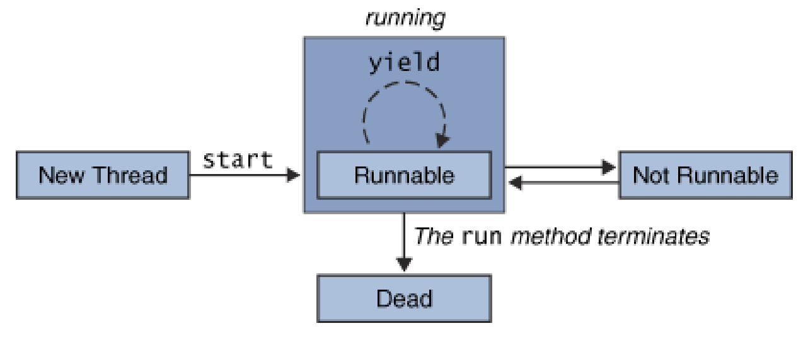
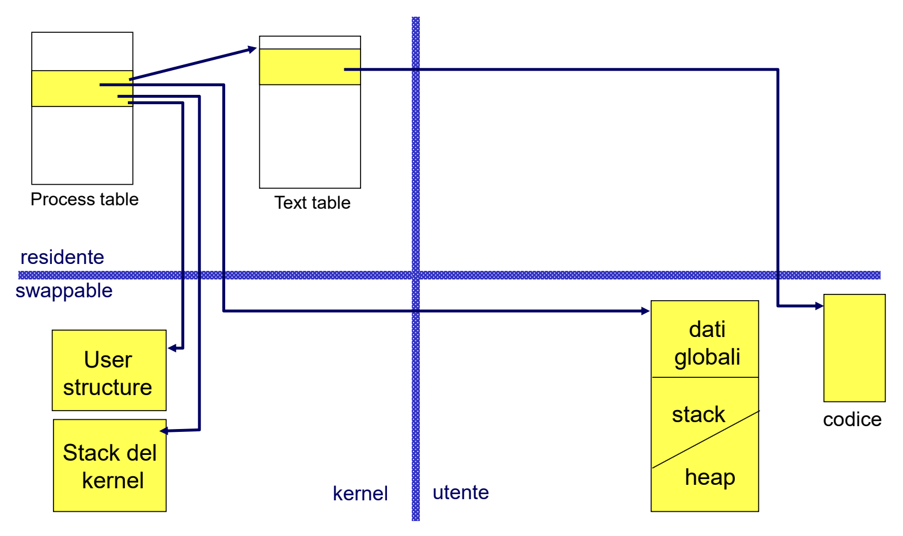
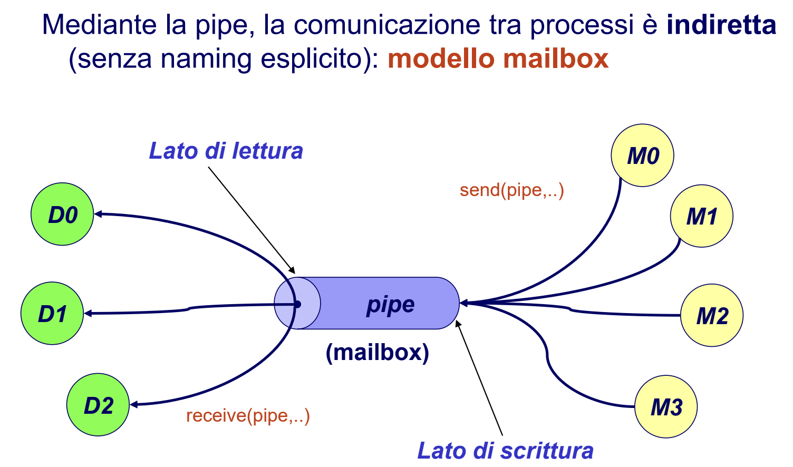
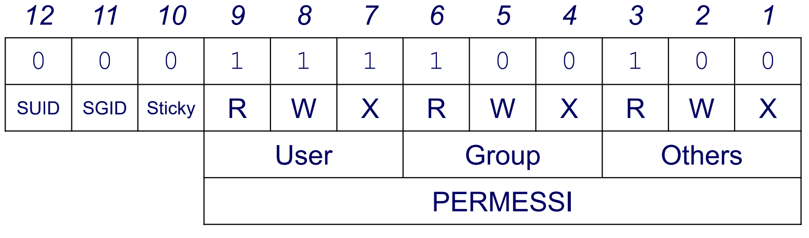
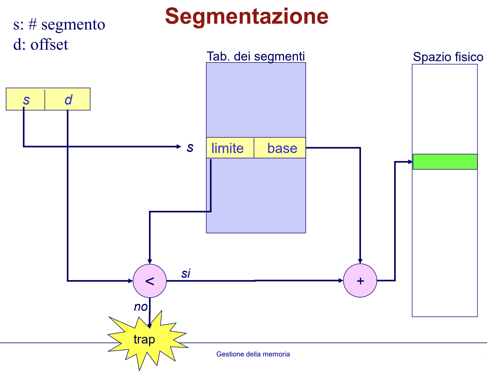
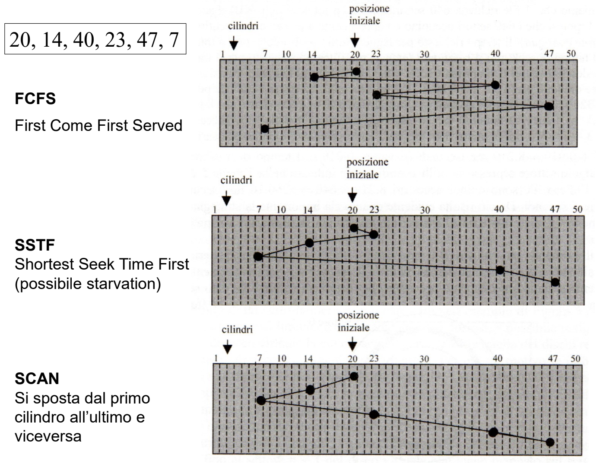

# Risposte domande SO

## 1 - Differenza tra processo pesante e processo leggero
Un processo leggero è un'entità di esecuzione che condivide codice e dati con altri thread ad esso associati.  
Un processo pesante è una task con un solo thread (task = insieme di thread che riferiscono lo stesso codice e gli stessi dati)

## 2 - Creazione di un thread, le sue fasi, ciclo di vita
Un processo padre può richiedere la creazione di un nuovo processo figlio creando gerarchie di processi.

Ciclo di vita di un thead:
- **New Thread**: variabili allocate e inizializzate
- **Runnable**: thread in esecuzione
- **not Runnable**: thread non in esecuzione, in attesa di un operazione di I/O o sospeso con `sleep()` o `wait()`
- **Dead**: thread terminato con `stop()` in modo safety

## 3 - Differenze tra fork ed exec, cosa accade in entrambe
**Fork** -> consente a un processo di generare un processo figlio (padre e figlio condividono lo stesso codice, il figlio eredita una copia dei dati del padre).  
**Exec** -> permette di differenziare i codici dei due processi (padre e figlio), vengono sostituiti codice ed eventuali argomenti di invocazione del processo che chiama la system call, con codice e argomenti di un programma specificato come parametro della system call (NO generazione di nuovi processi)

## 4 - Stati di un processo
Un processo durante la sua esistenza può avere vari stati:
- init: caricamento in memoria del processo
- ready: processo pronto per l'acquisizione della CPU
- running: processo che sta utilizzando la CPU
- waiting: processo sospeso in attesa di un evento
- terminated: processo in fase di terminazione e deallocazione

in Unix (ambiente locale -> spazio di indirizzamento non condiviso tranne per codice e file system) si aggiungono:
- sleeping = al posto di waiting (fase identica)
- zombie: processo terminato, in attesa che il padre ne rilevi lo stato di terminazione
- swapped: processo temporaneamente trasferito in memoria secondaria

## 5 - Processi UNIX (cosa cambia tra processi UNIX e processi in generale)
Un processo UNIX è composto da:

- **text** (kernel, residente): elemento della text table associato al codice
- **dati globali** (utente, swappable): contiene variabili globali del programma
- **stack, heap** (utente, swappable): aree dinamiche associate al programma
- **stack del kernel** (kernel, swappable): stack di sistema associato al processo per le system call
- **PCB (process controll block)**: process structure + user structure
   - **process structure** (kernel, residente): 
      - elemento della process table associato al processo
      - mantiene informazioni per gestire il processo anche se è swapped in memoria secondaria
      - contiene riferimento alla user structure
   - **user structure** (kernel, swappable): 
      - contiene dati necessari al kernel per la gestione del processo quando è residente
      - necessario solo se processo in running
      - se processo in swapping la user structure può essere trasferita in memoria secondaria

Mentre un processo in generale è rappresentato da:
- **codice (text)** del programma eseguito
- **dati**: variabili globali
- **program counter**
- **alcuni registri della CPU**
- **stack**: parametri, variabili locali a funzioni/procedure

## 6 - A cosa serve la wait
La wait(int *status) serve al padre per rilevare lo stato di terminazione del processo figlio.  
Il parametro status è l'indirizzo della variabile in cui viene salvato lo stato di terminazione del figlio.  
Il processo che invoca la wait può avere figli in esecuzione:
- se tutti i figli non sono ancora terminati, il processo si sospende in attesa della terminazione del primo di essi;
- se almeno un figlio è già stato terminato ed è in stato di zombie, wait() ritorna immediatamente con il suo stato di terminazione
- se non esiste neanche un figlio, wait non è sospensiva e ritorna un codice di errore.

## 7 - Lo zombie è uno stato?
Si, lo zombie è considerato uno stato ma solo nei processi UNIX.  
Zombie: processo è terminato, ma è in attesa che il padre ne rilevi lo stato di terminazione.

## 8 - Se il SO esaurisce la memoria principale, cosa si può fare?
Nel caso in cui il SO esaurisce la memoria principale viene usata una funzione dello scheduler a medio termine, lo swapping.  
Swapping -> trasferimento temporaneo in memoria secondaria di processi (o parti di processi) per consentire l'esecuzione di altri processi.

## 9 - Scheduling della CPU, differenza tra breve, medio e lungo termine
Un sistema operativo compie tre diverse attività di scheduling:

- **Scheduler a breve termine (o di CPU)**:
   - seleziona i processi a cui assegnare la CPU
   - gestisce la coda dei processi pronti
   - nei SO time-sharing:
      - seleziona i processi a cui assegnare la CPU
      - effettua il context-switch (cambio di contesto):
         1. salva lo stato del processo Pi
         2. ripristina lo stato del processo Pi+1

- **Scheduler a medio termine (swapper)**:
   - nei SO multiprogrammati:
      - la memoria fisica può essere minore delle dimensioni degli spazi logici di indirizzi da allocare a ciascun processo
      - il grado di multiprogrammazione (numero di progessi contemporaneamente presenti nel SO) non è vincolato dalle esigenze di spazio dei processi
   - Soluzione -> Swapping: trasferimento temporaneo in memoria secondaria di processi (o parti di processi) per consentire l'esecuzione di altri processi

- **Scheduler a lungo termine**:
   -  seleziona programmi da eseguire dalla memoria secondaria per caricarli in memoria centrale
   - controlla il grado di multiprogrammazione (numero di processi contemporaneamente presenti nel sistema)
   - componente importante dei sistemi batch multiprogrammati
   - è nei sistemi time-sharing

## 10 - Gestione dei segnali e cosa sono
Un segnale è un interruzione software a un processo, che notifica un evento asincrono (es. CTRL+C).  
Quando un processo riceve un segnale, può gestirlo in 3 modi diversi:
- gestire il segnale con una funzione handler definita dal programmatore
- eseguire un azione predefinita dal SO (azione di default)
- ignorare il segnale

## 11 - Differenza tra PIPE e FIFO
- **Pipe**: è un canale di comunicazione tra processi della stessa gerarchia:
   - **unidirezionale**: accessibile mediante due estremi distinti, uno di lettura e uno di scrittura 
   - **molti-a-molti**: piu' processi possono spedire messaggi attraverso la stessa pipe, piu' processi possono ricevere messaggi attraverso la stessa pipe
   - **capacità limitata**: in grado di gestire l'accodamento di un numero limitato di messaggi, gestiti in modo FIFO.

- **FIFO**: è un canale di comunicazione tra processi anche non appartenenti alla stessa gerarchia:
   - **unidirezionale**: come le pipe del tipo FIFO
   - **rappresentazione**: rappresentata da un file nel file system (persistenza, visibilità globale)
   - **gestione**: essendo un file ha un proprietario, un insieme di diritti, una lunghezza e viene aperta e acceduta dalle system call dei file

## 12 - Allocazione in memoria dei file
I file sono implementati dal sistema operativo con tecniche diverse per ciò che riguarda la memorizzazione su disco:
- **Allocazione contigua**:
   - **a partizione singola**: parte di memoria disponibile non partizionata:
      - allocazione in memoria di un processo alla volta
      - SO in memoria bassa [0, max]
      - protezione di codice e dati del SO da accessi di processi utente (uso di registri RL (registro limite) e RR (registro rilocazione))
   - **a partizione multipla**: partizione della memoria in piu' parti, ad ogni processo viene associata un'area di memoria distinta:
      - **partizione fissa**: dimensione di ogni partizione fissata a priori (problema di frammentazione interna)
      - **partizione variabile**: ogni partizione è allocata dinamicamente e dimensionata in base alla dimensione del processo da allocare (problema di frammentazione esterna)
- **Allocazione non contigua**: 
   - **paginazione**: partizione della memoria fisica in pagine (frame) di dimensione fissa e limitata dove poter mappare i processi
   - **segmentazione**: partizionamento dello spazio logico degli indirizzi di un processo in parti (segmenti), ognuna caratterizzata da numero di riferimento e posizione cella nel segmento

## 13 - Immagine di un processo (PCB)
**PCB (process control block)**: struttura dati associata ad ogni processo, contiene tutte le informazioni relative al processo:
- Stato del processo (init, ready, running, waiting, terminated)
- Puntatore alla user structure
- PID
- Puntatore all'elemento della Text Table associata al codice del processo
- Informazioni di scheduling (priorità processo, tempo di CPU usato, ...)
- Riferimento al PID del processo padre
- Puntatori alle varie aree dati e stack associati al processo

## 14 - Scelta della pagina vittima
Se pagina in memoria centrale -> nessuna operazione  
Se pagina non in memoria centrale (mem. secondaria o invalida) -> page fault

**Trattamento page fault:**
1. salvataggio del contesto del processo
2. verifica del motivo del page fault
   - violazione delle politiche di protezione
   - pagina in memoria secondaria
3. copia della pagina in frame libero
4. aggiornamento page table
5. ripristino del contesto del processo

**Problema**: sovrallocazione in memoria centrale in seguito al page fault  
**Soluzione**: algoritmi di sostituzione delle pagine vittime con le pagine nuove da caricare

**Algoritmi di sostituzione (esamina dirty bit -> se pagina modificata o no):**

- **LFU (Least Frequently Used)**:
   - sostituzione della pagina usata meno frequentemente (tempo prefissato)
   - necessità di un contatore degli accessi per ogni pagina
   - minimo valore del contatore -> pagina vittima meno usata

- **FIFO (First In First Out)**:
   - sostituzione della pagina caricata in memoria da più tempo
   - necessità di memorizzare la cronologia dei caricamenti in memoria

- **LRU (Least Recently Used)**:
   - sostituzione della pagina usata meno recentemente (preferibile per principio di località)
   - necessità di registrare la sequenza degli accessi alle pagine in memoria
   - overhead per l'aggiornamento della sequenza degli accessi

## 15 - Working set
Tecnica di gestione memoria basata su pre-paginazione.  
Prevede il set di pagine che un processo ha bisogno di caricare per la prossima fase di esecuzione (individuate per la località temporale).

Fasi:
1. caricamento processo = caricamento del working set iniziale
2. SO mantiene il working set di ogni processo aggiornandolo con località temporale dinamicamente

Vantaggi -> riduzione del numero di page fault

## 16 - Paginazione su richiesta  
Tutte le pagine in memoria secondaria vengono trasferite (tramite il **pager**) in memoria centrale all'occorrenza.

**Pager**: modulo del SO che realizza i trasferimenti delle pagine da/verso memoria secondaria/centrale ("swapper" di pagine).

**Paginazione su richiesta (o "su domanda")**:
- pager lazy trasferisce in memoria centrale una pagina soltanto se ritenuta necessaria
- working set

## 17 - System calls
La system call serve per ottenere l'esecuzione di istruzioni privilegiate.  
Essa avviene in 4 fasi:
1. invio di un'interruzione software al SO
2. salvataggio dello stato (PC, registri, bit di modo, ...) del programma chiamante e trasferimento del controllo a SO
3. SO esegue in modo kernel l'operazione richiesta
4. al termine dell'operazione, il controllo ritorna al programma chiamante (ritorno al modo user)

Le system call ci servono anche per una gestione ottimale di file e directory.

## 18 - System calls in C
Le system call in C vengono utilizzate per la gestione dei processi.
- `fork()`: creazione di un nuovo processo
- `exec()`: sostituzione del codice del processo invocante
- `wait()`: sospensione in attesa della terminazione di un processo figlio
- `exit()`: terminazione di un processo

## 19 - Gestione dei segnali a valle della fork e a valle dell'exec
**Fork**:
   - `fork()` copia User Structure del padre in quella del figlio
   - padre e figlio condividono lo stesso codice, quindi il figlio eredita dal padre le informazioni relative alla gestione dei segnali:
      - ignora gli stessi segnali ignorati dal padre
      - gestisce con le stesse funzioni gli stessi segnali gestiti dal padre
      - segnali a default del figlio sono gli stessi del padre
   - ovviamente `signal()` del figlio successive alla `fork()` non hanno effetto sulla gestione dei segnali del padre

**Exec**:  
   - `exec()` sostituisce codice e dati del processo invocante
   - User Structure viene mantenuta, tranne le informazioni legate al codice del processo (ad esempio, le funzioni di gestione dei segnali, che dopo `exec()` non sono piu' visibili)
   - dopo `exec()`, un processo:
      - ignora gli stessi segnali ignorati prima di `exec()`  
      - i segnali a default rimangono a default ma
      - i segnali che prima erano gestiti, vengono riportati a default

## 20 - Segnale SIGCHLD
SIGCHLD è il segnale che il kernel del SO invia a un processo padre quando uno dei suoi figli termina.  
Tramite l'uso di segnali è possibile svincolare il padre da un'attesa esplicita della terminazione del figlio, mediante un'apposita funzione handler per la gestione di SIGCHLD:
- la funzione handler verrà attivata in modo asincrono alla ricezione del segnale
- handler chiamerà `wait()` con cui il padre portà raccogliere ed eventualmente gestire lo stato di terminazione del figlio

## 21 - Bit di protezione dei file (Shell)
Per proteggere un file vengono usati i bit di protezione (di solito 12).  
I primi 9 contengono i permessi (lettura, scrittura e esecuzione) di user, group and others.  
Gli ultimi 3 contengono:
- SUID (Set User ID) -> identificatore di utente effettivo
- SGID (Set Group ID) -> come SUID ma per i gruppi
- Sticky bit -> il sistema cerca di mantenere in memoria l'immagine del programma, anche se non è in esecuzione

## 22 - Differenze tra SIGNAL e SIGACTION
- **signal()**
   - semantica variabile reliable/unreliable (affidabile/non affidabile)
   - in alcune realizzazioni UNIX/Linux l'handler ripristina automaticamente l'azione di default
   - se arriva un segnale durante l'esecuzione dell'handler:
      - segnale perso
      - innestamento della routine di gestione
      - accodamento dei segnali

- **sigaction()**
   - sempre reliable
   - semantica ben definita, identica in ogni versione UNIX/Linux
   - non c'è bisogno di installare l'handler
   - non perdiamo segnali -> il segnale che ha causato l'attivazione dell'handler è automaticamente bloccato fino alla fine dell'esecuzione dell'handler stesso

## 23 - Storia ed evoluzione dei SO (sistemi batch semplici, time-sharing, ecc.)
1. **Prima generazione (anni '50)**: 
   - Linguaggio macchina
   - dati su schede perforate

2. **Seconda generazione ('55 - '65)**: 
   - sistemi batch semplici
   - linguaggio di alto livello (fortran)
   - input mediante schede perforate
   - aggregazione programmi lotti (batch) con esigenze simili

Sistema batch -> insieme di programmi (job) da eseguire in modo sequenziale con la terminazione che avviene solo quando tutti i job sono stati eseguiti.

3. **Sistemi Batch semplici**:
   - SO residente in memoria (monitor)
   - no interazione tra utente e job
   - scarsa efficienza: durante l'I/O del job corrente la CPU rimane inattiva perchè in memoria centrale veniva caricato al più un solo job.

   Per migliorare l'utilizzo della CPU, è stato introdotto il meccanismo di **Spooling** (Simultaneous Peripheral Operation On Line): disco usato come buffer per memorizzare i dati in attesa di essere elaborati.

4. **Sistemi batch multiprogrammati**:
   - evita inattività della CPU -> caricati più job (pool di job) in memoria ad ogni istante
      1. SO seleziona un sottoinsieme dei job da caricare in memoria
      2. job in attesa di evento -> CPU assegnata ad altro job (scheduling)

   

5. **Sistemi time sharing (Multics, 1965):**
   - nascono per la necessità di multiutenza (nuova macchina virtuale ad ogni utente) e di interattività (SO interrompe l'esecuzione di un job dopo un tempo prefissato per eseguire un altro job)
   - la CPU è dedicata a job diversi che si alternano ciclicamente
   - frequenza di commutazione della CPU talmente alta da fornire l'illusione ai vari utenti di una macchina completamente dedicata

   Context switch -> operazione di trasferimento del controllo da un job al successivo

## 24 - Cosa succede all'apertura di un file e metodi di accesso (in generale e UNIX)
- In generale aprendo un file:
   - inserito un nuovo elemento nella tabella dei file aperti
   - eventuale memory mapping del file (i file aperti vengono temporaneamente copiati in memoria centrale --> accessi piu' veloci)

- In UNIX, l'apertura di un file provoca:
   - user structure contiene la tabella dei file aperti del processo
   - ogni elemento della tabella è un file aperto dal processo (individuato con indice -> file descriptor)
   - inserito un elemento nella prima posizione libera della tabella dei file aperti del processo
   - inserito un nuovo record nella tabella dei file aperti di sistema
   - copia l'i-node nella tabella dei file attivi se il file non è già in uso

Metodi di accesso:
- read
- write
- execute

Modalità di accesso:
- owner
- group
- others

## 25 - Context switch
**Context switch** (cambio di contesto) -> operazione di trasferimento del controllo da un job al successivo.

Nei processi e thread, il cambio di contesto è la fase in cui l'uso della CPU viene commutato da un processo ad un altro.

## 26 - Cosa succede se dividiamo un intervallo di tempo?
Dividere un intervallo di tempo può significare variare la quantità di tempo allocata o riservata per determinare attività o processi.  
Questo può determinare diverse implicazioni:

- Scheduling dei processi;
- Gestione delle risorse; 
- Timeout di gestione degli eventi.

## 27 - Pager
**Pager**: modulo del SO che realizza i trasferimenti delle pagine da/verso memoria secondaria/centrale ("swapper" di pagine).  
Può avere vari utilizzi:
- **Paginazione su richiesta**:
   - pager lazy trasferisce in memoria centrale una pagina soltanto se è ritenuta necessaria
   - working set
- Prima di eseguire lo swap-in di un processo, il pager può prevedere le pagine di cui (probabilmente) il processo avrà bisogno inizialmente --> caricamento pagine

## 28 - Segmentazione
Si basa sul partizionamento dello spazio logico degli indirizzi di un processo in parti (segmenti) con nome e lunghezza.

**Struttura degli indirizzi logici**: ogni indirizzo è costituito da una coppia <segmento, offset>
   - segmento: numero di riferimento del segmento
   - offset: posizione cella nel segmento

**Tabella dei segmenti**: ha una entry per ogni segmento con coppia <base, limite>
- base: indirizzo prima cella del segmento nello spazio fisico
- limite: dimensione del segmento

## 29 - Raid
Per migliorare ulteriormente le prestazioni di un sistema concorrente, si possono utilizzare in parallelo più dischi fissi. Questo può permettere anche di migliorare l'affidabilità e la tolleranza ai guasti (tramite ridondanza dei dati). 

I sistemi RAID (Redundant Array of Independent Disks) hanno vari livelli:

- **livello 0 (striping)**: Si crea un solo volume logico su tutti i dischi
- **livello 1 (mirroring)**: tutti i dati sono replicati su due dischi (il sistema scrive un dato sempre su due dischi)
- **livello 5 (striping con parità)** 
   - ogni sezione di parità contiene l'XOR delle 4 sezioni dati corrispondenti
   - nel caso di perdità delle sezioni dati viene ricostruita tramite la sezione di parità
   - minore costo rispetto a mirroring
   - ogni scrittura modifica sezione di parità
- **livello 6 (striping con doppia parità)**
   - come RAID livello 5 ma con un blocco di parità aggiuntivo: striping dei dati su tutti i dischi con due blocchi di parità
   - operazioni di scrittura sono più costose a causa dei calcoli della parità ma le letture non hanno svantaggi prestazionali
   - maggiore affidabilità rispetto al RAID livello 5
   
## 30 - Protezione
**Protezione**: garantire che le risorse di un sistema di elaborazione siano accedute solo dai soggetti autorizzati

**Obiettivo della protezione**: assicurare che ciascun componente di programma/processo/utente attivo in un sistema usi le risorse del sistema solo in modi consistenti con le politiche stabilite per il loro uso

## 31 - Thread in Java
ambiente globale a processi leggeri -> risolve il problema di efficienza del modello a processi pesanti

Thread -> entità di esecuzione che condivide codice e dati con altri thread associati

Caratteristiche di un thread:
- NON ha spazio di memoria riservato per dati e heap: tutti i thread sono appartenenti allo stesso processo e condividono il loro spazio di indirizzamento
- ha stack e program counter privati
- comunicazione fra thread avviene direttamente, tramite la condivisione di aree di memoria (necessità di meccanismi di sincronizzazione)

Il linguaggio Java supporta nativamente il multithreading. Per creare un nuovo thread ci sono due metodi:
1. Istanziare `Thread` passando come parametro un oggetto ottenuto implementando l'interfaccia `Runnable`. L'interfaccia `Runnable` definisce il solo metodo `run()`, identico a quello della classe `Thread` (che infatti implementa l'interfaccia `Runnable`). L'implementazione della interfaccia `Runnable` consente alle istanze di una classe non derivata da `Thread` di essere eseguite come un thread (purchè venga agganciata a un oggetto di tipo `Thread`)
2. Estendere direttamente la classe `Thread`. La classe `Thread` è una classe (non astratta) attraverso la quale si accede a tutte le principali funzionalità per la gestione dei thread.

## 32 - Stati dei thread in C
Gli stati principali di un thread in C, utilizzando la libreria `pthread.h`, sono:

- **Creato**: stato inziale di un thread appena creato. Il thread è stato istanziato e pronto all'esecuzione, ma non è ancora in esecuzione
- **In esecuzione**: Il thread si trova in questo stato quando la CPU esegue effettivamente il codice del thread.
- **In attesa**: Un thread può entrare in uno stato di attesa quando aspetta l'attivazione di un evento o una risorsa esterna.
- **Terminato**: Il thread ha completato la sua esecuzione e ha terminato con successo
- **Interrotto**: un thread può essere interrotto in modo forzato tramite `pthread_cancel()`. Quando viene interrotto il thread si trova in uno stato di terminazione, ma è responsabile di liberare le risorse acquisite prima di terminare definitivamente

## 33 - Sicurezza
**Protezione vs sicurezza**
- protezione -> serve per prevenire errori o usi scorretti da parte di processi/utenti che operano nel sistema
- sicurezza -> serve per difendere un sistema dagli attacchi esterni

La sicurezza ha molti aspetti:

- **Autenticazione**: verifica dell'identità dell'utente attraverso:
   - Possesso di un oggetto
   - Conoscenza di un segreto
   - Caratteristica personale fisiologica

   Problema della mutua autenticazione, si noti che l'autorizzazione serve per specificare le azioni concesse a ogni utente
- **Riservatezza**: previene la lettura non autorizzata delle informazioni (es. messaggi cifrati. Se intercettati, non rilevano comunque il contenuto)
- **Integrità**: previene la modifica non autorizzata delle informazioni (es. messaggio spedito dal mittente è ricevuto tale e quale dal destinatario)
- **Disponibilità**: garantire in qualunque momento la possibilità di usare le risorse
- **Paternità**: chi esegue un azione non può negare la paternità (per esempio un assegno firmato)

## 34 - Come bloccare un thread, cosa non si può fare, cosa sono SUSPEND e STOP
- `suspend()`: blocca l'esecuzione di un thread in attesa di una successiva operazione, non libera le risorse (possibilità di deadlock)

- `stop()`: forza la terminazione dell'esecuzione di un thread, libera tutte le risorse

`stop()` e `suspend()` rappresentano azioni brutali sul ciclo di vita di un thread --> rischio di determinare situazioni di deadlock o di inconsistenze

Soluzione: se la `synchronized` non basta si usa la `wait()` per bloccare un thread in attesa di un evento, senza bloccare l'intero processo

## 35 - Perchè si crea un deadlock?
deadlock -> quando due o più processi o thread nel sistema si trovano in uno stato di stallo in cui ciascuno attende il rilascio di una risorsa che è detenuta da un altro processo o thread coinvolto nello stesso stallo.

4 condizioni perchè si verifichi un deadlock:
1. Mutua esclusione
2. Possessione e ritenzione di risorse
3. Prevenzione del rilascio anticipato delle risorse
4. Attesa circolare

## 36 - Cos'è l'HARD DISK e il suo accesso
hard disk -> dispositivi che offrono spazio di memoria di massa, usato per file system o per memoria virtuale

accesso dei dati all'hard disk -> processo di lettura e scrittura dei dati su di esso

Fasi dell'accesso:

1. **Seek (ricerca)**: il braccio di lettura/scrittura si sposta fisicamente sulla posizione desiderata sul disco.
2. **Latency**: una volta che il braccio di lettura/scrittura è posizionato sulla traccia corretta, il disco rigido deve attendere che il settore desiderato passi sotto il braccio. La latenza è influenzata dalla velocità di rotazione del disco
3. **Lettura/scrittura dei dati**: il braccio di lettura/scrittura, quando il settore desiderato è posizionato sotto di esso, legge o scrive i dati magnetici sulla superficie del disco
4. **Trasferimento dati**: Dopo che i dati vengono letti/scritti, vengono trasferiti alla memoria del computer o viceversa.

## 37 - Capability list
- La Capability List è una soluzione al problema della matrice degli accessi troppo grande
- **Capability list**: lista di coppie <oggetto, diritti> che definiscono le risorse a cui un processo può accedere e le operazioni che può eseguire su di esse
- La Capability List è protetta e gestita dal SO, non può essere manipolata dai processi

## 38 - Politiche di Scheduling HDD
Per ridurre i tempi di accesso ai dati si usano politiche di scheduling dell'hard disk:

- **FCFS (First Come First Served)**
- **SSTF (Shortest Seek Time Firts)** 
- **SCAN**: si sposta dal primo cilindro all'ultimo e viceversa

## 39 - File system in UNIX (4 regioni) e metodi di allocazione dei blocchi in memoria secondaria
L'organizzazione fisica del file system in UNIX è divisa in 4 regioni:

1. **Boot Block**: contiene le procedure di inizializzazione del sistema (da esegire al bootstrap)
2. **Super Block**: fornisce
   - i limiti delle 4 regioni
   - il puntatore a una lista dei blocchi liberi
   - il puntatore a una lista degli i-node liberi
3. **Data Blocks**: area del disco effettivamente disponibile per la memorizzazione dei file. Contiene:
   - i blocchi allocati
   - i blocchi liberi (organizzati in una lista collegata)
4. **i-List**: contiene la lista di tutti i descrittori (i-node) dei file normali, direttori e dispositivi presenti nel file system (accesso con l'indice i-number)

Metodi di allocazione dei blocchi in memoria secondaria:
- **Contiguo**: file mappati su insieme di blocchi fisicamente contigui
- **Lista**: blocchi organizzati in una lista concatenata, puntatori ai blocchi distribuiti sul disco
- **Indice**: ogni file ha un blocco indice con tutti gli indirizzi dei blocchi in cui è allocato il file

## 40 - Differenze tra SWAPPER e PAGER
- **Swapper**: gestisce il trasferimento di interi processi da memoria centrale a secondaria (swap out) e viceversa (swap in)
- **Pager**: gestisce il trasferimento di singole pagine da/verso memoria secondaria/centrale ("swapper di pagine")

## 41 - Algoritmi di scheduling a breve termine
- **FCFS (First Come First Served)**: coda dei processi pronti gestita come FIFO, processi schedulati secondo l'ordine di arrivo
- **SJF (Shortest Job First)**: schedula il processo con il tempo di esecuzione più breve (difficile stimare il tempo di esecuzione)
- **Round Robin**: assegna un tempo di CPU fisso a ciascun processo in modo ciclico e gestisce la ready queue come FIFO in modo che ogni processo usa la CPU per un $\Delta t$ prefissato
- **Priority Scheduling**: assegna la CPU al processo con la priorità più alta e con il tempo che:
   - aumenta priorità se il processo è nella ready queue
   - diminuisce priorità se il processo è in esecuzione
- **MLFQ (Multi-Level Feedback Queue)**:
   - scheduling in Unix
   - ci sono più livelli di priorità
   - ad ogni livello è associata una coda, gestita Round Robin
   - ogni secondo viene rilocata la priorità di ogni processo
   - priorità del processo diminuisce all'aumentare del tempo di CPU usato
   - l'utente può modificare la priorità di un processo con comando `nice`
- **Java Thread Scheduling**: usa un algoritmo di scheduling a priorità (FCFS con stessa priorità)

## 42 - i-node  
L'i-node è il descrittore del file.  
- attributi dell'i-node:
   - tipo di file
      - ordinario
      - direttorio 
      - file speciale, per i dispositivi
   - proprietario, gruppo (user-id, group-id)
   - dimensione
   - data
   - 12 bit di protezione  
   - numero di link
   - 13-15 indirizzi di blocchi (a seconda della realizzazione)
- indirizzamento i-node (contenuti puntatori a blocchi):
   - primi 10 indirizzi -> dati
   - 11° indirizzo -> altri indirizzi di blocchi di dati (1° livello indirettezza)
   - 12° indirizzo -> 2° livello indirettezza
   - 13° indirizzo -> 3° livello indirettezza

## 43 - Utilizzo dell'export
L'uso della `export` è importante per rendere le variabili d'ambiente disponibili per i processi figli o per l'ambiente delle shell successive.  
Senza l'uso della `export`, le variabili d'ambiente definite in uno script shell non sarebbero visibili al di fuori dello script stesso o dei suoi processi figli.  
Esempio: se si vuole impostare il PATH --> `export PATH=$PATH:`\`pwd`