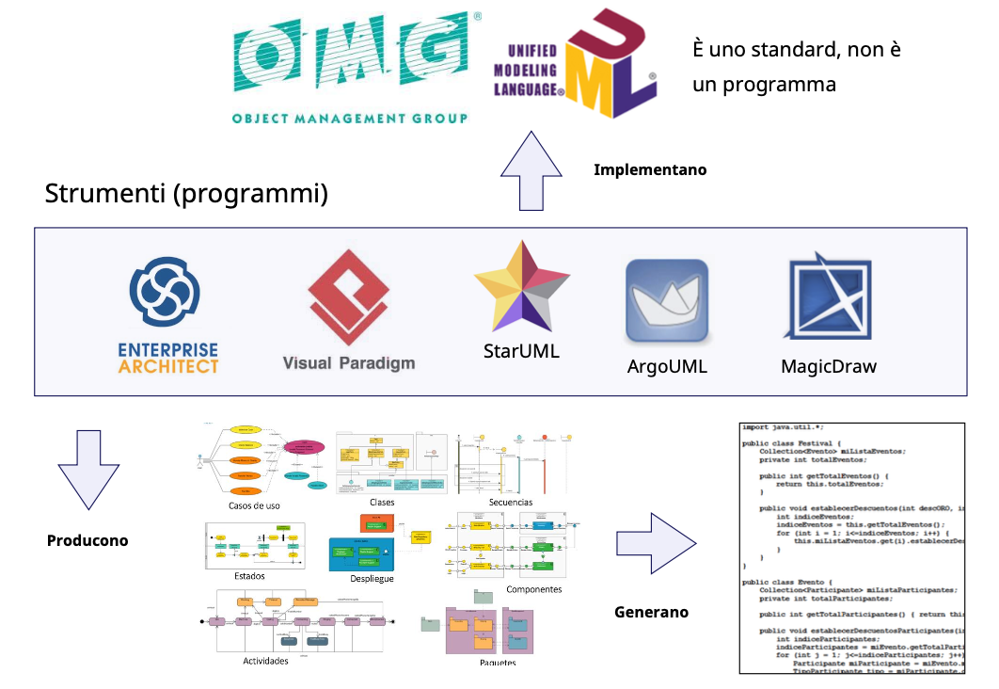
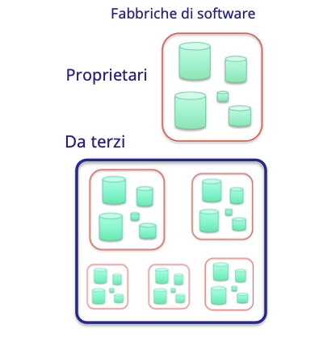
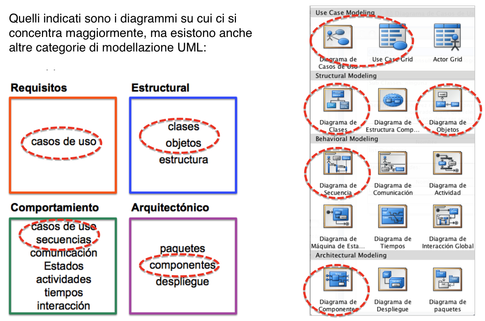

# UML - Unified Modeling Language (Linguaggio di modellazione unificato)
UML è uno standard dell'organizzazione OMG (Object Management Group), non è un programma
- **Visualizzare**: UML consente di visualizzare graficamente un sistema.
- **Specificare**: UML consente di specificare le caratteristiche (requisiti) di un sistema prima della sua
costruzione.
- **Costruire**: I prototipi possono essere generati dai tuoi progetti.
- **Documento**: Le rappresentazioni grafiche servono a documentare le implementazioni del
sistema.
- **Ispezionare**: Utilizzando il reverse engineering, è possibile ricostruire un visual design dal
codice (utile ad esempio per “ereditarietà del sistema”, Sistemi legacy).
- **Astratto**: UML consente di isolare le specifiche dalle implementazioni finali su cui verrà costruito il sistema finale.

Gli strumenti (programmi) che implementano l'UML producono diagrammi di diverso tipo e generano codice

## Sviluppo di progetti informatici basati su UML
I modelli di sviluppo software seguono linee guida simili a quelle degli sviluppi industriali.  
Solitamente vengono utilizzate metodologie di sviluppo basate su componenti o software.  
Sono usati **fabbriche di software**: refactoring o riutilizzo di componenti, software, documenti, progetti, codice (Git).  
Queste fabbriche possono essere:
- **proprietari**: specifico per l'azienda che lo sviluppa
- **terzi**: sviluppato da altri o dove vengono acquistate le componenti (i pezzi) del sistema da sviluppare (bisogna considerare gli aspetti di qualità e affidabilità).

Nello sviluppo del software si possono applicare “linee di montaggio” partendo da progetti originali con la progettazione del prodotto con maggiore o minore dettaglio e/o viste diverse.

## Tipi di diagrammi UML
1. Diagrammi casi d'uso (diagramma dei casi d'uso)
2. Diagrammi classi (diagramma di classe)
3. Diagrammi oggetti (diagramma degli oggetti)
4. Diagrammi struttura composita (diagramma della struttura)
5. Diagrammi sequenze (diagramma di sequenza)
6. Diagrammi comunicazione (diagramma di comunicazione)
7. Diagrammi stati (diagramma di stato)
8. Diagrammi attività (diagramma di attività)
9. Diagrammi tempo (diagramma temporale)
10. Diagrammi interazione (diagramma di interazione)
11. Diagrammi pacchetti (diagramma del pacchetto)
12. Diagrammi componenti (diagramma dei componenti)
13. Diagrammi distribuzione o implementazione (diagramma di distribuzione).

## Categorie di modellazione UML
