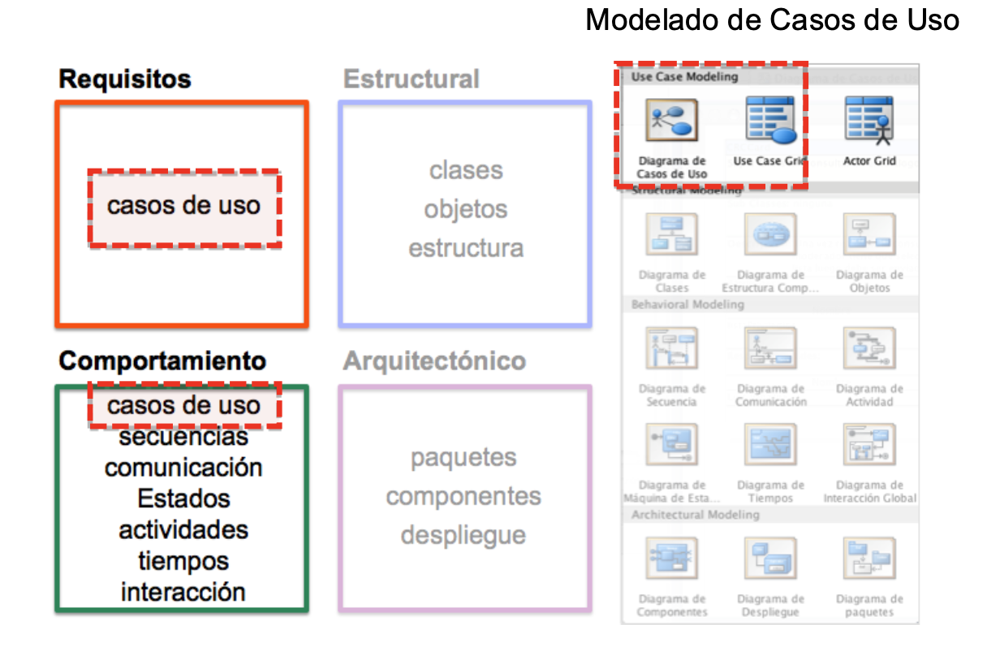
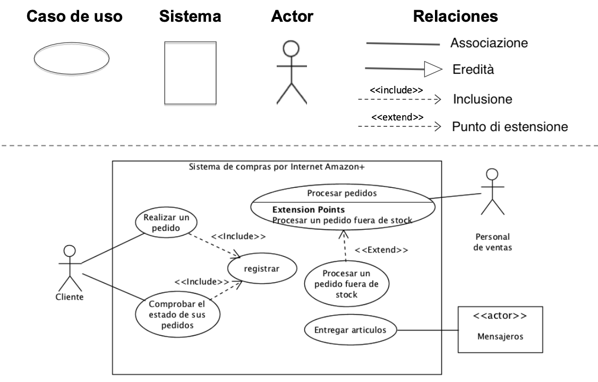
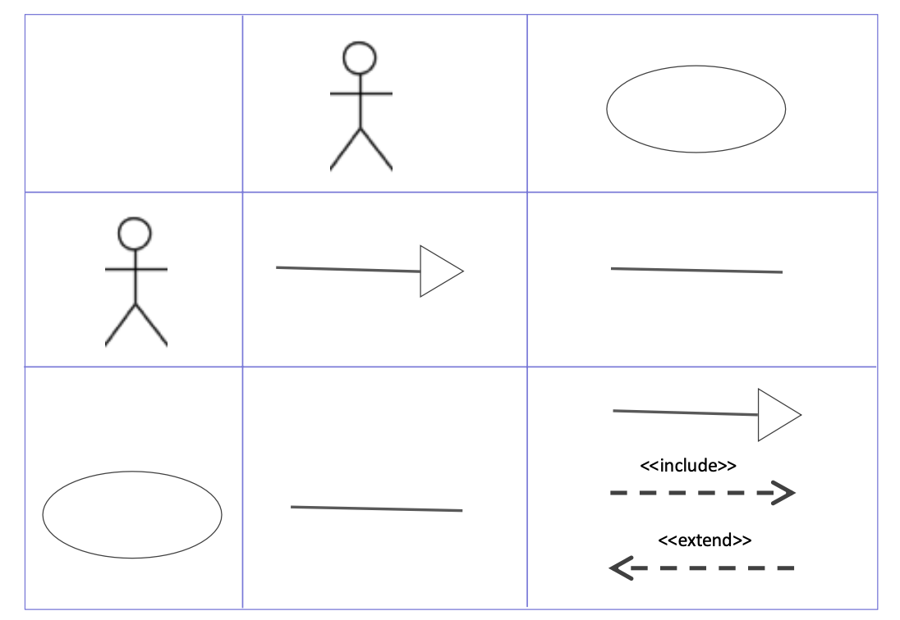

# Modellazione dei casi d'uso

## Cos'è la modellazione dei casi d'uso
1. cattura funzioni, capacità o comportamento del sistema in sviluppo senza specificare l'implementazione
2. metodo per modellare i requisiti
3. mostra le capacità del sistema realizzate dagli attori e agli attori
4. definisce interazioni tra attore e sistema (ma non tra attori)
5. aiuta a definire l'ambito del sistema da sviluppare
6. la modellazione è definita tramite:
    - diagrammi dei casi d'uso: forniscono un modo grafico per rappresentare le funzionalità del sistema
    - descrizione dei casi d'uso:
        * utilizzando modelli di testo (con un elenco di eventi)
        * accompagnati da diagrammi comportamentali (ad esempio, diagrammi di sequenza o diagrammi di attività)

## Elementi di un diagramma dei casi d'uso

- **caso d'uso**: sequenza di azioni che possono essere eseguite dal sistema interagendo con gli attori del sistema  
Esempio di sequenza di un Login: inserire l'ID, premere un pulsante, controllare se è corretto e, in caso affermativo, continuare
- **attore**: è esterno al sistema ed è il ruolo svolto da un utente (o da un altro sistema) che interagisce con il sistema  
Esempio: un cliente, il personale di vendita, la banca, i corrieri, un server esterno, un reparto, ...
- **sistema**: limite del sistema / confine tra sistema e attori che interagiscono con esso
- **relazione**: associazione tra attori, casi d'uso e sistema
    - **associazione**:
        - collega sempre un attore a un caso d'uso
        - rappresenta le azioni principali dell'attore con/verso il sistema
        - l'attore comunica attraverso i principali casi d'uso
    - **eredità: generalizzazione/specializzazione**:
        - rappresenta un sottoinsieme (uno più generale, l'altro più specifico)
        - si usa o tra due casi d'uso o tra due attori
        - non può essere usato tra attori e casi d'uso
    - **inclusione**:
        - rappresenta "è composto dal" o "include il" comportamento di un altro caso d'uso
        - si usa solo tra i casi d'uso
        - le inclusioni sono sobbligatorie durante l'esecuzione
    - **estensione**:
        - estende il comportamento di un altro caso d'uso
        - l'estensione avviene in punti specifici dell'esecuzione, quando si verificano alcune condizioni

**Relazioni tra attori e casi d'uso:**

I diagrammi dei casi d'uso servono nei processi iniziali di ingegneria dei requisiti per identificare e raccogliere i requisiti del sistema.  
Strumenti come VP4UML consentono un'analisi testuale delle specifiche preliminari, che aiuta a ottenere le prime approssimazioni dei diagrammi dei casi d'uso (diagrammi preliminari).