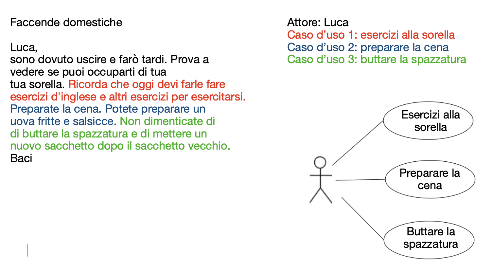
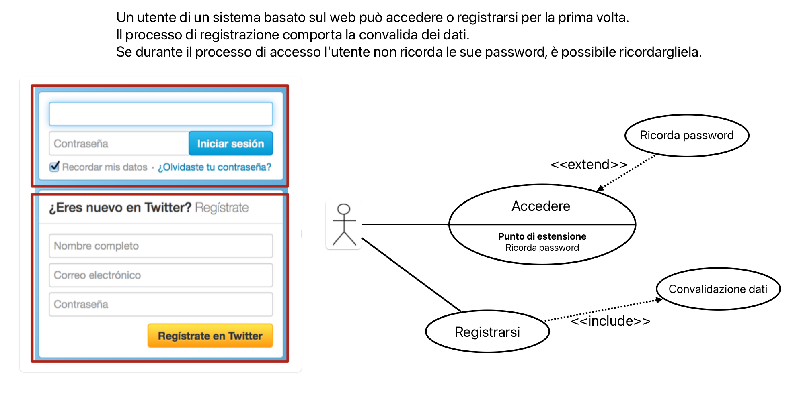
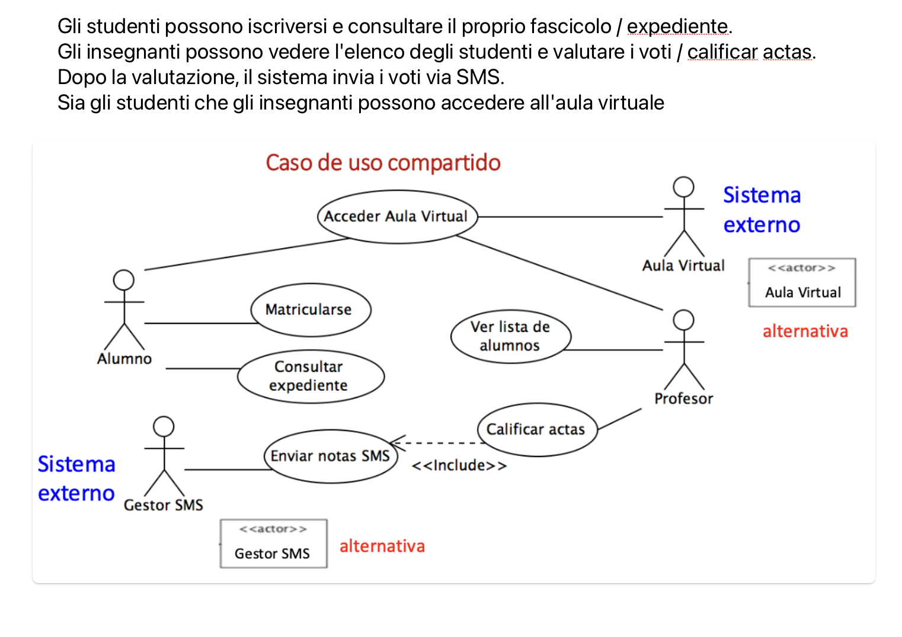
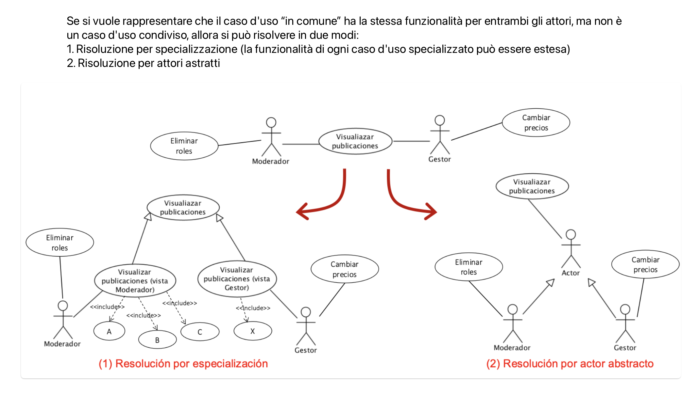
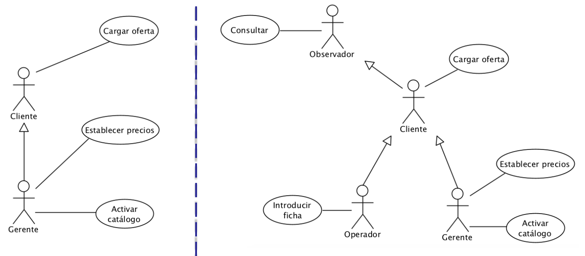
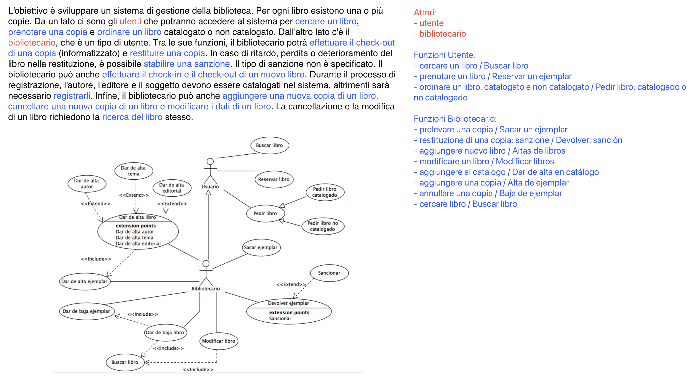

# Modellazione di Casi d'uso

## Modellazione dei casi d'uso
- **Obiettivo**: descrive **cosa** fa un sistema senza specificare **come**.
- **Finalità**:
    - raccoglie e organizza i **requisiti** del sistema.
    - definisce le **interazioni** tra **attori** (utenti o sistemi esterni) e **sistema**.
- **Capacità del sistema**:
    - mostra come le funzionalità del sistema sono realizzate **dagli attori**.
    - delinea il **confine** tra sistema e ambiente esterno.
- **Strumenti di rappresentazione**:
    - **Diagrammi di casi d'uso**: visualizzano graficamente le funzionalità principali.
    - **Descrizioni testuali**: supportate da diagrammi comportamentali per chiarire il flusso operativo.
- **Vantaggi**:
    - chiarisce le esigenze degli attori.
    - definisce le funzionalità chiave del sistema.

## Elementi di un Diagramma di Casi d'uso

- **Attore**:  
  - rappresenta un utente o un sistema esterno che interagisce con il sistema.  
  - **Esempi**: Cliente, banca, personale di vendita.

- **Caso d'uso**:  
  - sequenza di azioni che il sistema esegue con l'interazione di un attore.  
  - **Esempio**: Login (inserimento credenziali, verifica, accesso).

- **Sistema**:  
  - rappresenta il confine tra ciò che è all'interno del sistema e ciò che è esterno.  
  - **Ruolo**: Determina i limiti del sistema, delimitando le interazioni possibili con gli attori.

- **Relazioni**:  
    - **Associazione**:  
        - connessione tra un **attore** e un **caso di uso**.
        - **Ruolo**: Rappresenta le azioni principali che un attore compie con il sistema.
        - **Esempio**: Un cliente (attore) che esegue l’azione di "effettuare un acquisto" (caso di uso).

    - **Include**:  
        - relazione che indica che un **caso di uso** include sempre il comportamento di un altro caso di uso.
        - **Ruolo**: Il comportamento dell’altro caso è **obbligatorio** e viene eseguito ogni volta che si verifica il primo.
        - **Esempio**: L’acquisto di un prodotto include il caso di uso "verifica disponibilità".

    - **Extend**:  
        - relazione che permette a un **caso di uso** di estendere il comportamento di un altro caso di uso.
        - **Ruolo**: Il comportamento aggiuntivo è **opzionale** e viene attivato solo in condizioni specifiche.
        - **Esempio**: Il caso di uso "pagamento" può estendere con "inserimento sconto" in caso di promozioni.

    - **Generalizzazione/Specializzazione (eredità)**:  
        - relazione "è_un" tra **casi di uso** o **attori**.
        - **Ruolo**: Un attore o caso di uso più specifico eredita il comportamento o le caratteristiche di uno più generale.
        - **Esempio**: Un "cliente premium" è_un "cliente", quindi eredita le stesse azioni di base con funzionalità aggiuntive.

**Relazioni tra attori e casi d'uso:**

I diagrammi dei casi d'uso servono nei processi iniziali di ingegneria dei requisiti per identificare e raccogliere i requisiti del sistema.  
Strumenti come VP4UML consentono un'analisi testuale delle specifiche preliminari, che aiuta a ottenere le prime approssimazioni dei diagrammi dei casi d'uso (diagrammi preliminari).

Esempi di diagrammi dei casi d'uso:

**Casi d'uso di base**: quando il caso d'uso è direttamente collegato all'attore (il primo esempio ha 3 casi d'uso di base e il secondo ne ha 2)

**Casi d'uso condiviso**: quando due o più attori intervengono contemporaneamente sul caso d'uso per soddisfare il requisito (la funzionalità)

**Ereditarietà tra attori**: per organizzare la semantica della specificazione

## Passaggi per la creazione di un DCU (Diagramma dei Casi d'Uso):
1. **Analisi del problema**:  
   - Partire da un **enunciato di specifica** iniziale.
   - Leggere attentamente l'enunciato per familiarizzarsi con il **dominio del problema**.

2. **Identificazione degli elementi chiave**:  
   - Durante una seconda lettura, **sottolineare** verbi e sostantivi rilevanti:
     - **Verbi**: suggeriscono possibili **funzionalità** del sistema.
     - **Sostantivi**: indicano potenziali **attori**.
     - Si consiglia l'uso di **colori** per differenziare gli elementi.

3. **Creazione di uno schema preliminare**:  
   - Basato sugli elementi identificati, creare uno **schema** per rilevare i casi di uso di base e la struttura dei casi di uso interni.

4. **Bozza iniziale del diagramma**:  
   - Disegnare una bozza veloce del DCU, rappresentando ogni attore separatamente.
   - Successivamente, unire gli attori nel **diagramma finale**.

5. **Revisione e analisi**:  
   - Controllare il diagramma per verificarne la correttezza **sintattica** e **semantica**.
   - Verificare le **restrizioni imposte** e la correttezza di relazioni come **specializzazione** ed **ereditarietà** tra attori.

### Esempio: Sistema di Gestione Bibliotecaria

## Qualità di un progetto