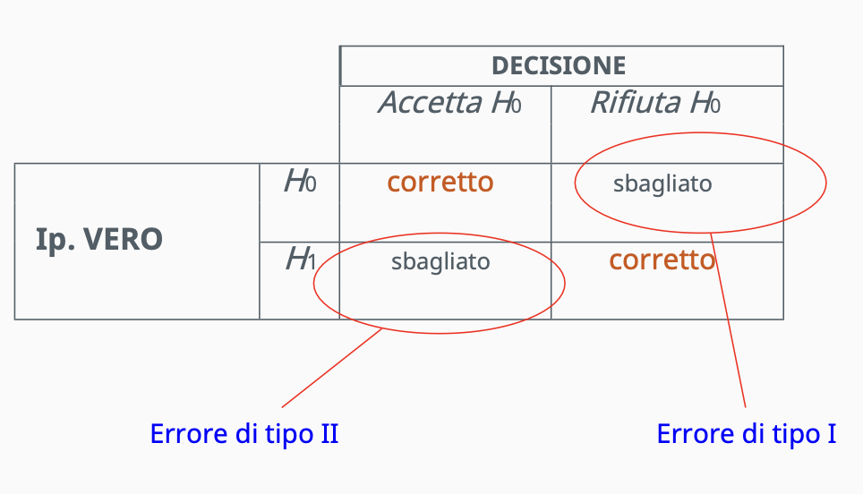

# Introduzione ai Big Data
- **Big Data**: grandi **volumi** di dati generati a una **velocità** elevata e con una **varietà** notevole.  
È necessario l'uso di tecnologie e metodi specifici per trasformare questi dati in valore.
- È molto importante **memorizzare**, **elaborare** e **analizzare** grandi quantità di dati.

## Caratteristiche di un problema di Big Data (Le tre "V"):
- **Volume**: quantità di dati generati o immagazzinati. Determina se i dati possono essere considerati Big.
- **Varietà**:
    - diversi tipi di dati: testo, immagini, audio, video
    - provenienza da diverse fonti o localizzazioni
- **Velocità**: frequenza con cui vengono generati nuovi dati. È un problema quando è necessario ottenere risultati in tempo reale (es. streams di dati dai sensori).

## Altre caratteristiche del Big Data:
- **Veridicità**: qualità dei dati, che influisce direttamente sulla precisione dei risultati.
- **Completezza**: rappresenta se i dati includono la totalità della popolazione.
- **Scalabilità**: la capacità di gestire una crescita rapida della quantità di dati.
- **Valore**: l'informazione utile che può essere estratta dai dati.

## Definizione di Data Science:
**Data science**: disciplina che combina competenze matematiche, statistiche/marketing e di programmazione per estrarre informazioni utili dai dati.

## Considerazioni sulla Data Science:
- Non si limita solo al Big Data.
- Richiede una conoscenza di tecnologie computazionali:
    - Come vengono archiviati e trasmessi i dati.
    - Linguaggi di programmazione.
    - Librerie specifiche per l'analisi.

## Limitazioni di alcune tecniche statistiche - errori sulla verifica delle ipotesi

- **livello di significatività**: probabilità di commettere un errore di tipo I (rifiutare l'ipotesi nulla quando è vera)
- **potenza del test**: probabilità di rifiutare l'ipotesi nulla quando è falsa

Problema della potenza del test:
- se N aumenta troppo -> analizzare la dimensione dell'effetto (interv. di confidenza):
    - Due campioni normali di medie 0 e 0.001 e varianza 1
    - Prova del T-Studente
- se molte variabili -> dati micro-array:
    - ogni colonna (variabile) misura il livello di espressione di un determinato gene
    - dati normali (V.A. Gaussiane)
    - micro-array di migliaia di geni (colonne) alla volta
    - solitamente ci sono una decina di righe su pazienti sani e una decina su pazienti malati
    - test medi per ciascun gene, confrontando pazienti sani con pazienti malati
    - obiettivo: trovare i geni non nulli, cioè con medie diverse tra pazienti sani e malati

**Correzione di Bonferroni**:
- si eseguono N prove
- si rifiutano solo le ipotesi nulle che raggiungono un livello di significatività: $\alpha' = \frac{\alpha}{N}$