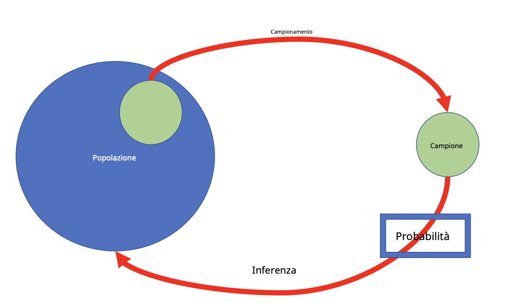
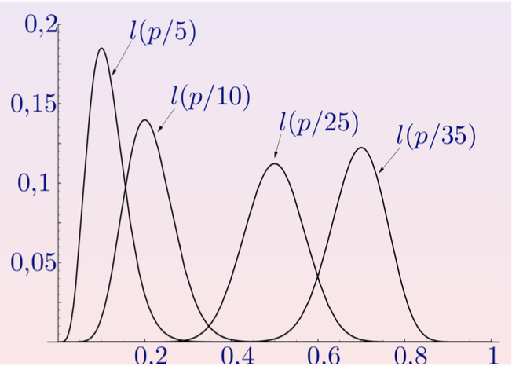

# Inferenza Bayesiana
## Enunciazione del problema dell'inferenza statistica

**Nozioni di base**:
- **popolazione** $\rightarrow$ descritta da una v.a. $X$ (caratteristica di interesse) quindi la sua caratterizzazione sarà data dalla sua distribuzione
- **campionamento** (selezione di un campione) $\rightarrow$ esperimento casuale e ogni sua osservazione è il valore osservato di una v.a.
- **variabili casuali** $(X_1, X_2,..., X_n)$ $\rightarrow$ campione casuale di dimensione N se:
    1. $X_i$ sono variabili casuali indipendenti
    2. tutti gli $X_i$ hanno la stessa distribuzione di probabilità
- **campione casuale** $\rightarrow$ sequenza di v.a. i.i.d. $X_1, X_2,..., X_n$ con la stessa distribuzione della caratteristica della popolazione di interesse $X$

**Elementi di un problema di inferenza**:
- **$\sigma$-algebra** $\rightarrow$ insieme di sottoinsiemi di uno spazio campionario $(\Omega)$ che soddisfano determinate proprietà che permettono di definire in modo coerente una misura, come la probabilità.  
Le 3 proprietà che deve soddisfare sono:
    1. insieme completo: l'intero insieme degli eventi possibili deve essere considerato misurabile ($\Omega$ deve essere in $\sigma$-algebra)
    2. se il sottoinsieme $\mathcal{A}$ è in $\sigma$-algebra, allora anche tutti gli elementi di $\Omega$ che non sono in $\mathcal{A}$ devono essere in $\sigma$-algebra
    3. Se una serie di sottoinsiemi $\mathcal{A}_1, ..., \mathcal{A}_n$ è nella σ-algebra, allora anche l'unione di questi sottoinsiemi deve essere nella σ-algebra
- **spazio campionario** $(\Omega, \mathcal{A})$ $\rightarrow$ insieme di tutti i possibili risultati di un esperimento casuale  
Esempio: esperimento -> lancio di un dado.  
    - spazio campionario $(\Omega)$ contiene tutte le sei possibili facce del dado
    - $\mathcal{A}$ è una σ-algebra che definisce gli eventi misurabili all'interno di questo spazio
- **variabile aleatoria** $X \rightarrow$ funzione che associa ogni risultato dell'esperimento a un numero  
Esempio: esperimento -> lancio di un dado e si considera il numero sulla faccia.
    - variabile aleatoria X rappresenta il numero sulla faccia del dado
    - variabile aleatoria definita come una funzione $X: (\Omega, \mathcal{A}) \rightarrow (X, B)$, dove $B$ è la σ-algebra corrispondente allo spazio dei valori che $X$ può assumere
- **funzione di distribuzione $F$** $\rightarrow$ dice quanto è probabile che la variabile aleatoria $X$ assuma determinati valori, descrivendo come sono distribuiti i risultati.  
Può essere di due tipi:
    - funzione di densità $\rightarrow$ v.a. continue
    - funzione di massa di probabilità $\rightarrow$ v.a. discrete
- **funzione di verosimiglianza** $f(x|\theta)$ $\rightarrow$ dice quanto è probabile osservare i dati $x$, dato un certo valore di $\theta$
- **Parametro $\theta$** $\rightarrow$ parametro incognito della distribuzione ed è il valore che si cerca di stimare o inferire  
Esempio: in un esperimento sulla probabilità di successo di un evento, $\theta$ potrebbe rappresentare questa probabilità sconosciuta

### Approccio classico per trova $\theta$
- $\theta$ è un parametro fisso ma sconosciuto
- si suppone che $f$ sia conosciuta e si denota come $f(x|\theta)$ o $f(x;\theta)$
- per un campione casuale $(X_1, X_2,..., X_n)$ di $f(x|\theta)$, la funzione di verosimiglianza è $L(\theta|x_1, ..., x_n) = f(x_1,..., x_n|\theta) = \prod_{i=1}^n{f(x_i|\theta)}$ cioè la PDF (probability density function) vista come funzione del parametro

Esempio: dato un campione $1, X \sim \mathcal{B}(50, p)$, la funzione di verosimiglianza è  
$L(p|x) = \binom{50}{x} p^x(1-p)^{50-x}$

### Approccio Bayesiano per trovare $\theta$
- **variabile sconosciuta** $\theta$ $\rightarrow$ usata come una variabile casuale e consente di introdurre informazione su di essa (informazioni a priori) anche prima di osservare i dati
- **informazione a priori** $\rightarrow$ rappresentata da una **distribuzione a priori** $\pi(\theta)$, riflette ciò che si sa (o si pensa di sapere) su $\theta$ prima di raccogliere nuove osservazioni e la concezione soggettiva della probabilità giocherà un ruolo importante
- **distribuzione a posteriori** $\pi(\theta|x) \rightarrow$ riflette la conoscenza di $\theta$ dopo aver osservato i dati, si ottiene attraverso il **teorema di Bayes** (distribuzione a priori e verosimiglianza combinate)
- **modello parametrico bayesiano** $\rightarrow$ è costituito da 3 elementi $(X, f(X|\theta), \pi(\theta))$ con cui fa inferenza:
    1. $X$ è la v.a. osservata
    2. $f(x|\theta)$ è la funzione di verosimiglianza
    3. $\pi(\theta)$ è la distribuzione a priori

## Distribuzioni associate all'inferenza bayesiana
1. **distribuzione a priori di** $\theta, \pi(\theta)$ $\rightarrow$ riflette la conoscenza di $\theta$ prima di osservare i dati
2. **distribuzione congiunta di** $(X, \theta) \rightarrow$ distribuzione combinata dei dati e del parametro sconosciuto, rappresenta la probabilità dei dati e dei parametri insieme
$$\psi(x, \theta) = f(x|\theta)\pi(\theta)$$
3. **distribuzione marginale (o predittiva a priori) di $X$** $\rightarrow$ distribuzione di probabilità dei dati $X$ prima di osservare i dati
$$m(x) = \int_{\Theta}{f(x|\theta)\pi(\theta)d\theta}$$
4. **distribuzione a posteriori di** $\theta, \pi(\theta|x) \rightarrow$ distribuzione aggiornata del parametro $\theta$ dopo aver osservato i dati, costruita attraverso il teorema di Bayes
$$\pi(\theta|x) = \frac{f(x|\theta)\pi(\theta)}{m(x)} = \frac{f(x|\theta)\pi(\theta)}{\int_{\Theta}{f(x|\theta)\pi(\theta)d\theta}}$$
5. **distribuzione predittiva date le osservazioni** $x = \{x_1, ..., x_n\}$ $\rightarrow$ distribuzione di probabilità dei dati futuri $X_{n+1}$ dopo aver osservato i dati $x$ (usando la distribuzione a posteriori è possibile fare previsioni sui dati futuri)
$$m(x_{n+1}|x) = \int_{\Theta}{f(x_{n+1}|\theta, x)\pi(\theta|x)d\theta} = \int_{\Theta}{f(x_{n+1}|\theta)\pi(\theta|x)d\theta}$$

**Esempio**:
- dato il campione $X_1, ..., X_n \sim \mathcal{B}(1, \theta)$ e $\theta \sim \mathcal{U}(0, 1)$
- dati $x = \{x_1, ..., x_n\}$ e $f(x|\theta) = P_{\theta}\{X = x|\theta\}$
- calcolare la distribuzione associata al modello parametrico bayesiano $(X, f(x|\theta), \pi(\theta))$

**Soluzione**:
1. **distribuzione a priori di $\theta, \pi(\theta)$**: visto che $\theta \sim \mathcal{U}(0, 1) \rightarrow \pi(\theta) = 1$ per $\theta \in [0, 1]$ (poiché è uniforme ha densità costante pari a 1 lungo tutto l'intervallo $[0, 1]$)
2. **verosimiglianza $f(x|\theta)$**:
    - per il campione a disposizione e il $\theta$, la verosimiglianza è basato sulla PMF (probability mass function) della distribuzione binomiale
    - per una distribuzione binomiale con $n = 1$ prove e probabilità di successo $\theta$, la probabilità di osservare $x_i$ successi è $f(x_i|\theta) = \theta^x_i(1-\theta)^{1-x_i}$
    - quindi la verosimiglianza totale per il campione sarà il prodotto di ogni verosimiglianza per ogni osservazione: $f(x|\theta) = \prod_{i=1}^n{\theta^{x_i}(1-\theta)^{1-x_i}} = \theta^{\sum_{i=1}^n{x_i}}(1-\theta)^{n - \sum_{i=1}^n{x_i}}$
    - $\sum_{i=1}^n{x_i}$ è il numero di successi osservati nel campione
3. **distribuzione a posteriori di $\theta, \pi(\theta|x)$**:
    - si applica il teorema di Bayes e si ottiene che:
    $$\pi(\theta|x) \propto f(x|\theta)\pi(\theta) = \theta^{\sum_{i=1}^n{x_i}}(1-\theta)^{n - \sum_{i=1}^n{x_i}}$$
    - la forma ottenuta è quella di una distribuzione Beta con parametri:
        - $\alpha = 1 + \sum_{i=1}^n{x_i} \rightarrow$ numero di successi osservati $+ 1$
        - $\beta = 1 + n - \sum_{i=1}^n{x_i} \rightarrow$ numero di insuccessi osservati $+ 1$
        $$\pi(\theta|x) \sim Beta(\alpha, \beta)$$

## Distribuzioni coniugate
Nell'inferenza bayesiana si combinano due informazioni per strimare un parametro $\theta$:
- **distribuzione a priori** $\pi(\theta)$
- **verosimiglianza** $f(x|\theta)$

Dopo aver osservato i dati, si applica il teorema di Bayes per ottenere la distribuzione a posteriori $\pi(\theta|x)$, ovvero la conoscenza aggiornata su $\theta$.

La **distribuzione a priori** è **coniugata** rispetto alla verosimiglianza se la distribuzione a posteriori appartiene alla stessa famiglia della distribuzione a priori.

**Definizione più generale**: una classe di distribuzioni a priori $\mathcal{P}$ è coniugata rispetto ad un modello parametrico (come la verosimiglianza) se la distribuzione a posteriori appartiene alla stessa famiglia di quella a priori, ovvero $\pi(\theta|x) \in \mathcal{P}$.

**Vantaggio** $\rightarrow$ la distribuzione a posteriori è della stessa famiglia della distribuzione a priori quindi è facile da calcolare

### Esempio: Distribuzione Binomiale e distribuzione Beta
- dato un campione casuale $X_1, ..., X_n \sim \mathcal{B}(1, \theta)$
- si suppone che la distribuzione a priori $\pi(\theta)$ sia di tipo $Beta(\alpha, \beta)$ con $\alpha, \beta > 0$
- la distribuzione a posteriori $\pi(\theta|x)$ per un campione $x = (x_1, ..., x_n)$ è:
$$\pi(\theta| x) \sim Beta(\alpha + \sum_{i=1}^n{x_i}, \beta + n - \sum_{i=1}^n{x_i})$$
- la distribuzione a posteriori è della stessa famiglia della distribuzione a priori quindi la distribuzione Beta è coniugata rispetto alla distribuzione Binomiale

### Proprietà distribuzione Beta
$X \sim Beta(\alpha, \beta), \alpha, \beta > 0$ se:
$$f(x) = \frac{\Gamma(\alpha + \beta)}{\Gamma(\alpha)\Gamma(\beta)}x^{\alpha - 1}(1-x)^{\beta - 1}, \space 0 < x < 1$$
con $\Gamma$ funzione Gamma definita come:
$$\Gamma(\alpha) = \int_0^{\infty}{x^{\alpha - 1}e^{-x}dx}$$

- **media** $E(X) = \frac{\alpha}{\alpha + \beta}$
- **varianza** $Var(X) = \frac{\alpha\beta}{(\alpha + \beta)^2(\alpha + \beta + 1)}$
- **distribuzione uniforme** se $\alpha = \beta = 1$
- **simmetrica o asimmetrica**:
    - $\alpha = \beta \rightarrow$ distribuzione simmetrica e centrata intorno a 0.5
    - $\alpha > \beta \rightarrow$ distribuzione asimmetrica e la probabilità si concentra verso 1
    - $\alpha < \beta \rightarrow$ distribuzione asimmetrica e la probabilità si concentra verso 0
- **concentrazione della distribuzione**:
    - $\alpha$ e $\beta$ grandi $\rightarrow$ distribuzione concentrata attorno alla media (più informazioni su $\theta$)
    - $\alpha$ e $\beta$ piccoli $\rightarrow$ distribuzione piatta