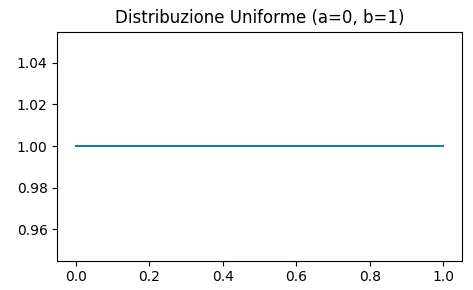
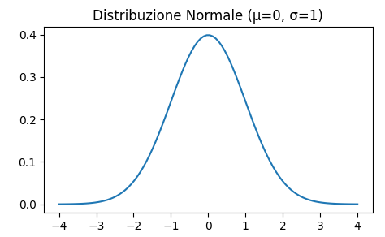

# Distribuzioni Discrete
- Modellano variabili casuali con valori distinti e finiti o numerabili
- Valori discreti (es. contare eventi)
- Associazione di probabilità a ciascun valore

## 1. Distribuzione Binomiale
Descrive il numero di successi in una serie di $n$ prove indipendenti, ognuna delle quali ha due possibili esiti: successo o fallimento, con probabilità di successo $p$.

**Esempio:** Supponiamo di lanciare una moneta 10 volte $(n)$ e di voler calcolare la probabilità di ottenere esattamente 6 teste $(p)$. La distribuzione binomiale può modellare questo scenario, dove ogni lancio è una prova indipendente con probabilità di successo $p = 0.5$.

- **Funzione di probabilità:**

  $$P(X = k) = \binom{n}{k} p^k (1 - p)^{n - k}$$

  Dove:
  - $n$ è il numero totale di prove;
  - $k$ è il numero di successi;
  - $p$ è la probabilità di successo;
  - $1 - p$ è la probabilità di fallimento.

- **Media (o valore atteso):** $\mu = n \cdot p$
- **Varianza:** $\sigma^2 = n \cdot p \cdot (1 - p)$

## 2. Distribuzione di Poisson
Descrive il numero di eventi che si verificano in un intervallo di tempo o spazio, quando gli eventi sono indipendenti e si verificano con una certa media costante $\lambda$.

**Esempio:** Un call center riceve in media 5 chiamate al minuto $(\lambda = 5)$. La distribuzione di Poisson può essere utilizzata per calcolare la probabilità di ricevere esattamente 3 chiamate $(k = 3)$ in un determinato minuto.

- **Funzione di probabilità:**

  $$P(X = k) = \frac{\lambda^k e^{-\lambda}}{k!}$$

  Dove:
  - $\lambda$ è la media o il tasso di eventi;
  - $k$ è il numero di eventi.

- **Media:** $\mu = \lambda$
- **Varianza:** $\sigma^2 = \lambda$

### Approssimazione di Poisson alla Binomiale
Quando $n$ è grande e $p$ è piccolo, la distribuzione binomiale può essere approssimata dalla distribuzione di Poisson con $\lambda = n \cdot p$.

**Esempio:** Consideriamo un grande numero di prodotti (ad esempio, $n = 10000$) con una piccola probabilità di difetto ($p = 0.001$). In questo caso, la distribuzione binomiale può essere approssimata dalla distribuzione di Poisson con $\lambda = n \cdot p = 10$.

## 3. Distribuzione Ipergeometrica
Descrive la probabilità di ottenere $k$ successi in $n$ prove, estratte senza reinserimento da una popolazione finita di $N$ elementi, di cui $K$ sono successi.

**Esempio:** Supponiamo di avere una popolazione di 50 studenti $(N)$, di cui 10 sono maschi $(K)$. Se ne selezioniamo 5 a caso senza reinserimento $(n)$, la distribuzione ipergeometrica può calcolare la probabilità di selezionare esattamente 2 maschi $(k)$.

- **Funzione di probabilità:**

  $$P(X = k) = \frac{\binom{K}{k} \binom{N-K}{n-k}}{\binom{N}{n}}$$

  Dove:
  - $N$ è la dimensione della popolazione;
  - $K$ è il numero di successi nella popolazione;
  - $n$ è il numero di estrazioni;
  - $k$ è il numero di successi nelle estrazioni.

## 4. Distribuzione Binomiale Negativa
Descrive il numero di fallimenti $k$ che si verificano prima di osservare un numero prefissato di successi $r$ in prove indipendenti con probabilità di successo $p$.

**Esempio:** Nel baseball un giocatore continua a battere finché non ottiene 3 successi $(r)$ (ad esempio, tre colpi in buca). La distribuzione binomiale negativa può modellare il numero di tentativi necessari $(k)$ per raggiungere i 3 successi.

- **Funzione di probabilità:**

  $$P(X = k) = \binom{k + r - 1}{k} p^r (1 - p)^k$$

  Dove:
  - $r$ è il numero di successi;
  - $k$ è il numero di fallimenti.

- **Media:** $\mu = \frac{r(1 - p)}{p}$
- **Varianza:** $\sigma^2 = \frac{r(1 - p)}{p^2}$

## 5. Distribuzione Geometrica
Descrive il numero di prove necessarie $k$ per ottenere il primo successo in una sequenza di prove indipendenti con probabilità di successo $p$.

**Esempio:** In un test di qualità, ogni prodotto ha una probabilità del 10% di essere difettoso $(p)$. La distribuzione geometrica può essere utilizzata per determinare la probabilità che il primo prodotto difettoso venga trovato al quinto controllo $(k)$.

- **Funzione di probabilità:**

  $$P(X = k) = (1 - p)^{k - 1} p$$

  Dove:
  - $k$ è il numero di prove (il numero di fallimenti prima del primo successo).

- **Media:** $\mu = \frac{1}{p}$
- **Varianza:** $\sigma^2 = \frac{1 - p}{p^2}$

---

# Distribuzioni Continue
- Modellano variabili casuali che possono assumere qualsiasi valore in un intervallo
- Valori continui (es. misurazioni)
- Associazione di probabilità a intervalli di valori

## 1. Distribuzione Uniforme
Descrive una variabile casuale che ha la stessa probabilità di assumere qualsiasi valore in un intervallo $[a, b]$.

**Esempio:** Supponiamo di generare numeri casuali tra 0 e 1 per simulare il lancio di un generatore di numeri casuali. La distribuzione uniforme assegna la stessa probabilità a ogni numero nell'intervallo $[0,1]$.

- **Funzione di densità:**

  $$f(x) = \frac{1}{b - a}, \quad a \leq x \leq b$$

- **Media:** $\mu = \frac{a + b}{2}$
- **Varianza:** $\sigma^2 = \frac{(b - a)^2}{12}$

## 2. Distribuzione Gamma
Utilizzata per modellare il tempo $x$ fino al verificarsi di un evento specifico.

**Esempio:** Se si considera un processo che richiede in media 5 unità di tempo per completare un compito $(\beta = \frac{1}{5}$, $\theta = 5)$, e si desidera modellare il tempo per completare 3 compiti $(\alpha = 3)$, si può usare la distribuzione Gamma per descrivere il tempo totale necessario per completare i 3 compiti.

- **Funzione di densità:**

  $$f(x; \alpha, \beta) = \frac{\beta^\alpha x^{\alpha - 1} e^{-\beta x}}{\Gamma(\alpha)}$$

  Dove:
  - $\alpha$ è il parametro di forma (numero di eventi / successi), $\alpha$ grandi portano a una distribuzione simile a una normale;

  - $\beta$ è il parametro di scala (tasso di arrivo degli eventi), $\beta$ grandi portano a schiacciare la distribuzione, allungandola;

  - $\theta = \frac{1}{\beta}$ è il tempo medio tra eventi;

  - $\Gamma(\alpha)$ è la funzione Gamma di Eulero, $\Gamma(\alpha) = \int_0^\infty x^{\alpha - 1} e^{-x} dx$;
  
  - $x$ è il tempo.

- **Media:** $\mu = \frac{\alpha}{\beta}$
- **Varianza:** $\sigma^2 = \frac{\alpha}{\beta^2}$

## 3. Distribuzione Esponenziale Negativa
Caso particolare della distribuzione Gamma con $\alpha = 1$, viene utilizzata per modellare il tempo $x$ tra eventi in un processo Poisson.

**Esempio:** Il tempo tra l'arrivo di auto in un parcheggio dove le auto arrivano a un tasso medio di 2 auto al minuto $(\lambda)$. La distribuzione esponenziale può modellare il tempo tra due arrivi consecutivi di auto.

- **Funzione di densità:**

  $$f(x; \lambda) = \lambda e^{-\lambda x}, \quad x \geq 0$$

  Dove $\lambda$ è il tasso medio di eventi.

- **Media:** $\mu = \frac{1}{\lambda}$
- **Varianza:** $\sigma^2 = \frac{1}{\lambda^2}$

## 4. Distribuzione Beta
Distribuzione definita sull'intervallo $[0, 1]$ ed è usata per modellare variabili casuali con limiti superiori e inferiori conosciuti.

**Esempio:** La distribuzione Beta può essere utilizzata per modellare la probabilità di successo di una campagna di marketing, dove i parametri $\alpha$ e $\beta$ riflettono il numero di successi e fallimenti osservati.

- **Funzione di densità:**

  $$f(x; \alpha, \beta) = \frac{\Gamma(\alpha + \beta)}{\Gamma(\alpha)\Gamma(\beta)} x^{\alpha - 1} (1 - x)^{\beta - 1} = \frac{x^{\alpha - 1} (1 - x)^{\beta - 1}}{B(\alpha, \beta)}$$

  Dove:
  - $\alpha$ e $\beta$ sono i parametri di forma;

  - $\Gamma(\alpha + \beta) = \int_0^1 x^{\alpha - 1} (1 - x)^{\beta - 1} dx$;

  - $B(\alpha, \beta) = \frac{\Gamma(\alpha)\Gamma(\beta)}{\Gamma(\alpha + \beta)}$

- **Media:** $\mu = \frac{\alpha}{\alpha + \beta}$
- **Varianza:** $\sigma^2 = \frac{\alpha \beta}{(\alpha + \beta)^2 (\alpha + \beta + 1)}$

## 5. Distribuzione Normale
Descrive la distribuzione di variabili casuali che tendono a concentrarsi attorno a un valore medio, descrivendola con media $\mu$ e deviazione standard $\sigma$.

**Esempio:** L'altezza degli adulti in una popolazione segue una distribuzione normale, con una media di 170 cm $(\mu)$ e una deviazione standard di 10 cm $(\sigma)$. Questa distribuzione può essere utilizzata per calcolare la probabilità che un adulto selezionato a caso abbia un'altezza superiore a 180 cm.

- **Funzione di densità:**

  $$f(x; \mu, \sigma) = \frac{1}{\sigma \sqrt{2\pi}} e^{-\frac{(x - \mu)^2}{2\sigma^2}}$$

- **Media:** $\mu$
- **Varianza:** $\sigma^2$

### Approssimazioni della Distribuzione Normale
La distribuzione normale viene spesso utilizzata per approssimare altre distribuzioni discrete (come la binomiale) quando il numero di osservazioni è grande e soddisfa certe condizioni (es. Teorema Centrale del Limite).

