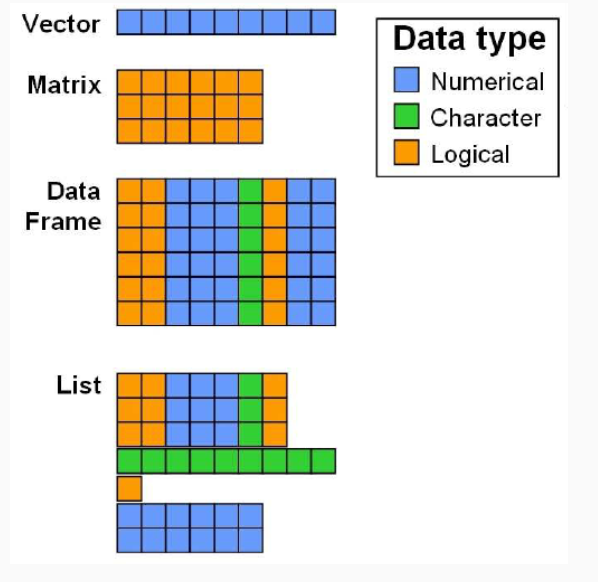

# R language
## Installazione di pacchetti

Installazione:
```R
install.packages("name_package")
```

Caricamento:
```R
library(name_package)
```

## Creazione oggetto
```R
a = 10
b <- a/2
b <- b^2
```
si usa `<-` o `=` per assegnare un valore ad una variabile

## Strutture dati
- Vettori
- Fattori
- Matrici
- Data frames
- Liste



### Vettori
Collezione ordinata di elementi dello stesso tipo

Costruzione:
```R
# vettore vuoto di dimensione fissa
x <- vector(mode="double", length=4)
# vettore dato
x = c(1,2,3,4)
# vettore di sequenza
x <- 9:29
```

Aritmetica vettorizzata:
```R
x <- c(10,12,9,5,14)
sum(x^2)/length(x)
```

Selezione di elementi:
```R
z <- letters # tutte le lettere minuscole z
z[4] # la quarta
z[2:5] # dalla seconda alla quinta
z[c(2,5)] # solo la seconda e la quinta
z[-c(1,length(z))] # tutte tranne la prima e l'ultima

# Errore tipico: selezionare elementi consecutivi senza usare c()
z[1,3]
Error in z[1, 3] : incorrect number of dimensions
```

Organizzazione di vettori per file o colonne (se hanno stesso numero di elementi):
```R
x <- c(10,20,11,1,5)
y <- c(8,5,3,4,11)
z <- c(1,2)
cbind(x,y) # col 
rbind(x,y) # row
cbind(x,z) 
```

### Data frames
Oggetto che può memorizzare diverse colonne di diverso tipo (numeriche, di caratteri, logiche...)

Costruzione:
```R
dati <- data.frame(
  Id=c("A","B","C"), # 1a colonna (caratteri)
  s1=c(32,25,48), # 2a colonna (interi)
  s2=c(T,F,T), # 3a colonna (valori logici)
  s3=c(NA,4.3,5.2) # 4a colonna (dati mancanti)
);
```

Assegnazione di nuovi nomi a righe e colonne:
```R
rownames(dati) <- c("Pepe","Ana","Luisa")
colnames(dati) <- c("Id","Età","Investire","Vincita")
dati
```

Selezione delle variabili o dei casi:
```R
# 3 modi per selezionare "Età"
dati[,2]
dati[,"Edad"]
dati$Edad

# 2 modi per selezionare "Pepe"
dati[1,]
dati["Pepe",]
```

### Liste
Oggetto più flessibile di R, consente di includere in esso dati di tipo diverso e oggetti diversi

- Vengono specificati tramite la funzione `list()`
- Può essere costituito da più elenchi e ogni componente può essere di tipo diverso.
- Selezione degli elementi di un elenco:
  - Parentesi singole, []: possiamo selezionare uno o più elementi e il risultato è un altro elenco.
  - Doppie parentesi quadre, [[]], o segni di dollaro, $: si può estrarre un solo elemento e il risultato non deve essere necessariamente un elenco: sarà della classe dell'elemento estratto.


## Operazioni aritmetiche
- Ordinario: `+, -, *, /`
- Radice quadrata e potenze: `sqrt, ˆ`
- Divisione: `%/%`
- Modulo: `%%`
- Logaritmi: `log, log10, log2, logb(x,base)`
- Trigonometria: `sin, cos, tan, asin, acos, atan`
- Altre operazioni: `max, min, range, media, mediana, var, sd, quantile, sum, prod, cumsum`

Operatori:
- `==` uguaglianza
- `!=` disuguaglianza
- `>, <, >=, <=` confronto
- `&` e logico, `&&` e logico con valutazione di corto circuito
- `|` o logico, `||` o logico con valutazione di corto circuito
- `xor(a, b)` o esclusivo
- `!` negazione

## Gestione delle funzioni di probabilità
R consente di valutare funzioni di densità e massa di probabilità, funzioni di distribuzione e quantili.  
I nomi di queste funzioni sono composti da due parti:
- Un prefisso:
    - `d` per i valori della funzione di densità
    - `p` per la probabilità cumulativa fino a un punto
    - `q` per i quantili
    - `r` per la generazione di numeri casuali
- Il nome con cui R designa la distribuzione:
    - `norm` (normale)
    - `binom` (binomiale)
    - `unif` (uniforme)
    - `exp` (esponenziale)
    - `beta` (beta)
    - `gamma` (gamma)
    - ...

Esempio:
```R
# P{X ≤ 200}; X ∼ N(170,15)
pnorm(200,170,15)

# Qualche qunatile di N(0,1)
alpha <- c(0.1,0.05,0.01,0.001)
qnorm(1-alpha/2)
```

```R
# 10 valori aleatori di N(170,15)
num <- rnorm(10,170,15)

# P{X = 3} X ∼ B(5,0.5)
dbinom(3,5,0.5)
```

## Grafici
La funzione `curve()` disegna la curva corrispondente a una funzione, per impostazione predefinita nell'intervallo [0,1] (può essere modificata con l'argomento `xlim`)

```R
# Funzione di densità N(0,1)
curve(dnorm, xlim = c(-4,4))
```

Aggiunta di una curva:
```R
# Aggiungere alla precedente curva la funzione di densità N(2,1)
curve(dnorm(x,mean = 2), add = T)
```

Altri parametri grafici:
- colore (`col`)-> stringa di caratteri che indica il nome del colore (ad esempio, col = “rosso”). Elenco dei valori possibili colori()
- linethickness (`lwd`, numero intero positivo, default1)
- linetype (`lty`, 1=continuo(di default), 2=discontinuo, 3=punto, 4=punto, 5=punto lungo, 6=punto doppio)
- `?par` -> per consultare il numero di parametri

```R
curve(dnorm, xlim = c(-4,6), col = ’blue’, lwd = 2)
curve(dnorm(x,mean = 2), add = T, col = ’orange’, lwd = 2, lty = 2)
```

Si può aggiungere una legenda al grafico utilizzando la funzione legend().  
È importante indicare:
- Dove posizionare la legenda, utilizzando le coordinate x, y o una stringa di caratteri: `bottomright`, `bottom`, `bottomleft`, `left`, `topleft`, `top`, `topright`, `right` e `center`.
- `legenda` -> indica le parole che compaiono nella legenda. È introdotto da un vettore di caratteri.
- `lty` o `lwd` -> per far apparire la riga associata a ciascuna parola della legenda.
- `col` -> un vettore di colori della stessa lunghezza della legenda.

```R
legend(
  ’topright’, 
  legend = c("N(0,1)", "N(2,1)"),
  lwd = 2, 
  lty = c(1,2), 
  col = c(’blue’, ’orange’)
)
```

## Creazione di funzioni
```R
nome <- function(arg1,arg2,...) {
       espressione
    return(risultato)
}
```

Esempio: calcolare la media geometrica di un insieme di dati dato dall'espressione $x = \prod_{i=1}^{n} x_i^{1/n}$
```R
media.g <- function(x) {
  n = length(x)
  ans = prod(x^(1/n))
  return(ans)
}

media.g(1:50)
```

## Controllo del flusso
- `if`:
```R
if (condizione) {
  espressione
}
```
- `if-else`:
```R
if (condizione) {
  espressione1
} else {
  espressione2
}
```
- `for`:
```R
for (elemento in vector) {
  espressione
}
```

- `while`:
```R
while (condizione) {
  espressione
}
```

- `break` per interrompere un ciclo
- `next` per saltare un'iterazione