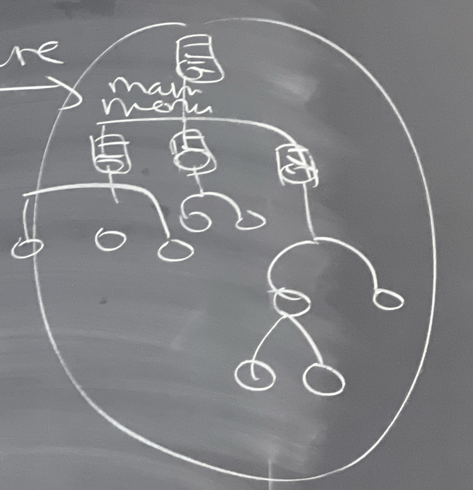
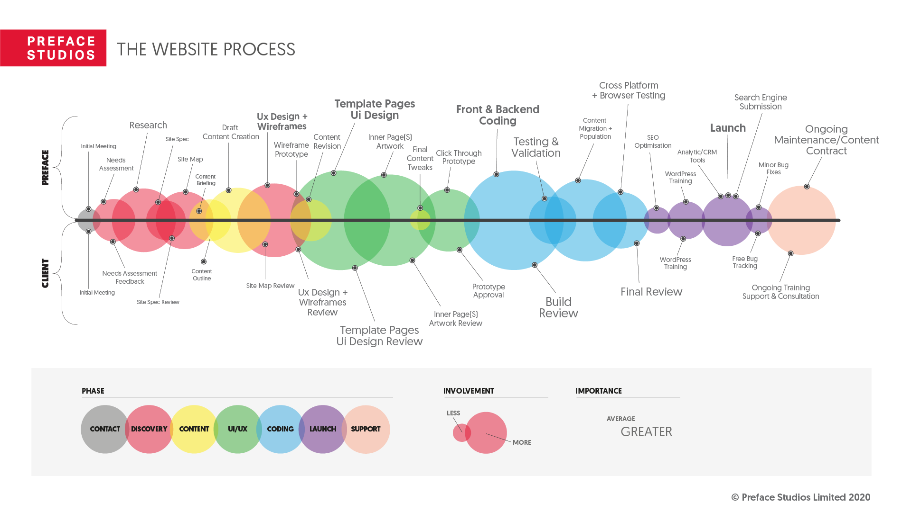

# Step to create a web site for the client
## 1. know the goals of the client
- why do you want a web site?
- write a general list of questions to ask the client:
    - what kind of visits are you expecting (how many visit you hope to obtain in number)?
    - which services do you want to offer?
    - what kind of information do you want to show?

## 2. plan
- time planning
- budget planning
- deliveries planning
- resources planning

## 3. design
- information structure with distribution
- graphic design (framework, mockup)
- UX experience

## 4. code
- architecture
- select tecnologies
- programming
    - front-end
    - back-end
    - database

## 5. explotation
- commercial server
- pilot project of users reviewing
- digital marketing launch

## The website process

